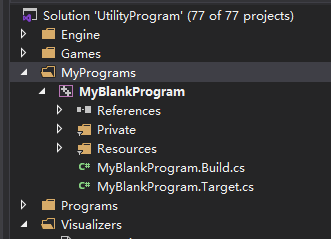
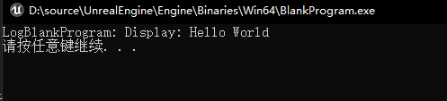

# UE4 Standalone Application
在UE4源码工程目录下有许多`Programs`类型的工程,其中还有许多控制台工程或用`Slate`实现的图形界面程序,这些都可以独立运行,比如:SlateViewer、UnrealPak等。它们编译生成的可执行程序在`UnrealEngine\Engine\Binaries\Win64`目录下。

有时候我们也会想利用UE4内部的一些设施实现一些可以独立运行的工具,其中最简单的办法就是直接从`Programs`下的一个空的控制台工程`BlankProgram`开始写,或者在`UnrealEngine\Engine\Source\Programs`下把它复制一份(记得改名字)再重新生成工程,就可以看到复制的那一个工程。这样编译出来的可执行程序也会在引擎目录下.

此外,也有办法把它放在当前工程目录下,随便新建一个空的项目,在其目录结构的Source文件夹下,模仿引擎的`UE4`工程目录新建两个文件夹`Programs`和`Runtime`,并将原来Source文件夹下的内容复制到`Runtime`中去。然后将引擎`Programs`目录下的`BlankProgram`文件夹复制到我们工程的`Programs`里面去(里面所有东西重命名为`MyBlankProgram`),假设我们工程名字为`UtilityProgram`则新的目录结构为:
```
UtilityProgram
|---Config
|---Content
|---Source
    |---Programs
        |---MyBlankProgram
            |---Private
                |---MyBlankProgram.h
                |---MyBlankProgram.cpp
            |---Resources
                |---Windows
                    |---MyBlankProgram.ico
            |---MyBlankProgram.Build.cs
            |---MyBlankProgram.Target.cs
    |---Runtime
        |---UtilityProgram
            |---UtilityProgram.Build.cs
            |---UtilityProgram.cpp
            |---UtilityProgram.h
            |---UtilityProgramGameModeBase.cpp
            |---UtilityProgramGameModeBase.h
        |---UtilityProgram.Target.cs
        |---UtilityProgramEditor.Target.cs
|---UtilityProgram.uproject
```
然后重新生成VS工程, 再打开。发现`MyBlankProgram`工程被放在了`Solution`根目录下的`Programs`下。如果不想这样,可以在`MyBlankProgram.Target.cs`加上一句:
```c#
public class MyBlankProgramTarget : TargetRules
{
	public MyBlankProgramTarget(TargetInfo Target) : base(Target)
	{
        // ... 
		SolutionDirectory = "MyPrograms";
        // ... 
	}
}
```
它就会出现在新的一个`MyPrograms`目录下:



RequiredProgramMainCPPInclude.h中include了LaunchEngineLoop.cpp,由于我们将工程移到了源码目录外,将会找不到这个文件,所以需要在MyBlankProgram.Build.cs中加上绝对路径:
```c#
public class MyBlankProgram : ModuleRules
{
	public MyBlankProgram(ReadOnlyTargetRules Target) : base(Target)
	{
		string EngineDirectory = "D:/source/UnrealEngine/Engine";

        // For LaunchEngineLoop.cpp include
		//PublicIncludePaths.Add("Runtime/Launch/Public");
		PublicIncludePaths.Add(System.IO.Path.Combine(EngineDirectory, "Source/Runtime/Launch/Public"));
		//PrivateIncludePaths.Add("Runtime/Launch/Private");      
		PrivateIncludePaths.Add(System.IO.Path.Combine(EngineDirectory, "Source/Runtime/Launch/Private"));

        // ...
	}
}
```

至此就可以运行出`Hello World`了。生成的可执行文件在当前工程的`Binaries\Win64`目录下。



注意:
1. `Target.cs`中的`LinkType`要是`TargetLinkType.Monolithic`,否则模块的加载会有问题,我在使用RSA时遇到:
```
RSA functionality was used but no modular feature was registered to provide it. Please make sure your project has the PlatformCrypto plugin enabled!
```
2. 使用了插件时要加上下面两句:
```
bCompileWithPluginSupport = true;
bIncludePluginsForTargetPlatforms = true;
```
3. `bCompileICU`设为`false`
```
bCompileICU = false;
```

reference:
1. https://zhuanlan.zhihu.com/p/145633340
2. https://imzlp.me/posts/31962/ 