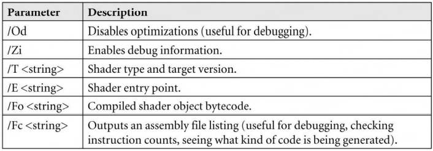

DXGI: DirectX Graphics Infrastructure

D3D Initialize: 

IDXGIFactory   IDXGISwapChain, IDXGIDevice, IDXGIAdaper, 

Constant buffer:
in heap : `D3D12_DESCRIPTOR_HEAP_TYPE_CBV_SRV_UAV`. can store a mixture of `constant buffer`, `shader resource`, `unordered access descriptors`.

## Root Signature 
在执行`Draw call`之前, 需要向`Render Pipeline`绑定和`Shader program`相对应的资源.`Resource`被绑定到可被`Shader Programs`直接访问的`Register slots`. 通常, 需要多个`constant buffer`, `textures`, `samplers`绑定到多个`Register slots`.

不同的`Draw call`通常要使用不同的`Shader Programs`, 也就需要不同的`Root signature`.

Interface : ID3D12RootSignature. 它用一个RootParamters数组定义了Shader需要的参数.一个RootParameters可以是`Root constant`, `Root descrptor` 或 `Descriptor table`. 一个`Descriptor table`指定了一个`Descriptor heap`中一个连续范围内的`Descriptors`.

## Compiling shaders

Shader program 首先应该被编译成字节码. `Graphics driver`会根据系统的`GPU`将它再次编译成最优的`Native`指令.

Runtime 下编译shader:

```c++
HRESULT WINAPI
D3DCompileFromFile(LPCWSTR pFileName, // source code file path .
                   CONST D3D_SHADER_MACRO* pDefines, // advanced 
                   ID3DInclude* pInclude, // advanced 
                   LPCSTR pEntrypoint, // the function name of the shader's entry point
                   LPCSTR pTarget, // shader  program type and version, vs_5_0, hs_5_0(Hull shader), ds_5_0(Domain shader), gs_5_0(Geometry shader), ps_5_0(pixel shader), cs_5_0(compute shader)
                   UINT Flags1, // compiled method , D3DCOMPILE_DEBUG or D3DCOMPILE_SKIP_OPTIMIZATION
                   UINT Flags2, // advanced option
                   ID3DBlob** ppCode, // return a pointer to a ID3DBlob data structure that stores the compiled shader object bytecode.
                   ID3DBlob** ppErrorMsgs); // store a string containing the compilation errors .

D3DCompileFromFile(shaderPath.c_str(), nullptr, nullptr,"VSMain","vs_5_0", compileFlags,0,&vertexShader, nullptr )
```

`ID3DBlob`是通用的内存块, 仅有两个方法:
```c++
LPVOID GetBufferPointer( void) ; // 返回指向数据块的void*指针 
        
SIZE_T GetBufferSize( void); // 返回buffer的bute size.
```
### Offline Compilation
除了在Runtime编译shader, 还可以在Build或处理资源时预先编译好Shader.这样做的原因:
1. 对于复杂的shader, 编译耗时较长. 预先编译可以时Runtime的加载时间缩短.
2. 在Build时就看到shader的编译错误会很方便.
3. Win8 Store app必须使用离线编译的Shader.

对于编译好的Shader, 其文件名后缀通常为`.cso(compiled shader object)`.离线编译使用的工具时DirectX工具链中的FXC 命令行工具.编译一个在文件color.hlsl中的入口为VS 和 PS的Vertex和Pixel shader, 并带有debugging, 其命令行参数为:
```c++
fxc "color.hlsl" /Od /Zi /T vs_5_0 /E "VS" /Fo "color_vs.cso" /Fc "color_vs.asm"
fxc "color.hlsl" /Od /Zi /T ps_5_0 /E "PS" /Fo "color_ps.cso" /Fc "color_ps.asm"

// release 
fxc "color.hlsl" /T vs_5_0 /E "VS" /Fo "color_vs.cso" /Fc "color_vs.asm"
fxc "color.hlsl" /T ps_5_0 /E "PS" /Fo "color_ps.cso" /Fc "color_ps.asm"
```


随后可以直接加载这些编译好的文件, 读成`ID3DBlob`:
```c++
ComPtr<ID3DBlob> LoadBinary(const std::wstring& filename)
{
    std::ifstream fin(filename, std::ios::binary);
    fin.seekg(0, std::ios_base::end);
    std::ifstream::pos_type size = (int)fin.tellg();
    fin.seekg(0, std::ios_base::beg);

    ComPtr<ID3DBlob> blob;
    ThrowIfFailed(D3DCreateBlob(size, blob.GetAddressOf()));
    fin.read((char*)blob->GetBufferPointer(), size);
    fin.close();

    return blob;
}
```

### Generated Assembly 
portable assembly code : 可移植的汇编代码.
/Fc 选项生成了`protable assembly code`.观察这些生成的汇编代码可以检查shader 的指令数量, 生成了什么样的代码(有时它可能与你期待的不同). 比如分支被展开成表达式。

## Rasterizer State
Rendering Pipeline大多数部分都是可编程的, 另一部分仅能被配置.其中Rasterizer state goup就只能配置, 由D3D12_RASTERIZER_DESC结构体描述, 用于配置渲染管线中的光栅化步骤.其中大部分配置都是Advanced, 很少用到.

## Pipeline State Object

上面提到的`Vertex`, `Pixel Shader`， `input layout`, `RootSignature`, 等等`RenderPipeline`的对象都需要被绑定到`PipelineState(ID3D12PipelineState)`.`D3D`会验证这些状态是否兼容, `Driver`可以预先生成所有代码来编程硬件状态.这些状态是相关的, 如果一些状态改变了, 一些依赖状态的硬件状态也需要重新编程. 如果更改许多状态以配置管线, 会造成硬件冗余地重新编程(每个改变都编一次). 为了避免这种冗余, `Driver`通常会延迟编程硬件状态, 直到要执行一次`DrawCall`时, 才更新硬件状态(此时所有状态都已经配置好了). 这种延迟需要`Driver`在`Runtime`记录一些额外的信息, 以追踪那些状态已经发生了改变, 然后生成代码编程硬件状态. 在`DX12`的状态模型中, 由于在管线初始化时就指定了多数的状态, 所以初始化时就可以生成所有编程管线状态需要的代码.

```
由于PSO的验证和创建需要消耗较多时间, 所有的PSOs应该在初始化时就创建. 也可以在Runtime时对一个PSO第一次引用到时再创建, 并把这些PSO存储在一个Map中, 以继续使用.PSO的改变要尽可能地少, 用同一PSO绘制地对象放在一起绘制.
```
并不是所有的Rendering State 都被封装进了PSO. 一些状态独立于PSO配置: `viewport`, `scissor rectangles`,这些状态可高效地独立于其它`Pipeline state`配置.

D3D本质上就是个状态机, 其当前状态直到我们主动改变它时才会改变. 如果一些Object需要使用不同地PSO来绘制, 代码结构将会像 :
```c++
// Reset specifies initial PSO.
mCommandList->Reset(mDirectCmdListAlloc.Get(),mPSO1.Get())
/* …draw objects using PSO 1… */
// Change PSO
mCommandList->SetPipelineState(mPSO2.Get());
/* …draw objects using PSO 2… */
// Change PSO
mCommandList->SetPipelineState(mPSO3.Get());
/* …draw objects using PSO 3… */
```


