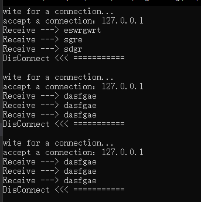

# Sockets(套接字)

套接字为通信的端点。通过网络通信的每`对`进程需要使用一`对`套接字。

套接字组成: `IP地址 + 端口号`

套接字采用`客户机`——`服务器`架构。

服务器通过监听指定端口，来等待客户请求。

实现特定服务的服务器监听众所周知的端口:
* telent服务器端口,23
* ftp服务器监听端口,21
* web或http服务器,80

所有低于1024的端口都是众所周知的。

### 客户端
发出请求Socket: 客户端IP + 大于1024且唯一的端口号。
例如: 146.86.5.20:1625
所有连接都必须是唯一的，当另一个进程与同一个服务器建立连接时，应该被分配大于1024且不等于1625的端口。

IP 127.0.0.1为特殊IP，回送(loopback),它引用自己，这一机制允许同一主机的客户机和服务器可以通过TCP/IP协议进行通信。

# BSD Sockts API
`伯克利套接字(Berkeley sockets)`定义了一组用于进程间Sockets通信的通用API,sockets的实现依赖于不同的操作系统各有所不同，在实现了BSD Sockets接口的操作系统上，就可以很方便地移植采用BSD Sockets API的应用程序。所有现代操作系统都实现了BSD Sockets。

#### 常用API:
* socket() 创建Socket,分配一些系统资源。
* bind() 通常用于服务端，将一个socket和一个socket地址结构关联，它指定了本地IP地址和端口号,可设定为绑定到本机的任何IP。
* listen() 用在服务端，使得一个被绑定的TCP socket进入监听状态。
* connect() 用在客户端，分配给Socket一个空闲的端口号，对于TCP Socket,还会尝试建立一个新的TCP连接。
* accept() 用在服务端，它接受来自远程客户端的创建TCP连接的请求`(connect)`，并创建一个新的Socket来表示这次连接两端的Sockets。
* send(), recv(), sendto(), and recvfrom() 用于发送和接收数据，标准IO函数`write()`和`read()`也可以使用。
* close() 使系统释放一个socket的资源，在TCP下，连接会终止。
* gethostbyname() and gethostbyaddr() 用于获取host名字和地址。仅在IPv4下可用。
* select() 用于挂起，等待列表中的一个或多个套接字准备好读取或写入或出现错误。
* poll() 检查在socket集合中的一个socket的状态。这个集合可以被测试是否有socket可以被写入或读出或出现错误。
* getsockopt() 获取一个socket的的指定socket 选项的当前值。
* setsockopt() 设置一个socket的指定socket选项的值。

# UE4 Sockets

UE4针对众多不同的操作系统的不同的Socket实现提供了同一的Socket编程接口。由于几乎所有操作系统都实现了BSD socket接口，利用这一点可以方便地统一一些基本的Socket接口。同时，不同的操作系统也提供了一些差异化的操作，这些操作由`ISocketSubsystem`定义。

## class FSocket

这个类定义了类似于BSD socket API 的抽象接口。包括:

    Close(),Bind(),Listen(), Connect(),Accept(),Send(),Recv(),等操作。

此外，还有一些便利操作:
```
WaitForPendingConnection(),HasPendingConnection(),可判断是否有连接请求。
HasPendingData(),查询是否有即将到来的数据可以接收。
RecvMulti(),一次读取多个数据包，
```

还有许多其它操作...

## class FSocketBSD

`FSocketBSD`继承自`FSocket`，它实现了所有`FSocket`的接口，跨平台的操作就是在这里实现的。

首先会通过`PLATFORM_HAS_BSD_SOCKETS`判断当前平台是否支持BSD socket接口，以决定是否定义`FSocketBSD`类。

在`BSDSockets/SocketSubsystemBSDPrivate.h`文件中，根据不同的平台包含不同平台的`BSD socket API`实现头文件。并统一原始Socket对象的类型为`SOCKET`，这一类型在`WinSock`中有定义:
```c++
    typedef UINT_PTR        SOCKET;
```
但在其它平台则没有，比如在`Unix`系统下就直接用的int类型表示socket对象指针。所以在其它情况下还会加上一些类型别名：
```c++
    typedef int32 SOCKET;
    // ... ...
```
它的几个成员变量:
```c++
	/** Holds the BSD socket object. */
	SOCKET Socket;

	/** Last activity time. */
	double LastActivityTime;

	/** Pointer to the subsystem that created it. */
	ISocketSubsystem* SocketSubsystem;
```
其中`SocketSubsystem`表示的是创建这个`FSocketBSD`的子系统，其中定义的是平台特异的操作。

## class ISocketSubsystem

这是抽象平台特异的sockets API的基本接口。其功能有:
* Get(const FName&) 获取指定平台的`ISocketSubsystem`单例。
* 不同平台的初始化操作
* 创建和销毁Sockets。
* Host name 到IP address 的域名解析。包括异步的域名解析。
* 创建恰当的`FInternetAddr`表示。
* CreateRecvMulti()
* TMap<FString, TSharedPtr<FInternetAddr> > HostNameCache; host Name的缓存

### class FSocketSubsystemBSD

此外，它还派生出`FSocketSubsystemBSD`对应于`FSocketBSD`。它实现了标准的BSD支持的一些socket 子系统的操作。

也是在这里，实现了CreateSocket(), 其中也是调用了平台特异的BSD socket API `socket()`实现的。先通过平台特异的原始`socket()`构造函数创建`SOCKET`，这一步其实将所有支持BSD socket API 的操作系统都考虑了进去，再进一步创建`FSocketBSD`，最后根据`ISocketSubsystem`定义的接口，返回`FSocket`.

## Observe

UE 定义的这一`Socket`模块，大体上分两个主要的继承线路，一个是`FSocket`是表示通信的一端的socket，定义了BSD 中的常规操作，以及一些额外的便利操作`(RecvMulti())`。另一条是`ISocketSubsystem`,这是抽象平台特异的功能的基本接口，同时也负责FSocket对象的创建，域名解析等其它功能。

通常情况下，下一步就可以是各个平台的FSocket 和ISocketSubsystem的派生实现了，但是，考虑到几乎所有操作系统都实现了BSD socket API，所以先加了一层`FSocketBSD`和`FSocketSubsystemBSD`，也是在这里,两者产生了直接引用，`FSocketBSD`保存了一个`ISocketSubsystem`指针。这一层其实已经实现了绝大部分的功能。

再往后就是每个平台的继承和实现，大多数只是`Subsystem`部分的`Create()`,`Init()`等操作，部分的`FSocketBSD`有继承下来改动Multi相关的操作。

`ISocketSubsystem::Get()`获取不同平台的单例`ISocketSubsystem`实例,在其上进一步调用`CreateSocket`创建`FSocket`.

UE4 采用`Module`来管理不同的平台`ISocketSubsystem`的创建和销毁。`FSocketSubsystemWindows`调用`CreateSocketSubsystem`和`DestroySocketSubsystem`来创建和销毁子系统。这两个函数extern 声明在`SocketSubsystem.cpp`中，而对应对每个平台的`Subsystem`类的`cpp`文件中都实现了这两个函数.

因此,Socket模块总的使用流程是：
1. ISocketSubsystem::Get(const FName& SubsystemName)获取一个指定平台Name的子系统。
2. ISocketSubsystem::Get中定义了一个静态结构体变量,它只有一个成员`FSocketSubsystemModule`，在这个静态变量初始化的时候，用`FModuleManager::LoadModuleChecked<FSocketSubsystemModule>("Sockets")`的返回值初始化`FSocketSubsystemModule`成员变量。最后返回GetSocketSubsystem(SubsystemName)的返回值。
3. `FSocketSubsystemModule`在加载时就会初始化一个默认的子系统，通过直接调用CreateSocketSubsystem( *this )构建一个默认子系统,至于调用的是什么平台的实现版本，是由什么决定的?
4. 在获取到了一个`ISocketSubsystem`后，就可以调用`ISocketSubsystem::CreateSocket`创建一个相关平台的`Socket`,这个`Socket`的动态类型可能是`FSocketBSD`，也可能是相关平台定义的子类比如`FSocketBSDIOS`,这又取决于这个子系统的动态类型，最终又取决于调用`ISocketSubsystem`的静态函数`Get`时的参数`SubsystemName`通常应该是此时运行的平台。


## 判断服务端与客户端的连接状态
UE4中判断连接状态是通过`FSocket::GetConnectionState()`,它通过调用`select`函数判断`socket`的读写及错误状态得出的连接状态。

但是，在windows 平台下，UE 4.23并不能正确获取到连接状态。当客户端调用`closesocket`关闭连接后，在服务端调用`GetConnectionState()`仍然返回的`ESocketConnectionState::SCS_Connected`。
```c++
ESocketBSDReturn FSocketBSD::HasState(ESocketBSDParam State, FTimespan WaitTime)
{
#if PLATFORM_HAS_BSD_SOCKET_FEATURE_SELECT
	// convert WaitTime to a timeval
	timeval Time;
	Time.tv_sec = (int32)WaitTime.GetTotalSeconds();
	Time.tv_usec = WaitTime.GetFractionMicro();

	fd_set SocketSet;

	// Set up the socket sets we are interested in (just this one)
	FD_ZERO(&SocketSet);
	FD_SET(Socket, &SocketSet);

	timeval* TimePointer = WaitTime.GetTicks() >= 0 ? &Time : nullptr;

	// Check the status of the state
	int32 SelectStatus = 0;
	switch (State)
	{
	case ESocketBSDParam::CanRead:
		SelectStatus = select(Socket + 1, &SocketSet, NULL, NULL, TimePointer);
		break;

	case ESocketBSDParam::CanWrite:
		SelectStatus = select(Socket + 1, NULL, &SocketSet, NULL, TimePointer);
		break;

	case ESocketBSDParam::HasError:
		SelectStatus = select(Socket + 1, NULL, NULL, &SocketSet, TimePointer);
		break;
	}

	// if the select returns a positive number, the socket had the state, 0 means didn't have it, and negative is API error condition (not socket's error state)
	return SelectStatus > 0 ? ESocketBSDReturn::Yes :
		SelectStatus == 0 ? ESocketBSDReturn::No :
		ESocketBSDReturn::EncounteredError;
#else
	UE_LOG(LogSockets, Fatal, TEXT("This platform doesn't support select(), but FSocketBSD::HasState was not overridden"));
	return ESocketBSDReturn::EncounteredError;
#endif
}
```
其主要是通过函数`HasState`调用`select`判断`socket`的可读、可写的状态以及错误信息。

	当一个`socket`没有出现错误信息，且(可读或可写)时就判定为已连接状态。

但是，这样判断是不对的，`socket`可读可写并不代表它的连接状态就正常，这里，我们需要深刻理解`select()`函数的意义。接下来，探讨用`select()`函数判断连接状态的可能性以及其它方法。

#### select()

```c++
int select(
  int           nfds,
  fd_set        *readfds,
  fd_set        *writefds,
  fd_set        *exceptfds,
  const timeval *timeout
);
```
此函数用于确定一个或多个`socket`的状态。对每一个`socket`，调用者可查询它的可读性、可写性及错误状态信息。用结构体 `fd_set` 来表示一组等待检查的`socket`。在调用返回时，这个结构存有满足一定条件的`socket`组的子集，并且`select()`返回满足条件的`socket`的数目(大于0)，若返回值为0则表示超时，-1表示出错。有一组宏可用于对 `fd_set` 的操作（宏的功能有：把套接口放入 `fd_set` 结构、清除 `fd_set` 结构中的某个`socket`、检查个`socket`是否可读可写等）


`maxfdp1`：等于成功创建的`socket`个数，`socket()`返回的整数范围为`0~NUM_SOCKETS-1`，`NUM_SOCKETS`为最多能创建的个数，所以`maxfdp1`一般取值为`socket()`返回的最大值`+1`.

`readset`：（可选）指针，指向一组等待可读性检查的`socket`。如果该`socket`正处于`listen()`状态，则若有连接请求到达，该`socket`便被标识为可读，这样一个`accept()`调用保证可以无阻塞完成。对其它状态而言，可读性意味着有数据供读取，于是`recv()`或`recvfrom()`操作均能无阻塞完成.

`writeset`：（可选）指针，指向一组等待可写性检查的`socket`。如果一个`socket`正在`connect()`连接（非阻塞），可写性意味着连接顺利建立。如果套接口并未处于`connect()`调用中，可写性意味着`send()`和`sendto()`调用将无阻塞完成

`exceptset`：（可选）指针，指向一组等待错误检查的`socket`。

`timeout`：`select(`)最多等待时间，对阻塞操作则为`NULL`.

不需要查看的形参可以设为`NULL`

返回值：
* < 0：`select`执行错误
* \> 0：可读、可写或出错的`socket`数目
* == 0：等待超时，没有可读写或错误的文件 

讲道理，按上面UE的判断方式似乎可以判断连接状态，既然可读或可写,那自然连接应该是正常的，而且`select`的参数的描述也是说的`保证accept, recv, recvXXX, connect, send, sendXXX可以无阻塞地完成`,但是不要忘了一点, 当连接断开时，`recv, send`也是可以无阻塞地完成的（立即返回0 或 -1）, 因此这个时候`select`会判断这个断开的`socket`是可读与可写的！

参考`Winsock2 API`的[文档](https://docs.microsoft.com/en-us/windows/win32/api/winsock2/nf-winsock2-select#remarks), 其中描述了对于面向连接的`socket`，可读性也可能表示来自`peer`的一个关闭请求,此时当所有之前的可读数据都收到之后，`recv`会立即返回0.

因此，用`select`判断`socket`已断开的充分条件是：

* `socket`可读 且 `recv`返回0.

下面这个例子中，先创建了一个`socket server`, 并监听3019端口， 然后开始循环，先阻塞和客户端建立连接，然后循环调用`select`判断是否有数据，没有就做其它事情，如果有，则有`真的有数据`和`断开`两种情况，有则读取，没有则表明客户端断开了连接，则`server`开始新一轮的`accept`.
```c++
int main(int argc, char* argv[])
{
    //init WSA  
    WORD sockVersion = MAKEWORD(2, 2);
    WSADATA wsaData;
    if (WSAStartup(sockVersion, &wsaData) != 0)
    {
        return 0;
    }

    // create server
    SOCKET server = socket(AF_INET, SOCK_STREAM, IPPROTO_TCP);
    if (server == INVALID_SOCKET)
    {
        printf("socket error !");
        return 0;
    }

    // bind
    sockaddr_in sin;
    sin.sin_family = AF_INET; 
    sin.sin_port = htons(3019);
    sin.sin_addr.S_un.S_addr = INADDR_ANY;// any local address
    if (bind(server, (LPSOCKADDR)&sin, sizeof(sin)) == SOCKET_ERROR)
    {
        printf("bind error !");
    }

    // listen
    if (listen(server,1) == SOCKET_ERROR)
    {
        printf("listen error !");
        return 0;
    }
    SOCKET client = NULL;
    while (true)
    {
        if (client == NULL)
        {
            // 等待一个连接
            // slisten.WiteForConnection();
            sockaddr_in remoteAddr;
            int nAddrlen = sizeof(remoteAddr);

            printf("wite for a connection...\n");
            while ((client = accept(server, (SOCKADDR*)&remoteAddr, &nAddrlen)) == INVALID_SOCKET)
            {
                printf("Connect failed, try agin\n");
            }
            printf("accept a connection：%s \r\n", inet_ntoa(remoteAddr.sin_addr));
        }
        else
        {
            fd_set SocketSet;
            // Set up the socket sets we are interested in (just this one)
            FD_ZERO(&SocketSet);
            FD_SET(client, &SocketSet);

            timeval t = { 0,0 };
            // Check the status of the state
            const int SelectStatus = select(client + 1, &SocketSet, NULL, NULL, &t);
            if (SelectStatus > 0) // readable
            {
                char revData[255];

                //接收数据  
                int ret = recv(client, revData, 255, 0);
                if (ret > 0) // have data
                {
                    revData[ret] = 0x00;
                    printf("Receive ---> %s\n", revData);
                }
                else // ret <=0 , connection break
                {
                    printf("DisConnect <<< ===========\n\n");
                    closesocket(client);
                    client = NULL;
                }
            } // Can't read
			else
			{
				// do something eles.
			} 
        }
    } 
    closesocket(server);
	return 0;
}
```


在UE4 提供的`FSocket`接口中没有直接操作`select`的方法，可以将其转换为`FSocketBSD`,调用`GetNativeSocket`获取到原始的`SOCKET`句柄,就可以直接对其进行`select,send,recv`等操作，只需包含`"SocketSubsystemBSDPrivate.h"`,它处理了平台相关的`socket`头文件包含。

#### send()

向一个已经连接的socket发送数据。

```c++
int send(
  SOCKET     s,
  const char *buf,
  int        len,
  int        flags
);
```
向socket s发送buf中的数据, len表示buf中数据长度。

重点在返回值，如果没有错误出现,返回的则是已发送的`bytes`数,它有可能小于`len`参数指定的大小。如果有错误出现，则返回`SOCKET_ERROR`.
```c++
#define SOCKET_ERROR            (-1)
```
因此,使用这一方法可以判断一个连接是否断开。[引用一句话](https://stackoverflow.com/questions/283375/detecting-tcp-client-disconnect):
```
There is also only one reliable way to detect a broken connection: by writing to it. 
```

你可能会想到这样调用`send()`来判断连接状态
```c++
send(socket, nullptr, 0,0);
```
[这种调用是允许的](https://docs.microsoft.com/zh-cn/windows/win32/api/winsock2/nf-winsock2-send#remarks)，通常情况下会返回0.但这并不代表连接状态是OK的。即使连接断开，如果在断开之后没有用`len!=0`的参数调用过`send`使其返回`-1`，而是直接像上面那样调用,它会直接返回0. 也就是说，`len==0`的参数调用`send`无法通过其返回值判断连接是否断开。

仅当通过`len!=0`的参数调用`send`并返回`-1`后，用`send(socket, nullptr, 0,0)`调用才会返回`-1`.

### reference:
* BSD Socket: https://www.cnblogs.com/god-of-death/p/7152387.html

* Select 函数: https://www.cnblogs.com/gangzilife/p/9766292.html

* select : https://docs.microsoft.com/en-us/windows/win32/api/winsock2/nf-winsock2-select#remarks

* 判断连接状态：https://stackoverflow.com/questions/283375/detecting-tcp-client-disconnect

