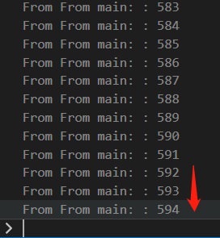

# 死锁

某个资源被多个锁保护时(可能一个锁是因为安全的原因，另一个锁是因为文件系统), 如果两个以上的线程在访问这一资源时的加锁顺序不同，则有可能会导致死锁。
```c++
class LogFile
{
private:
    // security reason
    std::mutex _mu;
    // filesystem reason or whatever
    std::mutex _mu2;
    ofstream _f;
public:
    LogFile()
    {
        _f.open("log.txt");
    }
    void shared_print(string id, int value)
    {
        std::lock_guard<std::mutex> locker2(_mu); 
        std::lock_guard<std::mutex> locker(_mu2);

        cout << "From " << id << ": " << value << std::endl;
    }
    void shared_print2(string id, int value)
    {
        std::lock_guard<std::mutex> locker2(_mu2);
        std::lock_guard<std::mutex> locker(_mu);

        cout << "From " << id << ": " << value << std::endl;
    }
    ~LogFile()
    {
        _f.close();
    }
};

void function_1(LogFile& log)
{
    for(int i = 0; i > -1000; i--)
    log.shared_print2("t1", i);
}

int main()
{
    LogFile log;
    std::thread t1(function_1, std::ref(log));
    for(int i = 0; i < 1000; i++)
        log.shared_print(("From main: "), i);
    t1.join();
    return 0;
}
```
上面的程序中，主线程和t1线程都在使用`log`对象的两个不同的成员函数访问同一资源`cout`(方便调试), 且两个函数加锁的顺序不同，运行这个程序就有可能出现死锁:



即程序卡在某个地方不动了，如上图所示(如果你运行时没有出现,请多运行几遍)。主线程在打印出549之后再也没动过，原因是,在主线程调用`shared_print`打印595时，`shared_print`刚运行到给`_mu`加锁,此时`t1`线程终于想起来它也该运行了，于是它调用了`shared_print2`，先给`_mu2`加上了锁。此时此刻,`_mu`和`_mu2`分别再同一时刻被两个不同的线程加上锁,再往后,这两个线程准备继续推进时,发现它们各自接下来想访问的锁都是被对方锁上的，于是它们都等待对方释放锁,但实际情况时谁也不可能再释放锁了。

为解决这一问题, 一个简单的办法是让所有访问这一资源的地方的加锁顺序相同，如:
```c++
// ...
void shared_print(string id, int value)
{
    std::lock_guard<std::mutex> locker2(_mu); 
    std::lock_guard<std::mutex> locker(_mu2);
    cout << "From " << id << ": " << value << std::endl;
}
void shared_print2(string id, int value)
{
    std::lock_guard<std::mutex> locker2(_mu);
    std::lock_guard<std::mutex> locker(_mu2);//<---
    cout << "From " << id << ": " << value << std::endl;
}
// ...
```
但是,往往难以保证每个地方都是按同一顺序加锁的,所以标准库提供了`std::lock`函数同时对多个锁加锁,
```c++
void shared_print(string id, int value)
{
    std::lock(_mu, _mu2);
    std::lock_guard<std::mutex> locker2(_mu, std::adopt_lock);
    std::lock_guard<std::mutex> locker(_mu2, std::adopt_lock);
    cout << "From " << id << ": " << value << std::endl;
}
void shared_print2(string id, int value)
{
    std::lock(_mu, _mu2);
    std::lock_guard<std::mutex> locker2(_mu, std::adopt_lock);
    std::lock_guard<std::mutex> locker(_mu2, std::adopt_lock);
    cout << "From " << id << ": " << value << std::endl;
}
```
`std::lock()`采用了一些避免死锁的算法,可以安全地对多个锁加锁。在后面的`std::lock_guard()`我们需要传入第二个参数`std::adopt_lock`告诉`std::lock_guard()`这个锁已经加上了,它需要做的只是在程序运行到超出当前范围时释放锁即可。

通常情况下我们没有必要同时对多个锁加锁, 此时我们应该分别使用这些锁：
```c++
{
    std::lock_guard<std::mutex> locker2(_mu);
    usr_function(); // never do this
    // do something..
}
{
    std::lock_guard<std::mutex> locker(_mu2);
    cout << "From " << id << ": " << value << std::endl;
}
```
还要注意不要在一个锁保护的范围内调用用户实现的函数(usr_function)，你永远不知道它会干啥,它有可能会阻塞在另外一个锁上, 或者再对同一个锁加锁。
## 避免死锁
* 评估你是否真的需要同时对多个锁加锁,尽量避免同时使用多个锁,
* 避免在加锁后调用用户提供的函数。
* 在使用多个锁时, 用`std::lock()`对多个锁加锁。
* 在不可能用`std::lock()`时, 以同一顺序对多个锁加锁。(hierarchy of mutex)

## 加锁粒度
- 细粒度锁: 保护少量数据
- 粗粒度锁: 保护大量的数据