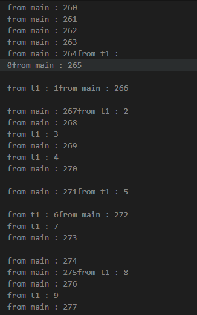
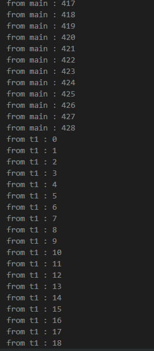
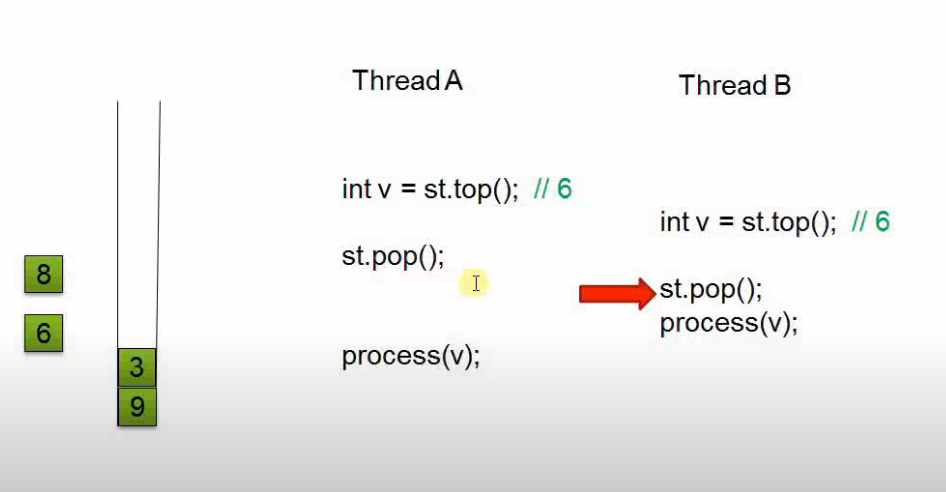

# Threading: Data Race and Mutex


## std::thread 
`std::thread`对象代表一个个执行线程。

`thread of execution`(执行线程)是一系列可以和其它指令序列在多线程环境中并发执行的指令序列，并共享同一地址空间。

一个被初始化的`thread`对象表示一个活跃的执行线程;这样的一个`thread`对象是`joinable`的，并且有一个唯一的`thread id`。

一个默认构造（未初始化）的`thread`对象不是`joinable`，它的`thread id`和所有`non-joinable`的线程一样。

当一个`joinable`的线程被`move`，或在其上调用`join`或`detach`，它会变为`not joinable`。

```c++
void join();
```

当线程执行完成时返回。

它同步了这个函数返回和线程中的所有操作都执行完的时刻。

而
```c++
void detach();
```
分离了这一线程本身和它的调用线程,使得它们独立执行。

## Race Condition and Mutex

```c++
void func_1()
{
    for (size_t i = 0; i < 100; i++)
    {
        std::cout << "from t1 : " << i << std::endl;
    }
}

int main()
{
    std::thread t1(func_1);

    for (size_t i = 0; i < 500; i++)
    {
        std::cout << "from main : " << i << std::endl;
    }

    t1.join();
    return 0;
}
```
主线程和t1线程都在竞争`std::cout`，使得程序的运行结果依赖于两个进程时间上推进的先后顺序，即竞争条件。


可以用`mutex`同步对共享资源`std::cout`的访问。
```c++
std::mutex mu;

void shared_print(string msg, int id)
{
    mu.lock();
    // if there throw a exception，then our mutex will end up being locked forever.
    std::cout << msg << " : " << id << std::endl;
    mu.unlock();
}

void func_1()
{
    for (size_t i = 0; i < 100; i++)
    {
        shared_print("from t1", i);
    }
}

int main()
{
    std::thread t1(func_1);

    for (size_t i = 0; i < 500; i++)
    {
        //std::cout << "from main : " << i << std::endl;
        shared_print("from main", i);
    }

    t1.join();
    return 0;
}
```


这里还有一个问题，如果`lock`和`unlock`之间的代码抛出异常，那么就不能正确执行`unlock`，这会导致`mu`永远处于`lcok`的状态，为解决这一问题，我们可以在一个`scope`开始处这样操作:
```c++
void shared_print(string msg, int id)
{
    // whenever the guard goes out of scope the mu sill always be unlocked
    std::lock_guard<std::mutex> guard(mu); // RAII
    //mu.lock();
    // if there throw a exception，then our mutex will end up being locked forever.
    // so not to use mutex lock and unlock directly, instead use a std::lock_guard<std::mutex>
    std::cout << msg << " : " << id << std::endl;
    //mu.unlock();
}
```
这样,一旦`guard`超出作用范围,它就会自动释放`mu`，无论有没有异常出现。

此外,由于`std::cout`是全局变量,其它线程仍然可以直接访问它(不通过`shared_print`).所以我们通常需要封装一个类来管理这样需要多个线程同时访问的资源。
```c++
// thread safe
class LogFile 
{
private:
    std::mutex m_mutex;
    ofstream f;
public:
    LogFile(/* args */)
    {
        f.open("log.txt");
    }
    ~LogFile(){}

    void shared_print(string msg, int id)
    {
        // whenever the guard goes out of scope the mu sill always be unlocked
        std::lock_guard<std::mutex> guard(mu); // RAII
        //mu.lock();
        // if there throw a exceptsion，then our mutex will end up being locked forever.
        // so not to use mutex lock and unlock directly, instead use a std::lock_guard<std::mutex>
        std::cout << msg << " : " << id << std::endl;
        //mu.unlock();
    }

    // Never return f to the outside world
    ofstream& getStream(){ return f;}

    // Never pass f as an augument to user provided function
    void processf(void fun(ofstream&))
    {
        fun(f); // fun can print to f witout lock, or close f etc..
    }
};
```
这样一来，外部就只能通过`shared_print`使用`f`，这样就确保了每次对f的使用都在锁的保护之下。此外，为确保线程安全，`LogFile`不能将`f`返回给外部，也不能将其作为参数传给外部函数。也不应该用外部的`ofstream`来初始化`f`.

考虑'STL'的'stack'的接口设计:

```c++
class stack{
private:
    int *data;
    std::mutex _mu;
public:
    // not thread safe
    void pop(); // pops off the item on top od the stack
    int& top(); // return the item on top
    // ...
};
```
当用在不同的线程中，用以下函数调用同一个`stack`时
```c++
void fun2(stack& stk)
{
    int v = stk.top();
    stk.pop();
    process(v);
}
```
虽然，`stack`中的单个接口都是线程安全的，但`top()`和`pop()`组合起来就不是了。



可以看到,由于多个线程`pop()`和`top()`执行顺序的不同，会导致不同的结果。在这里线程A和B都处理了同一个元素6，而元素8将永远不会被处理。

解决这一问题办法就是把`pop()`和`top()`合成一个接口, 即

```c++
    // ...
    int pop();
    // ...
```
这样在`pop`元素的同时返回元素的值，无需先调用`top`操作查询栈顶的值，以此达到了线程安全。但同时也导致了另外一个问题,这个`pop`操作变得不是异常安全`(exception safe)`的。这也是STL的`stack`接口的设计权衡。

## 总结
避免数据竞争的方法:
1. 使用`mutex`同步数据访问
2. 永远不要将数据泄露到类外部。
2. 恰当地设计接口。
