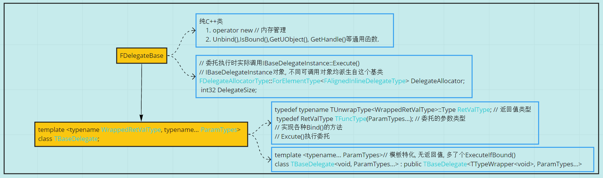
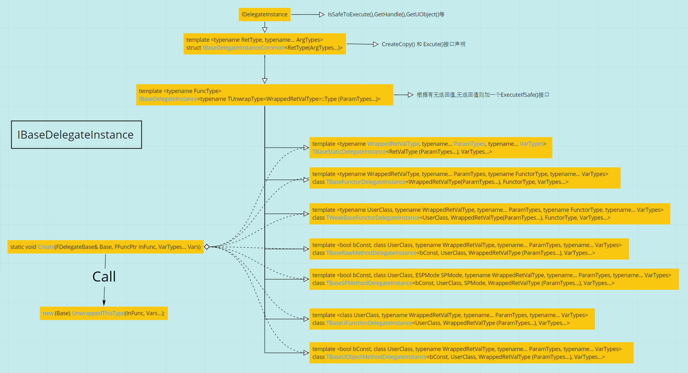
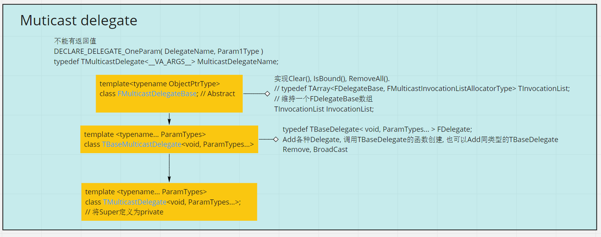
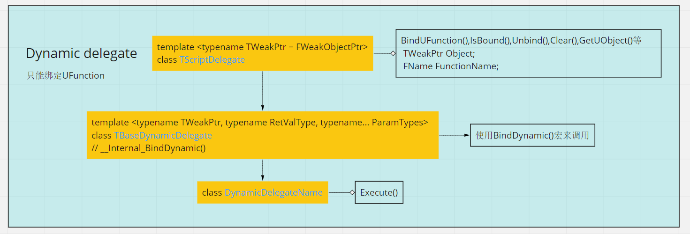
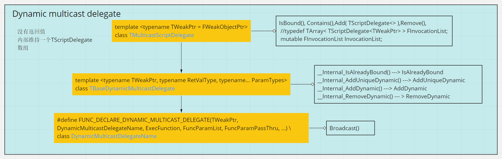

## Introduction to Delegate
在UE4的实现中, 委托可绑定到任何的c++可调用对象, 全局函数(静态成员函数), 类的非静态成员函数,Lambda 以及 按Name 绑定到UFunction.尔后可在恰当的时机调用它。

简单来说,由于不同的可调用对象的调用方式差别巨大,所以我们需要把这些可调用对象统一成一个东西, 即`Delegate`, 不同的`Delegate`之间仅仅是所代表的可调用对象的参数和返回值类型不同。而具体的调用方式, 则根据你绑定的可调用对象的形式而定.

最简单的, 全局函数, 仅需该函数的函数指针就可以调用:
```c++
class MyClass
{
public:
    static int MyStaticMemberFunc(std::string)
    {
        return 0;
    }
};

int Func1(std::string str)
{
    // balabala
    return 1;
}

int main()
{
    using Func1Type = int (* )(std::string );

    // Create delegate 
    Func1Type MyDelegate = &Func1;
    Func1Type MyDelegate2 = &MyClass::MyStaticMemberFunc;
    // ********

    // Call delegate in other context
    int Ret1 = (*MyDelegate)("Call Delegate somewhere");
    int Ret2 = (*MyDelegate2)("Call Delegate somewhere else");
}
```
而对于非静态成员函数:
```c++
class MyTest 
{
    public:
    int MemberFunc1(std::string str)
    {
        std::cout << ret << "--------->" << str << std::endl; 
        return 2;
    }
};

int main()
{
    using Func1PtrTypeOfClassMyTest = int (MyTest::* )(std::string );

    Func1PtrTypeOfClassMyTest Func1Ptr = &MyTest::MemberFunc1;

    MyTest* MyObj = new MyTest();
    MyTest StackObj;
    
    int Ret1 = (MyObj->*Func1Ptr)("Call func via member function pointer ");
    int Ret2 = (StackObj.*Func1Ptr)("Call from stack Object");
}
```
不必在意过多细节, 你只需要意识到不同的可调用对象的调用方式有着较大的差别, 我们必须采取一些手段将他们统一封装起来.除了上述两种情况, UE4中Delegate还处理了lambda、weak lambda、基于shared pointer的成员函数(还有线程安全版本)、UFunction等。  

## UE4 中Delegate的组织方式

UE中有四类委托:
1. 单播委托
绑定单个可调用对象, 支持返回值.
2. 多播委托
可以绑定多个可调用对象, 实质是维持了一个单播委托的数组, 调用时一个个调用.没有返回值.
3. 事件
其实就是多播委托, 只是比多播委托多了个`friend class OwningType;`
4. 动态委托
同样分为单播和多播,意义和上面一样. 只能绑定UFUNCTION, 支持序列化, 可在蓝图中使用, 可以有UPROPERTY修饰,上面三种都不可以.

其中核心的是单播委托, 

## 1. 单播委托

通常, 我们会通过一些预先写好的宏来声明一个委托类型:
```c++
DECLARE_DELEGATE_RetVal_OneParam(int, MyDelegateType, FString);
```
其实质是:
```c++
typedef TBaseDelegate<int, FString> MyDelegateType;
```
将委托的返回类型和参数类型作为模板参数传给`TBaseDelegate`,同时定义它的别名为我们传入的委托名字。后面我们就可以用这个别名来创建指定类型的委托对象.同时,在UE4中,其以T开头的类名也告诉我们, 它只是一个普通的C++模板类.当我们用那些宏声明不同的参数类型的委托时, 只是简单地定义了一个`TBaseDelegate`模板类实例的别名。
```c++
// 模板类TBaseDelegate
template <typename WrappedRetValType, typename... ParamTypes>
class TBaseDelegate;
```
其第一个模板参数类型是返回值类型, 后面是可变参数, 表示委托调用时要传入的参数类型及数目。因此定义这个模板的实例至少需要一个参数作为返回值类型。因此我们可以得到, 通过宏定义的一些委托类型其实是这样的:
```c++
TBaseDelegate<void> DelegateNoRetNoParam;
TBaseDelegate<int> DelegateIntRet;

TBaseDelegate<void, FString> DelegateNoRetStringParam;
TBaseDelegate<int, FString> DelegateIntRetStringParam;
// ... ...
```
当我们的委托的参数类型越来越多,且类型越来越复杂时, 直接这样写将是一场灾难(想象一下你每定义一个这种委托的对象都要写一遍它的模板参数...)。而用引擎提供的宏, 在声明委托类型的同时又定义了一个简短的别名, 这将大大地方便了委托的使用。

### 1.1 类层次结构

由上述可知, 我们直接使用的是`TBaseDelegate`, 委托类型的定义, 函数的绑定和执行都是直接在它上面调用的. 此外它继承了`FDelegateBase`。其继承结构如下:


### 1.2 BindXXX and CreateXXX
`TBaseDelegate`中实现了两大类创建Delegate的方法, `BindXXX` 和 `CreateXXX`, `TBaseDelegate::CreateXXX`是静态成员函数, 它创建一个`TBaseDelegate`实例并返回, 根据绑定的可调用对象不同有着不同`CreateXXX`方法.比如最简单的绑定一个全局函数(或静态成员函数),细节在后面讨论:
```c++
template <typename... VarTypes>
FUNCTION_CHECK_RETURN_START
inline static TBaseDelegate<RetValType, ParamTypes...> CreateStatic(typename TIdentity<RetValType(*)(ParamTypes..., VarTypes...)>::Type InFunc, VarTypes... Vars)
FUNCTION_CHECK_RETURN_END
{
	TBaseDelegate<RetValType, ParamTypes...> Result;
	TBaseStaticDelegateInstance<TFuncType, VarTypes...>::Create(Result, InFunc, Vars...);
	return Result;
}
```
与每一个`CreateXXX`对应的有一个`BindXXX`, 可以看到, 它只是简单地调用对应的`CreateXXX`版本, 并将其返回值赋给自身`*this`:
```c++
template <typename... VarTypes>
inline void BindStatic(typename TBaseStaticDelegateInstance<TFuncType, VarTypes...>::FFuncPtrInFunc, VarTypes... Vars)
{
	*this = CreateStatic(InFunc, Vars...);
}
```
这里由于`CreateXXX(...)`返回的是一个右值(临时对象,在等号右边, 不能访问地址),所以调用的是(*this)的`Move assigment operator`, 将创建的`TBaseDelegate`绑定到自身.这便是创建一个委托的过程。

在每一个`CreateXXX`中, 都根据不同的可调用对象的类型, 调用不同的`DelegateInstance`的`Create`方法, 
```
CreateStatic()     ---> C++ 原始全局函数指针(包括静态成员函数) ---> TBaseStaticDelegateInstance<...>::Create(...)
CreateLambda()     ---> Lambada 可调用对象                   ---> TBaseFunctorDelegateInstance<...>::Create(...)
CreateWeakLambda() ---> weak object C++ lambda delegate     ---> TWeakBaseFunctorDelegateInstance<...>::Create(...)
CreateRaw()        ---> C++ 原始成员函数委托                 ---> TBaseRawMethodDelegateInstance<...>::Create(...)
CreateSP()         ---> 基于共享指针的成员函数委托            ---> TBaseSPMethodDelegateInstance<...>::Create(...)
CreateUFunction()  ---> 基于UFunction的成员函数委托          ---> TBaseUFunctionDelegateInstance<...>::Create(...)
CreateUObject()    ---> 基于UObject的成员函数委托            ---> TBaseUObjectMethodDelegateInstance<...>::Create(...)
```



### 1.3 TBaseDelegate 内存管理---> FDelegateBase

对于不同的可调用对象, 其占用的内存空间也不尽相同, 对于全局函数只要一个函数指针即可, 而对于一个成员函数, 则至少要一个对象的指针和成员函数指针. 此外，在绑定时可能还需要将一些参数也保存下来, 以便在将来调用这个委托时将这些参数也传进来, 因此一个`IBaseDelegateInstance`对象的大小还是很可观的。这些委托实例的创建销毁是由`TBaseDelegate`来管理的(实际在它的父类FDelegateBase中).

这些`TBase_XXX_DelegateInstance`均从`IBaseDelegateInstance`派生而来, 在`Create`函数中, 他们都调用了一个在`DelegateBase.h`中定义的`placement new`:

```c++
inline void* operator new(size_t Size, FDelegateBase& Base)
{
	return Base.Allocate((int32)Size);
}
```

且它在`FDelegateBase`中被声明为`friend`.由此也不难理解每一个`Create`函数的第一个参数都是`FDelegateBase& Base`。以`CreateStatic`为例：

```c++
FORCEINLINE static void Create(FDelegateBase& Base, FFuncPtr InFunc, VarTypes... Vars)
{
	new (Base) UnwrappedThisType(InFunc, Vars...);
}
// 其中, UnwrappedThisType是它自身的typedef
// typedef TBaseStaticDelegateInstance<RetValType (ParamTypes...), VarTypes...> UnwrappedThisType;
```

而这简单来说, 构造一个对象通常有三步, 
1. 申请内存空间
2. 对申请的内存空间进行类型转换
3. 在这块空间上调用类的构造函数.

其中`placement new`的作用就是第一步.而它转而调用了`Base.Allocate((int32)Size)`，在其中根据传进来的内存大小, 进行一系列操作, 调用`FMemory::Realloc`来最终得到内存空间, 这块空间保存在`FDelegateBase`的`DelegateAllocator`成员变量中,另一个成员`DelegateSize`保存了这个块空间的大小.接下来, 会在这块空间上调用对应的`TBase_XXX_DelegateInstance`的构造函数, 这样, `CreateXXX(FDelegateBase& Base, ...)`第一个参数就算拥有了一个构造好的`TBase_XXX_DelegateInstance`。

在`FDelegateBase`的析构函数中会调用`Unbind()`:

```c++
FORCEINLINE void Unbind( )
{
	if (IDelegateInstance* Ptr = GetDelegateInstanceProtected())
	{
		Ptr->~IDelegateInstance();
		DelegateAllocator.ResizeAllocation(0, 0, sizeof(FAlignedInlineDelegateType));
		DelegateSize = 0;
	}
}
```

其获取到上面那块内存, 并转为`IDelegateInstance`类型, 调用它的析构函数, 再归还这块内存.

### 1.4 参数绑定

在所有委托实例的实现中都可以接受额外的参数绑定, 假设有一个接受一个`int`参数的委托, 但我有一个有两个参数的函数, 其第一个参数也是`int`, 希望能够绑定到这个委托, 则可以在绑定的时候将第二个参数直接传进去:

```c++
DECLARE_DELEGATE_OneParam(MyDelegateOneParam, int)

// *********
void MyFunc(int i, FString str);

MyDelegateOneParam MyDelegate = MyDelegateOneParam::CreateStatic(&MyFunc, TEXT("My Payload parameter"));
```

这种实现要用到元组`TTuple<VarTypes...>`, 它可以表示任意数目任意类型的元素。涉及到的具体的细节比较麻烦, 不必深究.但其简单的作用方式还是容易明白的.还是以`TBaseStaticDelegateInstance`为例, 其构造函数:

```c++
TBaseStaticDelegateInstance(FFuncPtr InStaticFuncPtr, VarTypes... Vars)
	: StaticFuncPtr(InStaticFuncPtr)
	, Payload      (Vars...)
	, Handle       (FDelegateHandle::GenerateNewHandle)
{
	check(StaticFuncPtr != nullptr);
}
```

它直接将传入的Vars参数包扩展后用于初始化Payload, 就将这些参数保存了下来, 且`TBaseStaticDelegateInstance`的模板参数中包含了其成员`TTuple<VarTypes...> Payload;`的模板参数, 所以在绑定不同`Payload`参数时, 将实例化出不同的类.

在调用时:

```c++
virtual RetValType Execute(ParamTypes... Params) const override final
{
	// Call the static function
	checkSlow(StaticFuncPtr != nullptr);

	return Payload.ApplyAfter(StaticFuncPtr, Params...);
}
```

将保存的函数指针和委托参数传给TTuple::ApplyAfter():

```c++
template <typename FuncType, typename... ArgTypes>
#if PLATFORM_COMPILER_HAS_DECLTYPE_AUTO
	decltype(auto) ApplyAfter(FuncType&& Func, ArgTypes&&... Args) const
#else
	auto ApplyAfter(FuncType&& Func, ArgTypes&&... Args) const -> decltype(Func(Forward<ArgTypes>(Args)..., this->Get<Indices>()...))
#endif
{
	return Func(Forward<ArgTypes>(Args)..., this->template Get<Indices>()...);
}
```

`#if`只是在不同的编译器版本是否支持`decltype(auto)`下做出选择, 是否需要显示用`decltype`推导出返回值类型, `c++14`之后支持`decltype(auto)`.从`return`后的调用可以看出, `ApplyAfter`将绑定时传入的参数展开后应用在后面, 而将执行委托时传入的参数展开后放在函数调用的参数列表的前面。

其它类型的`DelegateInstance`也是如此，仅在调用方式上有所区别.

### 1.5 复制委托对象

前面提到, `TBaseDelegate`持有一块表示`IBaseDelegateInstance`的动态内存, 根据一些类设计的原则, 其拷贝构造, 析构函数, 赋值操作符, Move构造, 都需要自己实现. 其赋值操作的实现中, 会在被赋值对象上动态分配堆内存：
```c++
inline TBaseDelegate& operator=(TBaseDelegate&& Other)
{
	if (&Other != this)
	{
		// this down-cast is OK! allows for managing invocation list in the base class without requiring virtual functions
		TDelegateInstanceInterface* OtherInstance = Other.GetDelegateInstanceProtected();
		if (OtherInstance != nullptr)
		{
			OtherInstance->CreateCopy(*this);
		}
		else
		{
			Unbind();
		}
	}
	return *this;
}

// 对于TBaseStaticDelegateInstance
// IBaseDelegateInstance interface
virtual void CreateCopy(FDelegateBase& Base) override final
{
	new (Base) UnwrappedThisType(*(UnwrappedThisType*)this);
}
```
这样, `=`左边的对象会按右边的`IBaseDelegateInstance`构造一个一毛一样的委托实例. 所以通常, 委托尽量用引用传递.

这样的实现也是必要的, 如果直接按值拷贝, 呵呵.

## 2. 多播委托
多播委托, 即`TMulticastDelegate`,委托类型不可有返回值. 它内部维持了一个`FDelegateBase`数组。

在调用时：
```c++
void Broadcast(ParamTypes... Params) const
{
	bool NeedsCompaction = false;
	Super::LockInvocationList();
	{
		const TInvocationList& LocalInvocationList = Super::GetInvocationList();
		// call bound functions in reverse order, so we ignore any instances that may be added by callees
		for (int32 InvocationListIndex = LocalInvocationList.Num() - 1; InvocationListIndex >= 0; --InvocationListIndex)
		{
			// this down-cast is OK! allows for managing invocation list in the base class without requiring virtual functions
			const FDelegate& DelegateBase = (const FDelegate&)LocalInvocationList[InvocationListIndex];
			IDelegateInstance* DelegateInstanceInterface = Super::GetDelegateInstanceProtectedHelper(DelegateBase);
			if (DelegateInstanceInterface == nullptr || !((TDelegateInstanceInterface*)DelegateInstanceInterface)->ExecuteIfSafe(Params...))
			{
				NeedsCompaction = true;
			}
		}
	}
	Super::UnlockInvocationList();
	if (NeedsCompaction)
	{
		const_cast<TBaseMulticastDelegate*>(this)->CompactInvocationList();
	}
}
```
只是遍历这个数组然后一个个调用其`ExecuteIfSafe`方法， 注意,在每一个`TBase_XXX_DelegateInstance`的模板类实现中, 对返回类型为`void`的模板类实例都做了特化处理, 即增加了一个`ExecuteIfSafe`方法,这个方法在无法执行这个委托时时会返回fasle。在无返回值的`TBaseStaticDelegateInstance`委托实例中, 总会执行：
```c++
template <typename... ParamTypes, typename... VarTypes>
class TBaseStaticDelegateInstance<void (ParamTypes...), VarTypes...> : public TBaseStaticDelegateInstance<TTypeWrapper<void> (ParamTypes...), VarTypes...>
{
	typedef TBaseStaticDelegateInstance<TTypeWrapper<void> (ParamTypes...), VarTypes...> Super;

public:
	/**
	 * Creates and initializes a new instance.
	 *
	 * @param InStaticFuncPtr C++ function pointer.
	 */
	TBaseStaticDelegateInstance(typename Super::FFuncPtr InStaticFuncPtr, VarTypes... Vars)
		: Super(InStaticFuncPtr, Vars...)
	{
	}

	virtual bool ExecuteIfSafe(ParamTypes... Params) const override final
	{
		Super::Execute(Params...);

		return true;
	}
};
```
而在基于共享指针的委托实例中, 则可以判断其是否能够执行:
```c++
virtual bool ExecuteIfSafe(ParamTypes... Params) const override final
{
	// Verify that the user object is still valid.  We only have a weak reference to it.
	auto SharedUserObject = Super::UserObject.Pin();
	if (SharedUserObject.IsValid())
	{
		Super::Execute(Params...);
		return true;
	}
	return false;
}
```

## 3. 事件
其实就是个多播委托, 只是对TBaseMulticastDelegate的一些成员的访问权限上的区别.
```c++
#define FUNC_DECLARE_EVENT( OwningType, EventName, ... ) \
	class EventName : public TBaseMulticastDelegate<__VA_ARGS__> \
	{ \
		friend class OwningType; \
	};
```

而多播委托: 
```c++
template <typename... ParamTypes>
class TMulticastDelegate<void, ParamTypes...> : public TBaseMulticastDelegate<void, ParamTypes... >
{
private:
	// Prevents erroneous use by other classes.
	typedef TBaseMulticastDelegate< void, ParamTypes... > Super;
};
```
所以区别不大.

## 4. 动态委托
得益于UE4的UObject及其配套设施实现的反射以及序列化机制, 可以实现更灵活的委托, 绑定时不需要函数指针, 仅需函数名称字符串即可。当然也只能绑定`UFunction`。和上面的几类委托不同, 动态委托可以在蓝图中使用, 可以加`UPROPERTY`修饰.



同样的套路, 多播也是维持一个单播的委托实例的数组, 在广播时挨个调用, 同时基类实现了一系列绑定和判断是否绑定的接口


reference:
* https://docs.unrealengine.com/en-US/Programming/UnrealArchitecture/Delegates/index.html
* https://www.codeproject.com/Articles/7150/Member-Function-Pointers-and-the-Fastest-Possible
* https://en.wikipedia.org/wiki/Delegation_(object-oriented_programming)
* UE_4.25\Engine\Source\Runtime\Core\Public\Delegates\\*