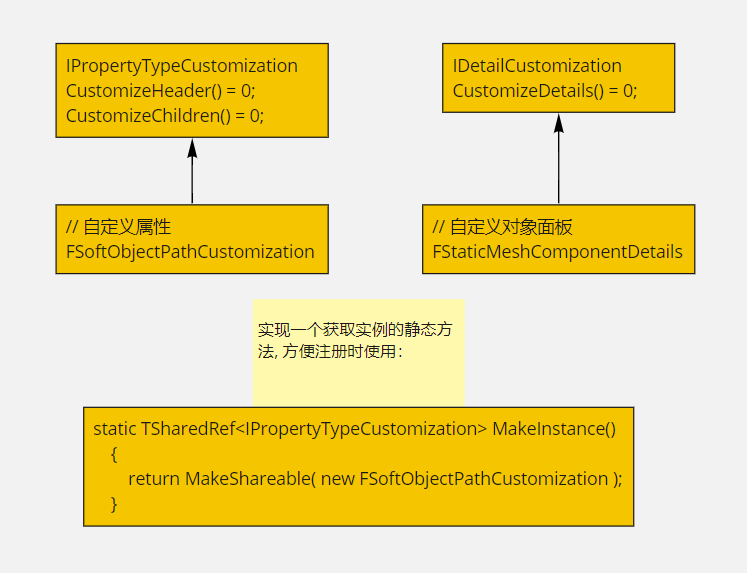

# Details Panel Customization

分为属性和对象两类自定义, 属性`Detail`自定义改变这个属性在任何`Detail`面板中出现的方式. 对象`Detail`自定义改变这个对象的`Details`面板.

结构体需要用一个派生自`IPropertyTypeCustomization`的类实现自定义, 并在模块`StartupModule`中注册.对象类型的自定义也是如此, 只是需要派生自`IDetailCustomization`.

然后需要将我们自定义的类注册到`PropertyEditor`模块,一般在自定义这些类的模块的`StartupModule`中完成:
```c++
FPropertyEditorModule& PropertyModule = FModuleManager::LoadModuleChecked<FPropertyEditorModule>("PropertyEditor");
// 类名和属性名去掉前缀U或F
PropertyModule.RegisterCustomClassLayout("ClassName", 
		FOnGetDetailCustomizationInstance::CreateStatic(&FMyDetailCustomization::MakeInstance));
PropertyModule.RegisterCustomPropertyTypeLayout( "PropertyTypeName",                      
        FOnGetDetailCustomizationInstance::CreateStatic(&FMyPropertyTypeLayoutCustomization::MakeInstance) );
```
这些信息会用`Name`为`Key`存在`FPropertyEditorModule`模块的`Map`中:
```c++
/** A mapping of class names to detail layout delegates, called when querying for custom detail layouts */
FCustomDetailLayoutNameMap ClassNameToDetailLayoutNameMap;
/** A mapping of property names to property type layout delegates, called when querying for custom property layouts */
FCustomPropertyTypeLayoutMap GlobalPropertyTypeToLayoutMap;
```

## 自定义对象的实现
主要需要实现一个接口方法: 
```
virtual void CustomizeDetails( IDetailLayoutBuilder& DetailBuilder ) override;
```
`IDetailLayoutBuilder`中定义了一些方法, 可以访问和对象`Detail`面板相关的一些属性, 包括分类, 获取属性等操作.比如, 在引擎的`StaticMeshComponent`的`Detail`面板自定义中,
可以通过一下方式获取到特定的属性:
```c++
TSharedRef<IPropertyHandle> UseDefaultCollision = DetailBuilder.GetProperty(GET_MEMBER_NAME_CHECKED(UStaticMeshComponent, bUseDefaultCollision));
```
可以获取当前`Detail`下的分类(不存在则添加):
```c++
DetailBuilder.EditCategory("StaticMesh", FText::GetEmpty(), ECategoryPriority::Important);
// or 
IDetailCategoryBuilder& LightingCategory = DetailBuilder.EditCategory("Lighting");
```
得到`CategoryBuilder`后也可以向其中加入一些属性:
```c++
IDetailPropertyRow& OverrideLightResRow = LightingCategory.AddProperty(OverrideLightResProperty);
```
可以在得到的`IDetailPropertyRow::CustomWidget()`直接写`Slate`自定义`UI`.
也可以直接加一个自定义`Row`:
```c++
FDetailWidgetRow& CustomWidget = Categoryy.AddCustomRow(FText::FromString(TEXT("Custom row")));
```
比如一下, 在一个自定义分类下加一个按钮:
```c++
void FSpritePlayerDetailCustomization::CustomizeDetails(IDetailLayoutBuilder& DetailBuilder)
{
	// DetailBuilder 中有对应对象的属性句柄TSharedRef<IPropertyHandle>

	// TSharedRef<IPropertyHandle> 可以被添加到一个Category中得到一个IDetailPropertyRow
	// 也有可以获取自身的ValueWidget或NameWidget
	DetailBuilder.GetObjectsBeingCustomized(CustomizedObject);
	IDetailCategoryBuilder& Categoryy = DetailBuilder.EditCategory("Custom", FText::GetEmpty(), ECategoryPriority::Important);
	FDetailWidgetRow& CustomWidget = Categoryy.AddCustomRow(FText::FromString(TEXT("Custom row")));
	TSharedPtr<STextBlock> ButtonText;
	CustomWidget
		[
			SNew(SButton)
			.ButtonStyle(FCoreStyle::Get(), "NoBorder")
			.OnClicked(this, &FSpritePlayerDetailCustomization::OnClickedButton)
			.HAlign(HAlign_Center)
			.VAlign(VAlign_Center)
			.ForegroundColor(FSlateColor::UseForeground())
			[
				SNew(SBorder)
				.Padding(FMargin(3))
				.BorderImage(FCoreStyle::Get().GetBrush("ColorSpectrum.Spectrum"))
				[
					SAssignNew(ButtonText, STextBlock)
					.Text(FText::FromString(FString("TestButton")))
					.Font(FSlateFontInfo(FPaths::EngineContentDir() / TEXT("Slate/Fonts/Roboto-Bold.ttf"), 16))
					.ColorAndOpacity(FLinearColor(1,0,1,1))
					.HighlightColor(FLinearColor(1,1,0,1))
					.ShadowColorAndOpacity(FLinearColor::Black)
					.ShadowOffset(FIntPoint(1,-1))
				]
			]
		];
}
```

自定义某个具体属性的行可以参考:`UE_4.26\Engine\Source\Editor\DetailCustomizations\Private\StaticMeshComponentDetails.h`
## 自定义属性Layout
参考引擎的用例, 和上面差不多.

* 文档: https://docs.unrealengine.com/zh-CN/ProgrammingAndScripting/Slate/DetailsCustomization/index.html
* struct details custom: https://zhuanlan.zhihu.com/p/77051015
* 引擎用例: UE_4.26\Engine\Source\Editor\DetailCustomizations\Public\DetailCustomizations.cpp