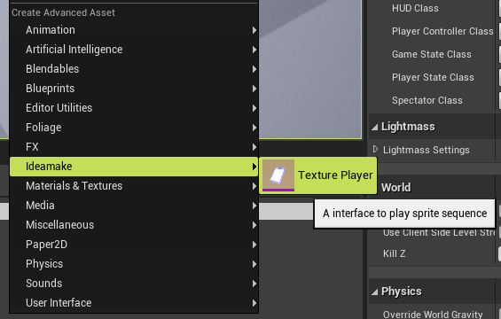

在UE的编辑器中,我们可以通过一些简单的操作在ContentBrowser中创建并编辑一些对象(即资源).
* 在ContentBrowser空白处单击右键创建资源.
* 在ContentBrowser选中一个或多个资源,右键从中创建新的资源.
* 自定义特定资源资源编辑器(双击资源时打开的窗口)

参照`Paper2D`插件, 假设我们需要实现一个播放`Texture`序列的功能, 即将一系列的序列帧图片导入UE4中, 以指定的频率播放它. 这里我们关注的是如何表示这些序列帧图片资源, 通常一段序列有上百张, 一种直观的想法是用一个数组按顺序存下这些图片, 但不会有人想一张张地在蓝图中加到这个数组中！

因此, 我们需要更快捷的方式！

### 1. 创建资产类——UObject
我们可以将这种资源的表示抽象为一个`UTexturePlayer`类, 显然它派生自`UObject`,这样就可以在编辑器中对它进行管理.

```c++
/**
 * A object to play texutre sequence
 */
UCLASS(BlueprintType)
class  YOURMODULENAME_API UTexturePlayer : public UObject
{
	GENERATED_BODY()
public:
	UPROPERTY(BlueprintReadWrite, EditAnywhere)
		TArray<class UTexture2D*> SourceTextures;
    
    // other play function ... ...
};
```
### 2. 创建资产对应的工厂——UFactory
UE的`Editor`中, 创建资源通常都是通过`UFactory`, 对每一个希望在编辑器的`ContentBrowser`中创建的资源, 都必须实现一个对应的`UFactory`.

```c++
/**
 * Implements a factory for UTextAsset objects.
 */
UCLASS(hidecategories=Object)
class UTexturePlayerFactoryNew
	: public UFactory
{
	GENERATED_UCLASS_BODY()

public:
    // Selected Textures
	TArray<class UTexture2D*> InitTextures;

	//~ UFactory Interface
    // 实现这个之后, 在UE4.24及之前,就会在Create Advanced Asset中的Miscellaneous分类中出现创建按钮,点击即会调用这个函数.
	virtual UObject* FactoryCreateNew(UClass* InClass, UObject* InParent, FName InName, EObjectFlags Flags, UObject* Context, FFeedbackContext* Warn) override;

	/** Returns true if this factory should be shown in the New Asset menu (by default calls CanCreateNew). */
	virtual bool ShouldShowInNewMenu() const override;

	virtual FText GetDisplayName() const override;

};
// 关键部分
UObject* UTexturePlayerFactoryNew::FactoryCreateNew(UClass* InClass, UObject* InParent, FName InName, EObjectFlags Flags, UObject* Context, FFeedbackContext* Warn)
{
	UTexturePlayer* NewTexturePlayer = NewObject<UTexturePlayer>(InParent, InClass, InName, Flags | RF_Transactional);

	NewTexturePlayer->SourceTextures = InitTextures;

	return NewTexturePlayer;
}

```
由于`UFactory`是派生自`UObject`的，所以我们不必手动注册它, 编辑器会自动搜集所有的`Factory`。

### 3. 定义资产在编辑器中的外观——IAssetTypeActions
`IAssetTypeActions`主要定义和这种资产本身相关的东西, 比如缩略图, 颜色, 分类 以及 在`ContentBrowser`中右键单击它的`Action`菜单.同时,引擎实现好了一个符合大多数资产行为的基类`FAssetTypeActions_Base`,我们可以从它派生, 以减少代码量.

```c++
class FTexturePlayerAssetActions
	: public FAssetTypeActions_Base
{
public:

	/**
	 * Creates and initializes a new instance.
	 *
	 * @param InType 该资产的自定义分类, 在外面注册再传进来
	 */
	FTexturePlayerAssetActions(EAssetTypeCategories::Type InType) : MyAssetType(InType);

public:

	//~ FAssetTypeActions_Base overrides
	virtual bool CanFilter() override { return true; }

    // 资产分类, 此处使用自定义类型, 或已有类型:EAssetTypeCategories::Misc
	virtual uint32 GetCategories() override {return MyAssetType;} 
    // 资产显示在ContentBrowser的名字
	virtual FText GetName() const override {return NSLOCTEXT("Test", "AssetTypeActions_TexturePlayerAsset", "Texure Player"); }
    // 与这个资产关联的类, 即我们定义的UObject
	virtual UClass* GetSupportedClass() const override{ return UTexturePlayer::StaticClass(); }
	// 图标的背景色
    virtual FColor GetTypeColor() const override{ return FColor::Purple; }
	// 是否有右键菜单Actions
    virtual bool HasActions(const TArray<UObject*>& InObjects) const override{return true; }

    virtual void GetActions(const TArray<UObject*>& InObjects, FMenuBuilder& MenuBuilder) override;
	virtual void OpenAssetEditor(const TArray<UObject*>& InObjects, TSharedPtr<IToolkitHost> EditWithinLevelEditor = TSharedPtr<IToolkitHost>()) override;

private:
	EAssetTypeCategories::Type MyAssetType;
};
```
`GetActions()`会在右键单击一个`ContetnBrowser`中的这种资源时调用, 由此来扩展右键菜单,执行和这个资源相关的操作.假设在有了一个`TexturesPlayer`后, 我们需要从中创建一个`UMG`,使其在一张图片上播放这组序列. 我们可以在右键菜单中加一个按钮创建这个`UMG`:
```c++
void FTexturePlayerAssetActions::GetActions(const TArray<UObject*>& InObjects, FMenuBuilder& MenuBuilder)
{
	FAssetTypeActions_Base::GetActions(InObjects, MenuBuilder);

	auto TextureAssets = GetTypedObjectPtrs<UTexturePlayer>(InObjects);
	
	MenuBuilder.AddMenuEntry(
		LOCTEXT("PlaySequenceFrame", "Create Texture UMG Player"),
		LOCTEXT("PlaySequenceFrameToolTip", "Create a UMG derived from FlipImageBook"),
		FSlateIcon(FIdeamakeStyle::GetStyleSetName(), "Ideamake.NewUMGState"),
		FUIAction(
			FExecuteAction::CreateStatic(CreateFlipImgaebook_Impl::CreateImageBook,TextureAssets),
			FCanExecuteAction::CreateLambda([=] { // 选中的Object至少有一个不是nullptr才需要执行创建操作.
				for (auto Texture : TextureAssets)
				{
					if (Texture != nullptr)
					{
						return true;
					}
				}
				return false;
			})
		)
	);
}
```
`OpenAssetEditor()`会在需要打开这个`Object`的编辑器的时候调用, 比如双击`ContentBrowser`中的资源图标.我们可以简单地打开一个属性`Details`面板编辑器, 这个是引擎已经写好的.
```c++
void FTexturePlayerAssetActions::OpenAssetEditor(const TArray<UObject*>& InObjects, TSharedPtr<IToolkitHost> EditWithinLevelEditor)
{
	FSimpleAssetEditor::CreateEditor(EToolkitMode::Standalone, EditWithinLevelEditor, InObjects);
}
```
此外, 也可以用自定义的编辑器,这个稍后再说.
与`Factory`不同的是,`FTexturePlayerAssetActions`及其父类是纯`C++`(从其前缀`F`也可以看出), 引擎是无法自动搜集它的, 所以需要手动注册.

### 3. 注册AssetAction

通常来讲,我们需要将一种资产的`UObject`与其相关的`Editor`部分分开, 因为在打包好的程序中是不会有`Editor`部分的.由此我们需要定义两个模块, 一个用来定义`UTexturePlayer`极其核心功能部分(控制播放逻辑),另一个用来定义编辑器中的辅助工具,`Factory`, `IAssetTypeActions`, 自定义编辑器和`Details`面板等, 假设我们定义`UTexturePlayer`的模块名为`TexturesPlayer`,其对应的编辑器工具模块通常叫`TexturePlayerEditor`, 且定义在同一个插件中.

```c++
class FTexturePlayerEditor : public IModuleInterface
{
public:
	virtual void StartupModule() override;

	virtual void ShutdownModule() override;
private:
	void RegisterAssetTools();
	void UnRegisterAssetTools();
private: 
	TArray<TSharedRef<IAssetTypeActions>> RegisteredAssetTypeActions;
};
```
和普通的模块定义差不多, 只是要记得将注册过的东西保留一份引用,以便在模块`Shutdown`时`UnRegister`.和编辑器相关的许多工具都需要在此处注册.

`AssetAction`需要注册到`AssetTools`模块中, 调用其`RegisterAssetTypeActions`注册即可.注意到上面定义我们的`AssetTypeActions`时,需要在构造时传入一个自定义资源类型,这个类型也需要注册到`AssetTools`中, 用`RegisterAdvancedAssetCategory()`,最终注册我们的`AssetTypeAction`的代码如下:
```c++
void FTexturePlayerEditor::RegisterAssetTools()
{
	IAssetTools& AssetTools = FModuleManager::LoadModuleChecked<FAssetToolsModule>("AssetTools").Get();
	
	EAssetTypeCategories::Type MyAssetType = AssetTools.RegisterAdvancedAssetCategory(FName("IdeamakeCustomCategory"), NSLOCTEXT("Ideamake", "Ideamake_Inc", "Ideamake"));
		
	// Create Asset actions
	TSharedRef<IAssetTypeActions> Action = MakeShareable(new FSpritePlayerAssetActions(MyAssetType));

	// Register Asset action
	AssetTools.RegisterAssetTypeActions(Action);

	RegisteredAssetTypeActions.Add(Action);
}
```
在`Module`的`StartupModule()`函数中调用它:
```c++
void FCharlesFrameWorkEditorModule::StartupModule()
{
	RegisterAssetTools();
	FIdeamakeStyle::Initialize();
}
```
其中`FIdeamakeStyle::Initialize()`注册了自定义图标.
至此我们可以在`ContentBrowser`空白处右键单击,就可以看到我们自定义的分类以及我们的`TexturePlayer`创建的按钮.


```
在uplugin配置文件中, 对Runtime模块的LoadingPhase最好是PreDefault, 否则会打包失败。
```
### 4. ContentBrowser扩展
如果我们希望在点击其它资源时(Textures)创建我们的TexturesPlayer, 但又无法直接扩展Texture的AssetTypeAction(改源码?),这时可以直接扩展ContentBrowser模块的选中资源时的右键菜单, 
https://zhuanlan.zhihu.com/p/164695117

Summary:
* 声明资产类型的C++类, 通常继承自UObject.
* 实现用户创建资产实例的方法, 即Asset Factories.
* 自定义资产在编辑器中的外观, 快捷菜单、缩略图颜色和图标、过滤、分类等.
* 特定资产的ContentBrowser actions.即右键菜单.
* TODO: 对复杂Asset类型,自定义Asset编辑器UI.


reference:
* https://learn.unrealengine.com/course/2504894?r=False&ts=637365057953224512
* PPT: https://www.slideshare.net/GerkeMaxPreussner/fmx-2017-extending-unreal-engine-4-with-plugins-master-class

Toolkits:
* Engine\Plugins\2D\Paper2D\Source\Paper2DEditor\Private\SpriteEditor\SpriteEditor.h