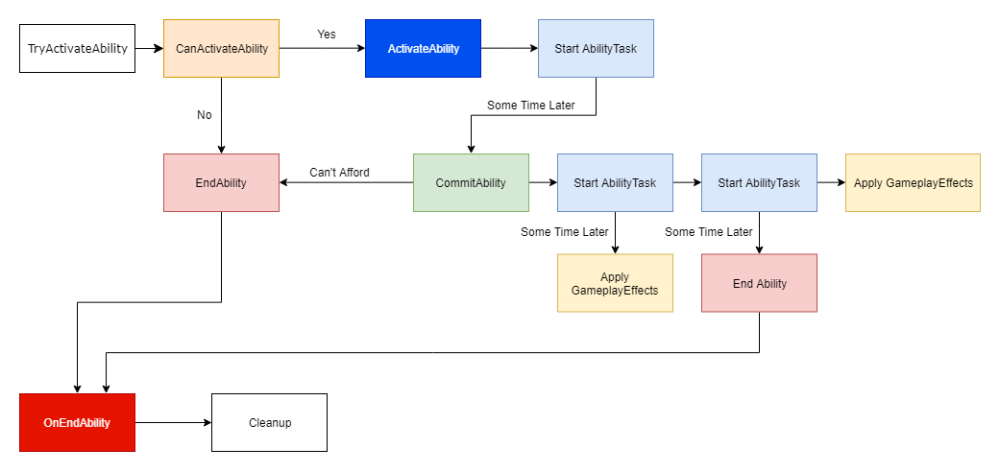
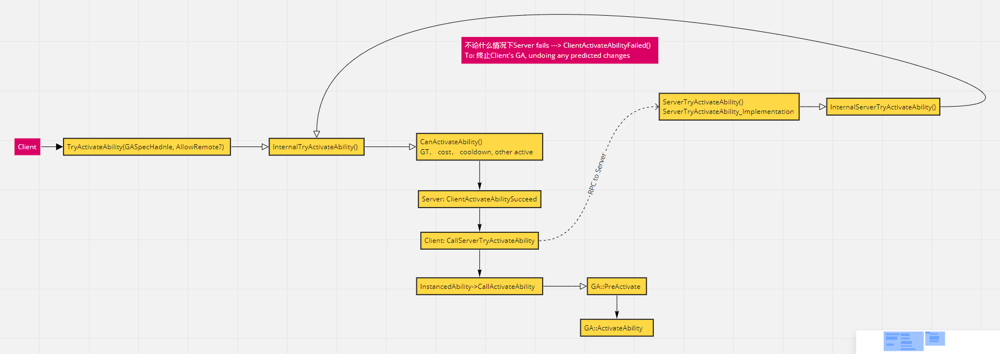

## 4.6 Gameplay Abilities    Move to Separate file
### 4.6.1 Gameplay Ability Definition
GameplayAbilities 是一个Actor在Game中世纪可以做的任何actions 或者skills.Example::
* Jumping
* Sprinting
* Shooting a gun 
* Passively blocking an attack every X number of seconds
* Using a potion
* Opening a door 
* Collecting a resource 
* Constructing a building 
不应该用GameplayAbilities实现的:
* Baseic Movement input 
* Some interactions with UIs - Don't use a GameplayAbility to purchase an item from a store.

Level 的默认实现, 可以修改Attributes 的改变量，改变GA的功能

### 网络复制相关
取决于`Net Execution Policy`, GA可以在owning client 和/或 Server上run, 除了simulated proxies. 

`Net Execution Policy`决定了GA是否是locally predicted.他们包含了`optional cost and cooldown GameplayEffects`的默认行为.

使用AbilityTasks的GA, 是一些在一段时间内变化的Action, 例如: 等待一个事件, 等待一个属性改变, 等待玩家选择一个目标, 用Root Motion Source移动一个Character,etc. 

Simulated Clients 将不会run GameplayAbilities. 当一些效果需要复制到每一个Client时, 需要先在Server上run GA, 再把视觉效果(animation montages, sounds, particles) 复制 或 通过AbilityTasks进行RPC 或 GameplayCues.

所有GameplayAbilities都要重载ActivateAbility()实现自己的gameplay logic.还可以在EndAbility()中加入额外的逻辑, 它在GA完成或取消时调用.




#### 4.6.1.1 Replication Policy

这个名字具有误导性, 它并不是设置复制策略, 而是如上面所述, 默认就是从Server 复制到 owning client.设置GA执行的位置.
四种复制策略:
* LocalPredicted 和 LocalOnly	
无论在那个端执行, 最终都是Client开始InternalTryActivateAbility(), LocalPredicted会进行预测执行, 并在其中生成Prediction Key, RPC到Server 执行.
1. Client 调用TryActivateAbility, --> InternalTryActivateAbility()
2. Server 调用TryActivateAbility, --> ClientTryActivateAbility() -- 处理Ability 复制先后的问题(PendingServerActivatedAbilities), --> InternalTryActivateAbility()

LocalOnly, 仅在LocalControlled (Client 和 ListenServer上的本地玩家)上执行.

* ServerInitiated 和 ServerOnly	
ServerInitiated由Server发起, 但Client也会执行.仅在Server上Run.
1. Client 调用TryActivateAbility, --> CallServerTryActivateAbility()(这里检查了CanActivate)(尝试batch) --> ServerTryActivateAbility() RPC --> InternalServerTryActivateAbility() --> InternalTryActivateAbility().
2. Server 调用TryActivateAbility, --> InternalTryActivateAbility().
后面实际处理这四种调用逻辑的地方在InternalTryActivateAbility(). 调用TryActivateAbility只是保证了激活Ability有个正确的开始的地方.
```c++
bool UAbilitySystemComponent::TryActivateAbility(FGameplayAbilitySpecHandle AbilityToActivate, bool bAllowRemoteActivation);
// 找不到这个GA, return false
if(Server && (LocalOnly || LocalPredicted))
    ClientTryActivateAbility(AbilityToActivate); return ;
if(Client && (ServerOnly || ServerInitiated))
    if(CanActivateAbility )
        CallServerTryActivateAbility(); return ;
return InternalTryActivateAbility();
```
#### 4.6.1.2 Server Respects Remote Ability Cancellation

这个选项经常会引起麻烦. 如果Client's GA 由于取消或自然完成而结束, 它将会强制Server's version 结束, 无论它有没有完成.对于高延迟玩家的Locally predicted GA, 这将会是一个很严重的问题. 通常会关闭这一选项.

#### 4.6.1.3 Replicate Input Directly

设置这个选项将会总是把输入press 和 release事件复制到Server.不建议使用这个, 而是依赖Generic Relicated Events, that are built into the existing input related AbilityTasks if you have your input bound to your ASC.


### 4.6.2 Binding Input to the ASC
在通常绑定按键的函数`SetupPlayerInputComponent`调用ASC的下面的函数:
```c++
void UAbilitySystemComponent::BindAbilityActivationToInputComponent(UInputComponent* InputComponent, FGameplayAbilityInputBinds BindInfo)
```
FGameplayAbilityInputBinds中需要传入瞄准和取消瞄准的按键绑定的Name, 这两个特殊处理, 然后是自定义枚举的Name。
例如:
```c++
AbilitySystemComponent->BindAbilityActivationToInputComponent(InputComponent, FGameplayAbilityInputBinds(FString("ConfirmTarget"),
	FString("CancelTarget"), FString("EGDAbilityInputID"), static_cast<int32>(EGDAbilityInputID::Confirm), static_cast<int32>(EGDAbilityInputID::Cancel)));

// 其中 AbilitySystemComponent_Abilities.cpp
void UAbilitySystemComponent::BindAbilityActivationToInputComponent(UInputComponent* InputComponent, FGameplayAbilityInputBinds BindInfo)
{
	UEnum* EnumBinds = BindInfo.GetBindEnum();

	SetBlockAbilityBindingsArray(BindInfo);

	for(int32 idx=0; idx < EnumBinds->NumEnums(); ++idx)
	{
		const FString FullStr = EnumBinds->GetNameStringByIndex(idx);
		
		// Pressed event
		{
			FInputActionBinding AB(FName(*FullStr), IE_Pressed);
			AB.ActionDelegate.GetDelegateForManualSet().BindUObject(this, &UAbilitySystemComponent::AbilityLocalInputPressed, idx);
			InputComponent->AddActionBinding(AB);
		}

		// Released event
		{
			FInputActionBinding AB(FName(*FullStr), IE_Released);
			AB.ActionDelegate.GetDelegateForManualSet().BindUObject(this, &UAbilitySystemComponent::AbilityLocalInputReleased, idx);
			InputComponent->AddActionBinding(AB);
		}
	}

	// Bind Confirm/Cancel. Note: these have to come last!
	if (BindInfo.ConfirmTargetCommand.IsEmpty() == false)
	{
		FInputActionBinding AB(FName(*BindInfo.ConfirmTargetCommand), IE_Pressed);
		AB.ActionDelegate.GetDelegateForManualSet().BindUObject(this, &UAbilitySystemComponent::LocalInputConfirm);
		InputComponent->AddActionBinding(AB);
	}
	
	if (BindInfo.CancelTargetCommand.IsEmpty() == false)
	{
		FInputActionBinding AB(FName(*BindInfo.CancelTargetCommand), IE_Pressed);
		AB.ActionDelegate.GetDelegateForManualSet().BindUObject(this, &UAbilitySystemComponent::LocalInputCancel);
		InputComponent->AddActionBinding(AB);
	}

	if (BindInfo.CancelTargetInputID >= 0)
	{
		GenericCancelInputID = BindInfo.CancelTargetInputID;
	}
	if (BindInfo.ConfirmTargetInputID >= 0)
	{
		GenericConfirmInputID = BindInfo.ConfirmTargetInputID;
	}
}
```
这会将EGDAbilityInputID枚举中的每一个字段的字符串Name作为Action Name, 对应在枚举类中的索引作为参数, 绑定到函数:`void UAbilitySystemComponent::AbilityLocalInputPressed(int32 InputID)`,这个函数会在已被授予的Abilities中寻找所有FGameplayAbilitySpec的InputID和传入ID相同的Ability, 并在没有激活的时候激活它.
```c++
ABILITYLIST_SCOPE_LOCK();
for (FGameplayAbilitySpec& Spec : ActivatableAbilities.Items)
{
	if (Spec.InputID == InputID)
	{
		if (Spec.Ability)
		{
			Spec.InputPressed = true;
			if (Spec.IsActive())
			{
				if (Spec.Ability->bReplicateInputDirectly && IsOwnerActorAuthoritative() == false)
				{
					ServerSetInputPressed(Spec.Handle);
				}
				AbilitySpecInputPressed(Spec);
				// Invoke the InputPressed event. This is not replicated here. If someone is listening, they may replicate the InputPressed event to the server.
				InvokeReplicatedEvent(EAbilityGenericReplicatedEvent::InputPressed, Spec.Handle, Spec.ActivationInfo.GetActivationPredictionKey());					
			}
			else
			{
				// Ability is not active, so try to activate it
				TryActivateAbility(Spec.Handle);
			}
		}
	}
}
```
ActivatableAbilities中的FGameplayAbilitySpec的InputID是通过ASC的`GiveAbility(const FGameplayAbilitySpec& Spec)`添加的.在Give Ability时(或创建FGameplayAbilitySpec时), 应该就想好了要和哪一个按键绑定, 从事先定义的枚举获得, 可以在Ability中定义一个属性`AbilityInputID`, 在蓝图中编辑. 

默认授予的Ability也可以是一个Character的成员数组, 在Character被Possess的时候授予所有Ability.

以上参见GASDocumentation 的HeroCharacter的FireGun Ability实现.

除了绑定按键激活GA, 要AbilityTasks响应输入需要分配input actions.

ASC 接受通用的Confirm和Cancel输入.可以被AbilityTasks用于confirming 一些像 Target actors 或 canceling 这样的事.

由于网络复制顺序的问题(PC 和 PS), 如果ASC的ownering 为PS, 则由于PC 和PS 的复制顺序不定, 单独的一次绑定可能不会成功, 所以, 需要在OnRep_PlayerState() 和 SetuptPlayerInputComponent中两次尝试绑定.

#### 4.6.2.1 Binding to Input without Activating Abilities

不想自动激活, 则可以重载ASC::AbilityLocalInputPressed(), 在GA中加一个变量, 判断是否需要默认激活即可.

### 4.6.3 Granting Abilities

就是用GA创建一个GASpec, 添加到ASC的ActivatableAbilities中, 然后就可以在GameplayTags meet时激活，(或按键).
```c++
ASC::GiveAbility();
```
仅可在Server调用.Give之后会自动复制GASpec到owning client.其它Clients / simulated proxies 不会收到这个.

如果想在Client Give, 则要自己用RPC调用在Server上Give, 这样也不能在Give之后的同一帧激活这个Ability, 
### 4.6.4 Activating Abilities

如果绑定了输入, 则会在input pressed 时自动激活, 或者ASC满足了GameplayTag Requirements.除这两种方法, 还有四种:
* GameplayTag
* GameplayAbility calss
* GameplayAbilitySpec handle
* by an event(允许传入Payload 数据)

```c++
UFUNCTION(BlueprintCallable, Category = "Abilities")
bool TryActivateAbilitiesByTag(const FGameplayTagContainer& GameplayTagContainer, bool bAllowRemoteActivation = true);

UFUNCTION(BlueprintCallable, Category = "Abilities")
bool TryActivateAbilityByClass(TSubclassOf<UGameplayAbility> InAbilityToActivate, bool bAllowRemoteActivation = true);

bool TryActivateAbility(FGameplayAbilitySpecHandle AbilityToActivate, bool bAllowRemoteActivation = true);

// Tag 事件触发
bool TriggerAbilityFromGameplayEvent(FGameplayAbilitySpecHandle AbilityToTrigger, FGameplayAbilityActorInfo* ActorInfo, FGameplayTag Tag, const FGameplayEventData* Payload, UAbilitySystemComponent& Component);

// 授予并激活一次, 然后移除
FGameplayAbilitySpecHandle GiveAbilityAndActivateOnce(const FGameplayAbilitySpec& AbilitySpec);
```



#### 4.6.4.1 Passive(被动) Abilities
在UGameplayAbility::OnAvatarSet()中, 可以添加一个属性指示是否要在被授予时激活. 这个函数会在GA 被授予并且AvatarActor设置好之后调用.用作类似BeginPlay之类的作用.
```c++
void UGDGameplayAbility::OnAvatarSet(const FGameplayAbilityActorInfo * ActorInfo, const FGameplayAbilitySpec & Spec)
{
	Super::OnAvatarSet(ActorInfo, Spec);

	if (ActivateAbilityOnGranted)
	{
		bool ActivatedAbility = ActorInfo->AbilitySystemComponent->TryActivateAbility(Spec.Handle, false);
	}
}
```
### 4.6.5 Canceling Abilities

### 4.6.XX TargetData
在激活GA时(LocalPredict):
Server: 
以SpecHandle和PredictionKey组成的Key对应到一个Delegate, 当对应这个Key的TargetData从Client RPC过来时, 将会调用这个委托(Clinet通过ASC::CallServerSetReplicatedTargetData(Handle, Key, TargetData)调用).

绑定一个函数到这个委托, 其中需要做的事: 
1. AbilitySystemComponent->ConsumeClientReplicatedTargetData(Handle, PredictionKey).(用过了就清掉数据)
2. 回调蓝图ValidData, 并把TargetData传出去, 实现真正使用这些数据的逻辑.
3. Remove前面绑定的委托.
这即是UOPAT_ServerWaitClientTargetData异步节点干的事.

Client:
对于Client, UOPAT_ServerWaitClientTargetData 什么也没干.但Client要执行WaitTargetDataWithReusableActor得到数据并调用ASC::CallServerSetReplicatedTargetData()把数据传给Server.

AGameplayAbilityTargetActor
这个要自己维护一个实例, 传给`UOPAT_ServerWaitClientTargetData`, 其中会会调用`TargetActor->ConfirmTargeting()`, 里面处理生成TargetData, 并回调TargetDataReadyDelegate, `UOPAT_ServerWaitClientTargetData`把这个数据再RPC给Server. 里面也实现了通用的由输入驱动的Confirm.

自定义TargetData:
1. 实现自己的AGameplayAbilityTargetActor, 可以从AOPGATA_Trace开始, 主要实现`ConfirmTargetingAndContinue`函数, 负责生成需要的数据, 并包装成TargetDataHandle, 调用`TargetDataReadyDelegate`通知处理上传数据.
2. 实现一个`FGameplayAbilityTargetData`, 类似于`FGameplayAbilityTargetData_SingleTargetHit`, 第一步将new出实际保存数据的这个结构体类型。
