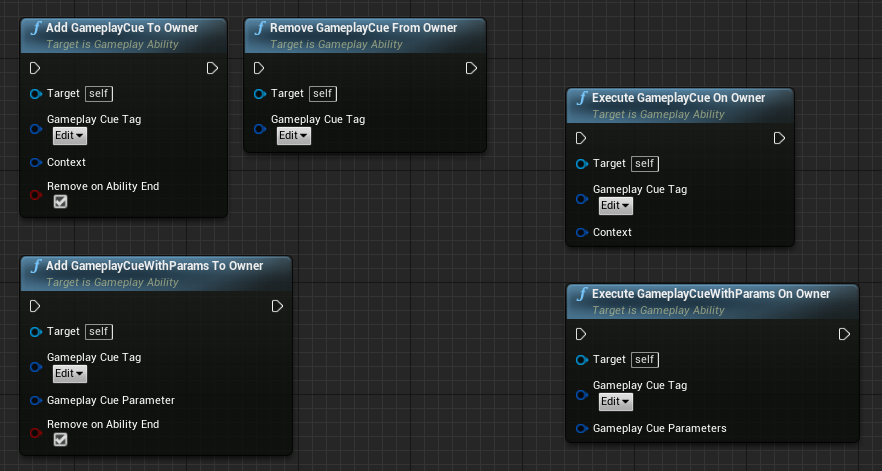
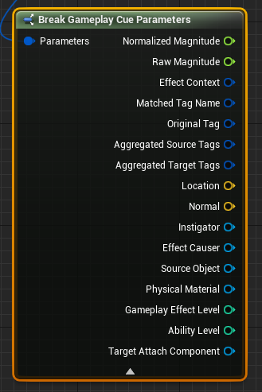

## 4.8.1 Gameplay Cue Definition
GameplayCues 执行非Gameplay相关的事情, sound effects, particle effects, camera shakes, etc. 通常是可复制的(除非Locally显式Executed, Added, Removed) 和 predicted.

触发GC要用它对应的GameplayTag, 且这个Tag必须以GameplayCue为根节点.通过ASC把对应的GameplayTag和Event type(Execute, Add , Remove) 发给GameplayCuemanager, 即可触发. GameplayCueNotify对象和其它实现了IGameplayCueInterface的Actor可以基于GameplayCue's GameplayTag订阅这些事件.

有两类GCnotify, Static 和 Actor, 他们负责不同的事件, 且不同的GE可以触发他们.在对应的事件中重写逻辑.

| `GameplayCue` Class | Event             | `GameplayEffect` Type    | Description    |
| ------------------- | ----------------- | ------------------------ | -------------- |
| [`GameplayCueNotify_Static`](https://docs.unrealengine.com/en-US/API/Plugins/GameplayAbilities/UGameplayCueNotify_Static/index.html) | `Execute`         | `Instant` or `Periodic`  | Static `GameplayCueNotifies` operate on the `ClassDefaultObject` (meaning no instances) and are perfect for one-off(一次性) effects like hit impacts. |
| [`GameplayCueNotify_Actor`](https://docs.unrealengine.com/en-US/BlueprintAPI/GameplayCueNotify/index.html)                           | `Add` or `Remove` | `Duration` or `Infinite` | Actor `GameplayCueNotifies` spawn a new instance when `Added`. Because these are instanced, they can do actions over time until they are `Removed`. These are good for looping sounds and particle effects that will be removed when the backing `Duration` or `Infinite` `GameplayEffect` is removed or by manually calling remove. These also come with options to manage how many are allowed to be `Added` at the same so that multiple applications of the same effect only start the sounds or particles once. |

GameplayCueNotifies 可以响应(respond to )任何事件, 这也是它的作用所在.

Note: 当使用 GameplayCueNotify_Actor时, 如果不选中 Auto Destory On Remove, 后面Add 它对应的GameplayCueTag将会失败.

当使用ASC的Replication Mode为Full之外时, Add 和 Remove GC 事件在Listen Server上会fire 两次. 一次是Apply GE时的, 另一次是NetMultiCast 到Clients, WhileActove事件仍然只执行一次. 所有事件在在Client上都只执行一次.

## 4.8.2 Triggering Gameplay Cues
* 在GE中的Display分类下的GameplayCues数组中, 可以配置当Ge被成功Applied(没有block或immunity)时激活的所有GC的Tag.

* GA 中有一系列蓝图节点可以Execute, Add, Remove GameplayCues.


* C++  可以直接调用ASC上的函数, 或者把它们暴露到蓝图.

```c++
/** GameplayCues can also come on their own. These take an optional effect context to pass through hit result, etc */
void ExecuteGameplayCue(const FGameplayTag GameplayCueTag, FGameplayEffectContextHandle EffectContext = FGameplayEffectContextHandle());
void ExecuteGameplayCue(const FGameplayTag GameplayCueTag, const FGameplayCueParameters& GameplayCueParameters);

/** Add a persistent gameplay cue */
void AddGameplayCue(const FGameplayTag GameplayCueTag, FGameplayEffectContextHandle EffectContext = FGameplayEffectContextHandle());
void AddGameplayCue(const FGameplayTag GameplayCueTag, const FGameplayCueParameters& GameplayCueParameters);

/** Remove a persistent gameplay cue */
void RemoveGameplayCue(const FGameplayTag GameplayCueTag);
	
/** Removes any GameplayCue added on its own, i.e. not as part of a GameplayEffect. */
void RemoveAllGameplayCues();
```
但最终的GC的执行是在`UAbilitySystemGlobals::Get().GetGameplayCueManager()`中执行的. ASC只是转发RPC.

## 4.8.3 Local Gameplay Cues
GA和ASC中的执行GC的函数默认都会被复制, 每一个GC事件都是一个multicast RPC.这回占用大量带宽. 可以通过尽量使用Local GameplayCues, 它仅在单个Client执行.


一些可以使用Local GameplayCues的场景: 
* Projectile impacts
* Melee collision impacts
* GameplayCues fired from  animation montages

即 触发GC的事件本身是在各个Client都会发生的就可以用Local GC. 需要的方法要自己实现:
```c++
// .h
UFUNCTION(BlueprintCallable, Category = "GameplayCue", Meta = (AutoCreateRefTerm = "GameplayCueParameters", GameplayTagFilter = "GameplayCue"))
void ExecuteGameplayCueLocal(const FGameplayTag GameplayCueTag, const FGameplayCueParameters& GameplayCueParameters);

UFUNCTION(BlueprintCallable, Category = "GameplayCue", Meta = (AutoCreateRefTerm = "GameplayCueParameters", GameplayTagFilter = "GameplayCue"))
void AddGameplayCueLocal(const FGameplayTag GameplayCueTag, const FGameplayCueParameters& GameplayCueParameters);

UFUNCTION(BlueprintCallable, Category = "GameplayCue", Meta = (AutoCreateRefTerm = "GameplayCueParameters", GameplayTagFilter = "GameplayCue"))
void RemoveGameplayCueLocal(const FGameplayTag GameplayCueTag, const FGameplayCueParameters& GameplayCueParameters);

// .cpp
void UPAAbilitySystemComponent::ExecuteGameplayCueLocal(const FGameplayTag GameplayCueTag, const FGameplayCueParameters & GameplayCueParameters)
{
	UAbilitySystemGlobals::Get().GetGameplayCueManager()->HandleGameplayCue(GetOwner(), GameplayCueTag, EGameplayCueEvent::Type::Executed, GameplayCueParameters);
}

void UPAAbilitySystemComponent::AddGameplayCueLocal(const FGameplayTag GameplayCueTag, const FGameplayCueParameters & GameplayCueParameters)
{
	UAbilitySystemGlobals::Get().GetGameplayCueManager()->HandleGameplayCue(GetOwner(), GameplayCueTag, EGameplayCueEvent::Type::OnActive, GameplayCueParameters);
	UAbilitySystemGlobals::Get().GetGameplayCueManager()->HandleGameplayCue(GetOwner(), GameplayCueTag, EGameplayCueEvent::Type::WhileActive, GameplayCueParameters);
}

void UPAAbilitySystemComponent::RemoveGameplayCueLocal(const FGameplayTag GameplayCueTag, const FGameplayCueParameters & GameplayCueParameters)
{
	UAbilitySystemGlobals::Get().GetGameplayCueManager()->HandleGameplayCue(GetOwner(), GameplayCueTag, EGameplayCueEvent::Type::Removed, GameplayCueParameters);
}
```

## 4.8.4 Gameplay Cue Parameters

GameplayCues 接收FGameplayCueParameters结构体作为参数以执行GameplayCues. 如果从GA或者ASC的函数手动触发GameplayCues, 就必须手动构建FGameplayCueParameters传给GameplayCue. 如果GC是由GE触发的, 下面的变量将会自动填充到FGameplayCueParameters 结构体: 
* AggregatedSourceTags
* AggregatedTargetTags
* GameplayEffectLevel
* AbilityLevel
* EffectContext
* Magnitude(如果在GE的GameplayCue配置中设置了Attribute并且有一个对应的Modifier影响这个属性)



在手动触发GC时, SourceObject通常用来传递任意数据.

Note: 这个结构体中的一些变量(Instigator)可能已经存在于EffectContext中了.  `EffectContext` 也会包含一个FHitResult, 其中有将GC Spawn到World中的位置. 向GE触发的GameplayCue传递更多的参数可以通过派生EffectContext来实现.

UAbilitySystemGlobals中有几个函数向GameplayCueParameters中填充更多的信息. 这些都是虚函数, 所以可以重写它们填充自定义信息.

## 4.8.5 Gameplay Cue Manager

默认情况下, GameplayCueManager将会在Play时, 扫描整个Game目录下的所有GameplayCueNotifies, 并时加载到内存中. 但是我们也许并不想在Play时异步加载每一个资源, 这会把每一个GameplayCueNotifies和他们引用的Sounds和particles都加载到内存中, 而不管Level中是否用到了他们. 在像Paragon这样大型的游戏中这可能会加载数百兆不必要的资源到内存中, 造成Game在启动的时候卡住很久.

一个替代方案是仅在GC触发时才加载对应的资源, 这减少了内存占用和启动时的卡顿, 作为代价, 可能造成在第一次触发对应的GameplayCue时有延迟.但这个问题对于SSD是不存在的. 如果这样, 在Editor中, 第一次加载GameplayCue时会有轻微的卡顿(编译粒子系统). 在打包的版本中不存在这个问题.

这种加载方式的实现方法:

创建一个继承自UGameplayCueManager的类, 告诉AbilitySystemGlobals使用我们自定义的GameplayCueManager类. 在DefaultGame.ini中添加:
```
[/Script/GameplayAbilities.AbilitySystemGlobals]
GlobalGameplayCueManagerClass="/Script/ParagonAssets.PBGameplayCueManager"
```
在我们的UGameplayCueManager子类中, 重载`ShouldAsyncLoadRuntimeObjectLibraries()`:
```c++
virtual bool ShouldAsyncLoadRuntimeObjectLibraries() const override
{
	return false;
}
```

## 4.8.6 Prevent Gameplay Cues from Firing

有时候并不想GameplayCues被fire. 比如格挡了一次攻击, 就不想播放DamageGE带来的击中效果, 或者是要播放另一个格挡的效果.这可以在GameplayEffectExecutionCalculations中调用OutExecutionOutput.MarkGameplayCuesHandledManually(), 然后手动发送我们期望的GameplayCue事件给Target或Source ASC.