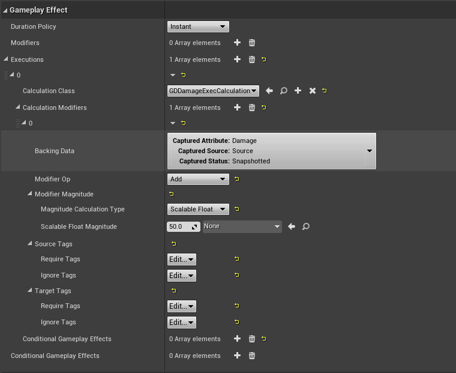
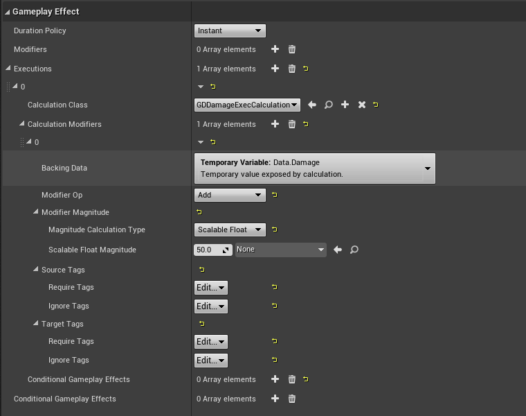
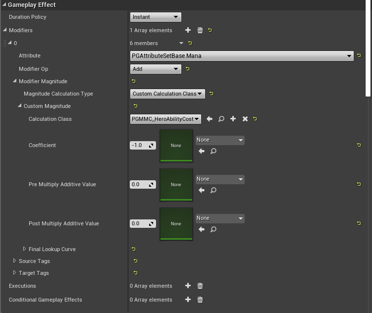
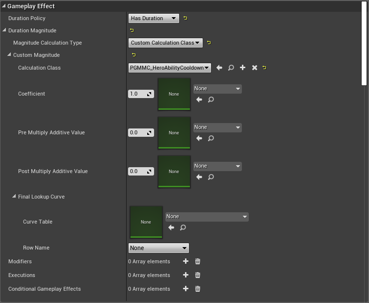

### 4.3.3 Meta Attributes
需要和其它Attributes交互的属性, 比如Damage, GameplayEffect不直接更改health Attribute, 而是用Meta Attribute作为占位, 进一步这个临时属性可以被buffs 或debuffs更改.

### 4.3.4 Responding to Attribute Changes
当属性值发生改变时, 会调用指定的委托, 

## 4.4 Attribute Set
### 4.4.1 Attribute Set definition
定义、保存、管理Attributes的变化.我们应该从他派生, 并在OwnerActor的构造函数中注册到ASC.
### 4.4.2 Attribute Set Design
一个ASC可以有一个或多个AttributeSets, 其内存消耗很小.

可以定义一个包含所有Attribute的Set, 在使用时忽略掉不用的就是.

也可以定义多个Set, 表示不同类型Attribute的组合, 在ASC中加入需要的即可.

AttributeSets也可子类化, 作为选择使用哪一个Set的另一种方式.

在一个ASC中最多只能有同一个AttributeSets 的一个实例, 有多个也只会用一个.

#### 4.4.2.1 Subcomponents with Individual Attributes

在一个有着多个可伤害组件的Pawn(载具)中,在知道这些组件的(最大)数量时, 就创建多少个Health属性在AttributeSet中,——DamageableCompHealth0,DamageableCompHealth1, etc.代表逻辑slot。在对应的Damageable component实例中,分配slot number Attribute, 以被GameplayAbilities或Executions读取. 

如果每个子组件都有许多Attributes, 而且可能有没有边界的数量的子组件，而且子组件可以被分离给其它玩家.直接用普通的float保存在Components中.

#### 4.4.2.2 Adding and Removing AttributeSets at Runtime
运行时添加或移除AttributeSet有崩溃的风险, 因为服务器客户端同步的原因，需要强制复制。
#### 4.4.2.3 Item Attributes (Weapon Ammo)
有三种方法:
对于可被多个玩家装备的物品的属性, 通常直接用float存在这些物品上。
##### 4.4.2.3.1 Plain Floats on the Item
Fortnite枪的子弹数量就是这样处理的.最大弹夹数,当前在弹夹中的子弹数, 储备子弹等
属性直接以可复制的float存在枪的实例中.

如果武器的储备子弹可以共享,可以把储备子弹放到Character的共享的弹药属性集中.

为避免射击期间把gun复制回客户端,应该在此期间disable复制.

##### 4.4.2.3.2 AttributeSet on the Item
##### 4.4.2.3.3 ASC on the Item
https://epicgames.ent.box.com/s/m1egifkxv3he3u3xezb9hzbgroxyhx89

### Defining Attributes
在派生自UAttributeSet的类的属性中定义, 包括其Getter,Setter 网络复制等都在这里定义.

### 4.4.4 Initializing Attributes
有多种方法初始化. 直接设置BaseValue.

Epic 建议使用一个立即触发的GameplayEffect.

在用了ATTRIBUTE_ACCESSORS定义属性时,也会生成一个InitXXX函数.

### 4.4.5 PreAttributeChange()
通常用于Clamp新的值, 但并不是永久的用于所有Modifier, 后续的更改需要重新Clamp.
```c++
void UMyAttributeSets::ProAttributeChange(const FGameplayAttribute& Attribute, float& NewValue)
{
    if(Attribute == GetMoveSpeedAttribute())
    {
        NewValue = FMath::Clamp<float>(NewValue, 150, 1000);
    }
}
```
这也不用于触发任何Gameplay事件, 应该用: UAbilitySyatemComponent::GetGameplayAttributeValueChangeDelegate(FGameplayAttribute Attribute)
### 4.4.6 PostGameplayEffectExecute()
在GameplayEffect修改了Attribute 的BaseValue之后调用.用于操纵来自GameplayEffect的属性更改.

在这里减去最终的Health Meta Attribute.如果有盾则减去盾.击中动画.显示伤害数据,分配经验 和 黄金给killer.

### 4.4.7 OnAttributeAggregatorCreated()


## 4.5 Gameplay Effects

### 4.5.1 Gameplay Effect Definition
GameplayEffects(GE)是abilities的容器, abilities通过它来改变Attributes和
GameplayTags(在GE上或其它地方).

通常是一个Data-only class, 定义了一个gameplay effect,没有额外的逻辑在里面.
通常会在蓝图中创建多个UGameplayEffect子类.

GameplayEffects 通过Modifiers 和 Executions(GameplayEffectExecuteion)改变
Attributes.

GameplayEffects 有三种类型: 
Instant 对Attribute立即执行的永久改变, 永远不会加GameplayTags, 一帧也不会.
Duration 临时改变, GE没有时Tags也消失.
Infinite 临时改变, GE不会主动消失, 必须被另一个Ability或ASC主动移除.

后两者可以设置为周期性地应用Periodic Effects(instant)执行Modifiers或Executeions.

GameplayEffects 可以添加/执行 GameplayCues. 

Instant GE 会调用GameplayCues或GameplayTags上的Execute(). Duration 或 
Infinite GE会调用Add 和Remove.

Duration 和 Infinite GE 可以被开启和关闭.

4.5.2 Applying Gameplay Effects
有许多方式, GameplayAbilities 或ASC都有函数可以, 类似于 ApplyGameplayEffectTo.
它们最终都是调用目标Actor的UAbilitySystemComponent::ApplyGameplayEffectSpecToSelf().

在其它任何地方应用一个GE都要先获取到目标Actor的ASC,并使用上述函数.

可以用下面的委托监听Duration或Infinite GE应用到ASC上:
```c++
AbilitySystemComponent->OnActiveGameplayEffectAddedDelegateToSelf.AddUObject(this, &MyObject::OnActiveGameplayEffectAddedCallback);
virtual void OnActiveGameplayEffectAddedCallback(UAbilitySystemComponent* Target, const FGameplayEffectSpec& SpecApplied, FActiveGameplayEffectHandle ActiveHandle);
```

### 4.5.3 Removing Gameplay Effects
同样GameplayAbilities和ASC也有许多函数可以移除GE, 通常叫 RemoveActiveGameplayEffect.
最终也是调用了目标上的FActiveGameplayEffectsContainer::RemoveActiveEffects().

同样在Target之外移除也需要先获取到Target's 的ASC.

也可以监听Duration 或 Infinite GE的移除:
```c++
AbilitySystemComponent->OnAnyGameplayEffectRemovedDelegate().AddUObject(this, &APACharacterBase::OnRemoveGameplayEffectCallback);
virtual void OnRemoveGameplayEffectCallback(const FActiveGameplayEffect& EffectRemoved);
```

### 4.5.4 Gameplay Effect Modifiers

Modifiers改变一个Attribute, 也是唯一的以可预测地方式改变属性的方法。
一个GE可以有一个或多个Modifiers, 每个Modifier只通过指定的操作改变一个属性.
包括加减乘除和直接覆盖.

一个Attribute的CurrentValue就是应用了所有Modifiers之后的BaseVlaue的值.
在GameplayEffectAggregator.cpp中的FAggregatorModChannel::EvaluateWithBase:
```
((InlineBaseValue + Additive) * Multiplicitive) / Division
```

有四种类型的Modifiers, 它们表示的操作数的来源:
Scalable Float: 有一个固定系数和数据表配置的等级系数
Attribute Based: 基于属性本身作更改.
Custom Calculation Class: 用一个ModifierMagnitudeCalculation操纵系数.
Set By Caller: 在GE之外运行时设定的值

#### 4.5.4.1 Multiply and Divide Modifiers

在`FAggregatorModChannel`中有一个`TArray<FAggregatorMod> Mods[EGameplayModOp::Max]`数组,
对应着Modifiers的四种操作, 其`EvaluateWithBase`方法根据传入的BaseValue来应用这些
操作, 并返回结果.其中对多个相同的操作先用`SumMods`处理,得到对应的单个操作数,最后用以下公式计算:
```
((InlineBaseValue + Additive) * Multiplicitive) / Division
```
其中值得注意的是对多个相同类型的比如乘和除的`SumMods`的调用类似于:
```
1 + (Mod1.Magnitude - 1) + (Mod2.Magnitude - 1) + ...
```
FAggregatorMod::EvaluatedMagnitude即是这个Modifier的操作数.这样的作法通常和我们想的不一样,
比如两个乘的Modifter的操作数为1.5, 它并不是BaseValue*1.5*1.5, 而是
BaseValue*(1 + (1.5 - 1) + (1.5 - 1)) = BaseValue * 2, 即表示的意义是两次增加0.5倍,
即BaseValue的2倍. 这看上去好像也没有问题，但是:
* 不要超过一个小于一的值, 和任何在1 和2之间的.
* 一个大于2的值.

两个0.5:
1 + (0.5 - 1) + (0.5 - 1) = 0 

1.1 和0.5 ： 
1 + (0.5 - 1) + (1.1 - 1) = 0.6; √

5,5 :
1 + (5 - 1) + (5 - 1) = 9

如果要改变这种规则, 则要修改`EvaluateWithBase`和`SumMods`函数.

#### 4.5.4.2 Gmaeplay Tags on Modifiers
在所属的Effect应用之后才会考虑, 如果是periodic 或infinite effect, 仅仅会在第一次
应用的时候考虑.

通过`UpdateQualifies`, 会通过GE捕获的target ASC 和source ASC获得他们的tags,并与
`FAggregatorEvaluateParameters`参数中的TagFilter比较, 以决定是否起作用.

### 4.5.5 Stacking Gameplay Effects

在GE中有一组属性定义它.

当一个新的GE加入到ASC时, 一般会创建一个新的GameplayEffectSpec, 也可以设置成stack
模式.仅对Duration 和 Infinite有效.

有两种类型, Aggregate by Source and Aggregate by Target.

可以在蓝图写一个自定义节点监听StackChange.

### 4.5.6 Granted Abilities

Duration 和 Infinite GE 可以授予ASCs新的GameplayAbilities.

当你想要另一个玩家被击退, 可以应用一个GE给另一个玩家,并自动激活执行击退动作的ability.
设计者可以选择GE授予什么ability, 及它的一些属性.还可以改输入绑定.

### 4.5.7 Gameplay Effect Tags


GE 中有许多Tags配置, .

GameplayEffectAssetTag: 这个GE本身的Tag,仅仅是为了描述这个GE.

Granted Tags: 会被给这个GE应用的ASC.当Ge移除时, 这些Tags也会从ACS移除.仅对
Duration和InfiniteGE有效.

Ongoing Tag Requirements: 一旦GE被应用,这些Tags决定它在应用时的初始状态是On还是off.

ApplicationTagRequirements: 决定Targets是否能够应用这个GE,如果Target不匹配这组GE,
将不会Apply.

RemoveGameplayEffectswithTags: 在Target的AssetTags或GrantedTags有任何一个这些Tags
都会把这个GE移除。

### 4.5.8 Immunity

GE可以授予免疫,有效地阻止其它GE的应用, 基于GameplayTags.还可以用他达到
ApplicationTagRequirements的效果, 还有一个由于Immunity导致的GE blocked的委托
UAbilitySystemComponent::OnImmunityBlockGameplayEffectDelegate.

GrantedApplicationImmunityTags检查Source ASC有任何指定的Tags,可以实现免疫来自
特定characters的GE.

GrantedApplicationImmunityQuery会检查即将来的GESpec,是否满足这个查询.

### 4.5.9 GameplayEffectSpec

GameplayEffectSpecs可以用UAbilitySystemComponent::MakeOutgoingSpec().直接
用传进来的GE的TSubclassOf的GetDefaultObject()作为GE, 这也暗示了GE是
不能在Runtime下改变的,否则一个地方改了, 其它地方都会受到影响.

通常可以把从一个Ability创建的GES传给Projectile, Projectile在稍后将其应用到击中
的对象上.当GES成功应用时, 会返回一个新的结构体: FActiveGameplayEffect.

* 有从GE创建的Class.
* GEC 的level, 通常和创建它的Ability一样, 也可以不一样
* GESpec 的Duration,默认和GE的一样, 也可以不一样, Period也是如此.
* GESpec stack limit 在GE上.
* GameplayEffectContextHandle告诉我们谁创建了这个GESpec.
* 在创建这个GESpec时是用snapshotting的方式捕获Attributes.
* DynamicGrantedTags 是GESpec授予目标的除了GE的GameplayTags 之外的额外的Tags.同样DynamicAssetTags也是.
* SetByCaller TMaps.
#### 4.5.9.1 SetByCallers
允许GESpec carry 和GameplayTag或FName关联的float值,通过TMap,  TMap<FGameplayTag, float>, TMap<FName, float>。
通常可被用作GE上的Modifiers, 或通用的过渡浮点值。 被普遍地用于通过SetByCallers传
递Ability中产生的数字数据给GameplayEffectExecutionCalculations或
ModifierMagnitudeCalculations.

蓝图中可在GESpec上用AssignTagSetbyCallerMagnitude或AssignSetbyCallerMagnitude设置.
get节点需要自己实现.

C++中:
```c++
void FGameplayEffectSpec::SetSetByCallerMagnitude(FName DataName, float Magnitude);
void FGameplayEffectSpec::SetSetByCallerMagnitude(FGameplayTag DataTag, float Magnitude);
float GetSetByCallerMagnitude(FName DataName, bool WarnIfNotFound = true, flaot DefaultIfNotFound = 0.f) const;
float GetSetByCallerMagnitude(FGameplayTag DataTag, bool WarnIfNotFound = true, float DefaultIfNotFound = 0.f) const;
```
通常建议使用GameplayTag, 可以阻止拼写错误, 而且GameplayTags在网络传输时也更高效.

### 4.5.10 Gameplay Effect Context
GameplayEffectContext结构体持有GESpec的instigator和TargetData的信息. 
这也是一个好地方通过子类化它, 来在ModifierMagnitudeCalculations,
GameplayEffectExecutionCalculations,AttributeSets 和 GameplayCues之间传递任意数据.

1. Subclass FGameplayEffectContext
2. Override FGameplayEffectContext::GetScriptStruct()
3. Override FGameplayEffectContext::Duplicate()
4. Override FGameplayEffectContext::NetSerialize() if your new data nedds to be replicated.
5. Implement TStructOpsTypeTraites for your subclass, like the parent struct 
FGameplayEffectContext has.
6. Override AllocGameplayEffectContext() in your AbilitySystemGlobals class to return
a new object of your subclass.

### 4.5.11 Modifier Magnitude Calculation

`ModifierMagnitudeCalculations`(MMC)通常在GE中用作Modifiers,它和
GameplayEffectExecutionCalculations差不多,但是没那么强大但可以被预测.其主要目的
是在CalculateBaseMagnitude_Implementation中返回一个浮点数.
```c++
/** Magnitude value represented by a custom calculation class */
UPROPERTY(EditDefaultsOnly, Category=Magnitude)
FCustomCalculationBasedFloat CustomMagnitude;
```
可以被用于任何类型的GE.MMC可以捕获任意数量的在GE的Source或Target上的Attributes, 
并且有完全的对GESpec的GameplayTags和SetByCallers的访问权限。这些Attribute可以在
创建时捕获也可以在应用或自动更新(Infinite, Duration)时计算.

MMC的计算结果可以被GE的Modifier用系数或加减进一步修改.

MMC捕获Target的mana属性,并因为poison effect, 需要扣除目标的mana.扣除数量依赖于目标的
mana值和它拥有的tag.

```c++
UPAMMC_PoisonMana::UPAMMC_PoisonMana()
{

	//ManaDef defined in header FGameplayEffectAttributeCaptureDefinition ManaDef;
	ManaDef.AttributeToCapture = UPAAttributeSetBase::GetManaAttribute();
	ManaDef.AttributeSource = EGameplayEffectAttributeCaptureSource::Target;
	ManaDef.bSnapshot = false;

	//MaxManaDef defined in header FGameplayEffectAttributeCaptureDefinition MaxManaDef;
	MaxManaDef.AttributeToCapture = UPAAttributeSetBase::GetMaxManaAttribute();
	MaxManaDef.AttributeSource = EGameplayEffectAttributeCaptureSource::Target;
	MaxManaDef.bSnapshot = false;

	RelevantAttributesToCapture.Add(ManaDef);
	RelevantAttributesToCapture.Add(MaxManaDef);
}

float UPAMMC_PoisonMana::CalculateBaseMagnitude_Implementation(const FGameplayEffectSpec & Spec) const
{
	// Gather the tags from the source and target as that can affect which buffs should be used
	const FGameplayTagContainer* SourceTags = Spec.CapturedSourceTags.GetAggregatedTags();
	const FGameplayTagContainer* TargetTags = Spec.CapturedTargetTags.GetAggregatedTags();

	FAggregatorEvaluateParameters EvaluationParameters;
	EvaluationParameters.SourceTags = SourceTags;
	EvaluationParameters.TargetTags = TargetTags;

	float Mana = 0.f;
	GetCapturedAttributeMagnitude(ManaDef, Spec, EvaluationParameters, Mana);
	Mana = FMath::Max<float>(Mana, 0.0f);

	float MaxMana = 0.f;
	GetCapturedAttributeMagnitude(MaxManaDef, Spec, EvaluationParameters, MaxMana);
	MaxMana = FMath::Max<float>(MaxMana, 1.0f); // Avoid divide by zero

	float Reduction = -20.0f;
	if (Mana / MaxMana > 0.5f)
	{
		// Double the effect if the target has more than half their mana
		Reduction *= 2;
	}
	
	if (TargetTags->HasTagExact(FGameplayTag::RequestGameplayTag(FName("Status.WeakToPoisonMana"))))
	{
		// Double the effect if the target is weak to PoisonMana
		Reduction *= 2;
	}
	
	return Reduction;
}
```
如果没有在构造函数中将`FGameplayEffectAttributeCaptureDefinition`添加到RelevantAttributesToCapture,在尝试捕获Attributes时,
或得到关于missing Spec的错误.如果不需要捕获属性, 则不必向RelevantAttributesToCapture中添加任何东西.

### 4.5.12 Gmaeplay Effect Execution Calculation
GameplayEffectExecutionCalculation.h

这几乎是GE中最强大的方式去修改一个ASC.和上面一样,它也可以捕获属性和可选的快照捕获方式.
不同的是它可以改变不止一个属性, 并且做任何你想做的事情。为达此目的的代价就是不能预测,
且必须用c++ 实现.

ExecutionCalculations 仅可被用于instant 和 Periodic GameplayEffects. 任何带有
Execute的， 通常都指这两种类型的GE.

Snapshotting 在GESpec创建时捕获属性, not Snapshotting 在GESpec应用时捕获. 
捕获一个属性会从他们的ASC上的mods重新计算它们的CurrentValue, 但不会运行AbilitySet中的PreAttributeChange().

参考Epic's ActionRPG样例工程, 可以通过定义一个结构体 保存或定义 如何捕获Attributes,并在其构造函数中创建它的一份copy.对每一个ExecCalc都要有一个这样的结构体.每一个结构体的名字都要是唯一的, 同一个名字会导致不正确地捕获Attributes.

对于Local Predicted, Sercer Only, Server Initiated GameplayAbilities, ExecCalc仅会
在server上调用.

ExecCalc的一个常用例子是基于一个复杂的计算公式和从Source和Target读取许多属性 计算承受的伤害, 样例工程中实现了一个简单的计算Damage的ExecCalc, 从GESpec的SetByCaller和从Taget捕获的armor 属性的值计算.See GDDamageExecCalculation.cpp/.h

#### 4.5.12.1 Sending Data to Execution Calculations
为了捕获Attributes, 有几种方式可以发送data给ExecutionCalculation.
##### 4.5.12.1.1 SetByCaller
可以直接读取设置在GESpec上的SetByCallers参数:
```c++
const FGameplayEffectSpec& Spec = ExecutionParams.GetOwningSpec();
float Damage = FMath::Max<float>(Spec.GetSetByCallerMagnitude(FGameplayTag::RequestGameplayTag(FName("Data.Damage")), false, -1.0f),0.0f);
```
##### 4.5.12.1.2 Backing Data Attribute Calculation Modifier
如果想传一个硬编码的值给GE, 可以用CalculationModifier,它使用被捕获的属性作为backing data.



在这个截图中, 我们将捕获的Damage Attribute加50.也可以设置成override以仅仅take
这个硬编码值.

ExecutionCalculation 在捕获这个属性时读取这个值:
```c++
float Damage = 0.0f;
ExecutionParams.AttemptCalculateCapturedAttributeMagnitude(DamageStatics().DamageDef, EvaluationParameters, Damage);
```
##### 4.5.12.1.3 Backing Data Temporary Calculation Modifiers
可以用使用Temporary Variable 或者 Transient Aggregator的CalculationModifier传递硬编码值给GE.Temporary Variable 与一个GameplayTag关联.

下面这个截图中使用Data.Damage加了50给一个Temporary Variable.


添加backing Temporary Variables 到你的ExecutionCalculation's 构造函数上:
```c++
ValidTransientAggregatorIdentifiers.AddTag(FGameplayTag::RequestGameplayTag("Data.Damage"));
```
在ExecutionCalculation中读取:
```c++
float Damage = 0.0f;
ExecutionParams.AttemptCalculateTransientAggregatorMagnitude(FGameplayTag::RequestGameplayTag("Data.Damage"), EvaluationParameters, Damage);
```

##### 4.5.12.1.4 Gameplay Effect Context
通过GESpec上自定义的GameplayEffectContext发送data给ExecutionCalculation.

在ExecutionCalculation中, 可以从FGameplayEffectCustomExecutionParameters访问EffectContext:
```c++
const FGameplayEffectSpec& Spec = ExecutionParams.GetOwningSpec();
FGSGameplayEffectContext* ContextHandle = static_cast<FGSGameplayEffectContext*>(SpecGetContext().Get());
```
如果需要改变GameplayEffectSpec或EffectContext上的一些东西:
```c++
FGameplayEffectSpec* MutableSpec = ExecutionParams.GetOwningSpecForPreExecuteMod();
FGSGameplayEffectContext* ContextHandle = static_cast<FGSGameplayEffectContext*>(MutableSpec->GetContext().Get());
```
在ExecutionCalculation中修改GameplayEffectSpec的使用警告:
```c++
/** Non const access. Be careful with this, especially when modifying a spec after attribute capture. */
FGameplayEffectSpec* GetOwningSpecForPreExecuteMod() const;
```
### 4.5.13 Custom Application Requirements

CustomApplicationRequirement(CAR)  给予设计者更高级的方式控制是否GE可以被应用, 而不采用GE上简单的GameplayTag检查.可以通过在蓝图中override CanApplyGameplayEffect() 或在C++ 中overrride CanApplyGameplayEffect_Implementation().

用例:
* 需要Target的一个属性有特定的值。
* Target需要有一个GE的特定数量的栈.
* 是否Target上已经有一个这个GE的实例
* 改变已存在的实例的duration(而不是应用一个新的实例)

4.5.14 Cost Gameplay Effect 
可选地, GameplayAbilities有一个特别设计的GE用于Ability的cost.Costs就是为了能够激活一个GameplayAbility, ASC必须有的一个属性值的量.如果GA不能承担GE的Cost, 它就不能激活。这个Cost GE 必须是一个带有一个或多个从Attributes减去值的Modifiers的Instant GameplayEffect.
默认地, Cost GEs是可预测的, 并且为了保持这一功能不建议使用ExecutionCalculations. 对于复杂的Cost Calculations,MMC是一种完全可接受的且完美的方式.

开始时, 可能对每一个有Cost的GA都要有一个unique的Cost GE.更高级的方式是对不同的GAs重用Cost GE, 仅仅是修改从这个Cost GE创建的GESPec(用GA特定的数据, Cost值定义在GA上)。仅对Instanced abilities 有效.

两个重用Cost GE的技术:
1. 使用MMC, 这是最简单的方式. 创建一个MMC, 从GameplayEffectSpec获取到GameplayAbility实例，从中读取到Cost值. 
```c++
float UPGMMC_HeroAbilityCost::CalculateBaseMagnitude_Implementation(const FGameplayEffectSpec& Spec) const 
{
	const UPGGameplayAbility* Ability = Cast<UPGGameplayAbility>(Spec.GetContext().GetAbilityInstance_NotReplicated());
	if(!Ability){
		return 0.0f;
	}
	return Ability->Cost.GetValueAtLevel(Ability->GetAbilityLevel());
}
```
其中, Cost value 是GameplayAbility子类中的FScalableFloat
```c++
UPROPERTY(BleuprintReadOnly, EditAnywhere, Category = "Cost")
FScalableFloat Cost;
```

2. 重载UGameplayAbility::GetCostGameplayEffect().可以在运行时创建一个GE从读取GA上的CostValue.

### 4.5.15 Cooldown Gameplay Effect
同样, GA也有一个用于cooldown的可选的特殊GE设计,Cooldowns决定了一个ability激活后要过多久才能再次激活.Cooldown GE应该是Duration GE, 没有Modifiers, 每一个GA(或ability slot)都应该有一个唯一GameplayTag在cooldown GE 的GrantedTags. (如果你的game 有可交替的分配到一个slot的ability, 且共享一个cooldown).GA实力上会检查Cooldown Tag是否存在。默认地, Cooldowns GE是可预测的, 并且建议维持这一性质, 所以不要使用ExecutionCalculations.  对于复杂的Cooldowns Calculations,MMC是一种完全可接受的且完美的方式.

开始时, 可能每一个GA都有一个独一无二的Cooldown GE. 也可以多个GA用同一个Cooldown GE, 仅仅是从这个GE 创建 GESpec时用特定GA的数据修改一下这个GESpec(Cooldown duration 和 Cooldown Tag定义在GA中.).仅对Instanced Abilities有效.

重用Cooldown GE的两种方式:
1. 使用SetByCaller.这是最简单的方式. 通过一个GameplayTag设置共享Cooldown GE的Duration到SetByCaller.在GA子类中, 为duration定义一个float / FScalableFloat,为unique Cooldown Tag定义一个FGmaeplayTagContainer, 和一个临时的FGameplayTagContainer,用于一个返回的pointer,持有Colldown Tag和Cooldown GE's Tag.
```c++
UPROPERTY(BlueprintReadOnly, EditAnywhere, Category = "Cooldown")
FScalableFloat CooldownDuration;

UPROPERTY(BlueprintReadOnly, EditAnywhere, Category = "Cooldown")
FGameplayTagContainer CooldownTags;

// Temp container that we will return the pointer to in GetCooldownTags().
// This will be a union of our CooldownTags and the Cooldown GE's cooldown tags.
UPROPERTY()
FGameplayTagContainer TempCooldownTags;
```
然后重载UGameplayAbility::GetCooldownTags()返回Cooldown Tags和任何存在的Cooldown GE's tags.
```c++
const FGameplayTagContainer * UPGGameplayAbility::GetCooldownTags() const
{
	FGameplayTagContainer* MutableTags = const_cast<FGameplayTagContainer*>(&TempCooldownTags);
	const FGameplayTagContainer* ParentTags = Super::GetCooldownTags();
	if (ParentTags)
	{
		MutableTags->AppendTags(*ParentTags);
	}
	MutableTags->AppendTags(CooldownTags);
	return MutableTags;
}
```
最终, 重载UGameplayAbility::ApplyCooldown()注入我们的CooldownTags到Cooldown Gameplay GameplayEffectSpec.
```c++
void UPGGameplayAbility::ApplyCooldown(const FGameplayAbilitySpecHandle Handle, const FGameplayAbilityActorInfo * ActorInfo, const FGameplayAbilityActivationInfo ActivationInfo) const
{
	UGameplayEffect* CooldownGE = GetCooldownGameplayEffect();
	if (CooldownGE)
	{
		FGameplayEffectSpecHandle SpecHandle = MakeOutgoingGameplayEffectSpec(CooldownGE->GetClass(), GetAbilityLevel());
		SpecHandle.Data.Get()->DynamicGrantedTags.AppendTags(CooldownTags);
		ApplyGameplayEffectSpecToOwner(Handle, ActorInfo, ActivationInfo, SpecHandle);
	}
}
```
```c++
float UPGMMC_HeroAbilityCooldown::CalculateBaseMagnitude_Implementation(const FGameplayEffectSpec & Spec) const
{
	const UPGGameplayAbility* Ability = Cast<UPGGameplayAbility>(Spec.GetContext().GetAbilityInstance_NotReplicated());

	if (!Ability)
	{
		return 0.0f;
	}

	return Ability->CooldownDuration.GetValueAtLevel(Ability->GetAbilityLevel());
}
```


4.5.15.1 Get the Cooldown Gameplay Effect'Remaining Time
```c++
bool APGPlayerState::GetCooldownRemainingForTag(FGameplayTagContainer CooldownTags, float & TimeRemaining, float & CooldownDuration)
{
	if (AbilitySystemComponent && CooldownTags.Num() > 0)
	{
		TimeRemaining = 0.f;
		CooldownDuration = 0.f;

		FGameplayEffectQuery const Query = FGameplayEffectQuery::MakeQuery_MatchAnyOwningTags(CooldownTags);
		TArray< TPair<float, float> > DurationAndTimeRemaining = AbilitySystemComponent->GetActiveEffectsTimeRemainingAndDuration(Query);
		if (DurationAndTimeRemaining.Num() > 0)
		{
			int32 BestIdx = 0;
			float LongestTime = DurationAndTimeRemaining[0].Key;
			for (int32 Idx = 1; Idx < DurationAndTimeRemaining.Num(); ++Idx)
			{
				if (DurationAndTimeRemaining[Idx].Key > LongestTime)
				{
					LongestTime = DurationAndTimeRemaining[Idx].Key;
					BestIdx = Idx;
				}
			}

			TimeRemaining = DurationAndTimeRemaining[BestIdx].Key;
			CooldownDuration = DurationAndTimeRemaining[BestIdx].Value;

			return true;
		}
	}

	return false;
}
```
Note: 只有能够接受复制的GE才能在客户端上查询cooldown的剩余时间.这依赖于他们的replication mode.

4.5.15.2 Listenning for Cooldown Begin and End
有两种方法可以监听Cooldown开始, 绑定函数到AbilitySystemComponent->OnActiveGameplayEffectAddedDelegateTOSelf会在Cooldown GE Apply时调用. 或者GE被added的时候调用, 通过AbilitySystemComponent->RegisterGmaeplayTagEvent(CooldownTag, EGameplayTagEventType::NewOrRemoved). 建议监听GE Added, 以为这时也可以访问添加这个标签的GameplayEffectSpec.这里你可以判定Cooldown GE 是locally predicted 还是Server's。

同样对称地, 监听End也有两种方法:
```c++
// 1. 
DECLARE_MULTICAST_DELEGATE_OneParam(FOnGivenActiveGameplayEffectRemoved, const FActiveGameplayEffect&);

/** Called when any gameplay effects are removed */
FOnGivenActiveGameplayEffectRemoved& OnAnyGameplayEffectRemovedDelegate();

// 2. 
DECLARE_MULTICAST_DELEGATE_TwoParams(FOnGameplayEffectTagCountChanged, const FGameplayTag, int32);
/** Allow events to be registered for specific gameplay tags being added or removed */
FOnGameplayEffectTagCountChanged& RegisterGameplayTagEvent(FGameplayTag Tag, EGameplayTagEventType::Type EventType=EGameplayTagEventType::NewOrRemoved);
```
建议监听Cooldown Tag移除的事件,因为当服务端校正的Cooldown GE复制过来时, 将会移除我们本地预测的这个, 即使仍然在colldown中, 也会造成OnAnyGameplayEffectRemovedDelegate()调用.Cooldown tag 在predicted colldown移除和Server's被校正的Colldown GE的应用之间不会改变.

Note: 在Client上监听GE的添加或移除, 要求他们可以接受GE复制. 而这依赖于ASC's replication mode.

Sample Project实现了一个自定义蓝图节点监听Cooldown的开始和结束.HUD Widget用它更新cooldown的剩余时间.这个异步任务将会永远存在, 除非手动调用EndTask(),可以在UMNG的Destruct中调用.AsyncTaskEffectCooldownChanged.h/cpp.

4.5.15.3 Predicting Colldowns
当前, Cooldown不能被真实地预测。当本地predicted的Cooldown GE被应用时就开始UI的cooldown定时, 但是GA的实际colldown是被绑定到server's cooldown's 剩余时间.


## 4.8 Gamplay Cues
### 4.8.1 Gameplay Cue Definition
GameplayCues(GC) 执行非gameplay 相关的事, 音效, 粒子, 相机震动等.
