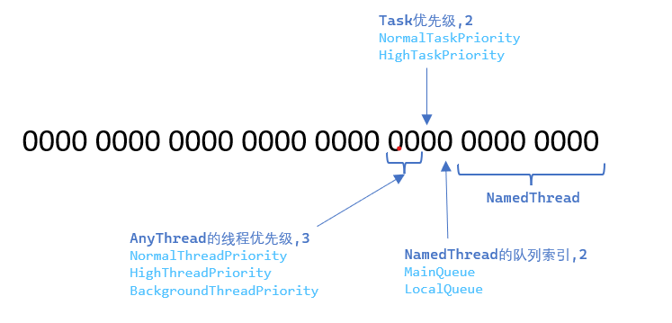

# UE4-TaskGraph
这篇文章分析了UE4中有关多线程的部分系统. 包括`Thread`的基本跨平台实现, 和基于此的`QueuedThreadPool`和`TaskGraph`, 重点在于`TaskGraph`, 因为`UE4`中的大部分线程之间的交互都是通过它完成的.尤其是多线程渲染, 所以也会简单提到关于渲染的线程之间的交互.

这里参考了许多大佬们的文章, 站在巨人们的肩膀上才能看的更远, 感谢各位大佬(&#x1F601;).

* [1. FRunnable](#1-frunnable)
* [2. FRunnableThread](#2-frunnablethread)
* [3. QueuedWork](#3-queuedwork)
	* [3.1 FQueuedThreadPoolBase实现](#31-fqueuedthreadpoolbase实现)
	* [3.2 IQueuedWork](#32-iqueuedwork)
* [4. TaskGraph](#4-taskgraph)
	* [4.1 FTaskGraphInterface和FTaskGraphImplementation](#41-ftaskgraphinterface和ftaskgraphimplementation)
    * [4.2 FBaseGraphTask](#42-fbasegraphtask)
	* [4.3 FGraphEvent](#43-fgraphevent)
	* [4.4 TGraphTask](#44-tgraphtask)
	* [4.5 实例](#45-实例)
* [5. 多线程渲染](#5-多线程渲染)
	* [5.1 渲染线程](#51-渲染线程)
	* [5.2 RHI线程](#52-rhi线程)
* [Reference](#reference)

## 1. FRunnable
`FRunnable`是所有多线程执行的`Runnable`对象的基类, 它定义了按一定顺序在创建的线程中执行的接口.
```c++
class CORE_API FRunnable
{
public:
	virtual bool Init();
	virtual uint32 Run() = 0;
	virtual void Stop() { }
	virtual void Exit() { }
};
```
这个对象中的这些方法均会新的线程内调用.
其部分子类:
```
FRenderingThread
FRHIThread
FRenderingThreadTickHeartbeat
FTaskThreadBase
FQueuedThread
TAsyncRunnable
FAsyncPurge
```
`FRunnable`仅仅是定义了期望多线程执行的逻辑, 它需要有真正的线程`(FRunnableThread)`执行它. 上面那些`FRunnable`对象的子类`FRenderingThread`或`FRHIThread`,名字听起来像线程对象, 但他并不是.

## 2. FRunnableThread
这才是线程本体.它提供了一些管理线程对象本身生命周期的接口. `FRunnableThread`在创建时, 接收一个`FRunnable`对象实例, 用平台相关的接口创建出真正的线程, 并执行真线程的入口函数, 其中会执行传入的`FRunnable`.
```c++
class CORE_API FRunnableThread
{
public:
    // 创建一个线程, 并执行InRunnable, 一切都是从这个函数开始的.
	static FRunnableThread* Create(
		class FRunnable* InRunnable,
		const TCHAR* ThreadName,
		uint32 InStackSize = 0,
		EThreadPriority InThreadPri = TPri_Normal,
		uint64 InThreadAffinityMask = FPlatformAffinity::GetNoAffinityMask(),
		EThreadCreateFlags InCreateFlags = EThreadCreateFlags::None);
	virtual void Suspend( bool bShouldPause = true ) = 0;
	virtual bool Kill( bool bShouldWait = true ) = 0;
	virtual void WaitForCompletion() = 0;
protected:
    // 平台相关的创建线程, 并按预期的顺序执行Runnable的逻辑
	virtual bool CreateInternal( FRunnable* InRunnable, const TCHAR* InThreadName,
		uint32 InStackSize = 0,
		EThreadPriority InThreadPri = TPri_Normal, uint64 InThreadAffinityMask = 0, 
		EThreadCreateFlags InCreateFlags = EThreadCreateFlags::None) = 0;
	/** Holds the name of the thread. */
	FString ThreadName;
	/** The runnable object to execute on this thread. */
	FRunnable* Runnable;
	/** Sync event to make sure that Init() has been completed before allowing the main thread to continue. */
	FEvent* ThreadInitSyncEvent;
	/** The priority to run the thread at. */
	EThreadPriority ThreadPriority;
	/** ID set during thread creation. */
	uint32 ThreadID;
private:
	static void SetupCreatedThread(FRunnableThread*& NewThread, class FRunnable* InRunnable, const TCHAR* ThreadName, uint32 InStackSize, EThreadPriority InThreadPri, uint64 InThreadAffinityMask, EThreadCreateFlags InCreateFlags);
};
```
在`Windows`平台下其实现:
```c++
	virtual bool CreateInternal( FRunnable* InRunnable, const TCHAR* InThreadName,
		uint32 InStackSize = 0,
		EThreadPriority InThreadPri = TPri_Normal, uint64 InThreadAffinityMask = 0,
		EThreadCreateFlags InCreateFlags = EThreadCreateFlags::None) override
	{
		static bool bOnce = false;
		if (!bOnce)
		{
			bOnce = true;
			::SetThreadPriority(::GetCurrentThread(), TranslateThreadPriority(TPri_Normal)); // set the main thread to be normal, since this is no longer the windows default.
		}

		check(InRunnable);
		Runnable = InRunnable;
		ThreadAffinityMask = InThreadAffinityMask;

		// Create a sync event to guarantee the Init() function is called first
		ThreadInitSyncEvent	= FPlatformProcess::GetSynchEventFromPool(true);

		ThreadName = InThreadName ? InThreadName : TEXT("Unnamed UE4");
		ThreadPriority = InThreadPri;

		// Create the new thread
		{
			LLM_SCOPE(ELLMTag::ThreadStack);
			LLM_PLATFORM_SCOPE(ELLMTag::ThreadStackPlatform);
			// add in the thread size, since it's allocated in a black box we can't track
			LLM(FLowLevelMemTracker::Get().OnLowLevelAlloc(ELLMTracker::Default, nullptr, InStackSize));
			LLM(FLowLevelMemTracker::Get().OnLowLevelAlloc(ELLMTracker::Platform, nullptr, InStackSize));

			// 调用Windows API创建线程对象, 入口函数为_ThreadProc
			Thread = CreateThread(NULL, InStackSize, _ThreadProc, this, STACK_SIZE_PARAM_IS_A_RESERVATION | CREATE_SUSPENDED, (::DWORD *)&ThreadID);
		}

		// If it fails, clear all the vars
		if (Thread == NULL)
		{
			Runnable = nullptr;
		}
		else
		{
			ResumeThread(Thread);

			// Let the thread start up
			ThreadInitSyncEvent->Wait(INFINITE);

			ThreadPriority = TPri_Normal; // Set back to default in case any SetThreadPrio() impls compare against current value to reduce syscalls
			SetThreadPriority(InThreadPri);
		}

		// Cleanup the sync event
		FPlatformProcess::ReturnSynchEventToPool(ThreadInitSyncEvent);
		ThreadInitSyncEvent = nullptr;
		return Thread != NULL;
	}
```

其中入口函数: 
```c++
static ::DWORD STDCALL _ThreadProc( LPVOID pThis )
{
	check(pThis);
	auto* ThisThread = (FRunnableThreadWin*)pThis;
	FThreadManager::Get().AddThread(ThisThread->GetThreadID(), ThisThread);
	return ThisThread->GuardedRun();
}
```
`pThis`为`WinAPI`创建线程时传入的当前`FRunnableThread`对象指针.这里将创建的线程添加到`FThreadManager`中管理, 里它实现了在不支持多线程时, 转为单线程执行`(Tick FRunnable)`:
```c++
void FThreadManager::Tick()
{	
	const bool bIsSingleThreadEnvironment = FPlatformProcess::SupportsMultithreading() == false;
	if (bIsSingleThreadEnvironment)
	{
		QUICK_SCOPE_CYCLE_COUNTER(STAT_FSingleThreadManager_Tick);

		FScopeLock ThreadsLock(&ThreadsCritical);

		// Tick all registered fake threads.
		for (TPair<uint32, FRunnableThread*>& ThreadPair : Threads)
		{
			// Only fake and forkable threads are ticked by the ThreadManager
			if( ThreadPair.Value->GetThreadType() != FRunnableThread::ThreadType::Real )
			{
				ThreadPair.Value->Tick();
			}
		}
	}
}
```
 其中`GuardedRun()`最终调用`Run()`开始执行`FRunnable`:
```c++
uint32 FRunnableThreadWin::Run()
{
	// Assume we'll fail init
	uint32 ExitCode = 1;
	check(Runnable);

	// Initialize the runnable object
	if (Runnable->Init() == true)
	{
		// Initialization has completed, release the sync event
		ThreadInitSyncEvent->Trigger();

		// Setup TLS for this thread, used by FTlsAutoCleanup objects.
		SetTls();

		// Now run the task that needs to be done
		ExitCode = Runnable->Run();
		// Allow any allocated resources to be cleaned up
		Runnable->Exit();

#if STATS
		FThreadStats::Shutdown();
#endif
		FreeTls();
	}
	else
	{
		// Initialization has failed, release the sync event
		ThreadInitSyncEvent->Trigger();
	}

	return ExitCode;
}
```
这里保证了`FRunnable`中的接口的执行顺序. 在`CreateInternal()`创建线程之后, 并不是立即返回, 而是等待一个同步事件:
```c++
// Let the thread start up
ThreadInitSyncEvent->Wait(INFINITE);
```
这个事件就是在`Run()`中执行完`Runnable->Init()`之后发出的.这就保证了, `FRunnableThread::Create()`一定是在`FRunnable`初始化完之后才会返回.
除此之外还有许多其它平台的实现:
```
FRunnableThreadPThread
    FRunnableThreadApple
	FRunnableThreadUnix
	FRunnableThreadAndroid
FFakeThread
FForkableThread
FRunnableThreadHoloLens
```

所以, 这组API的使用流程大概就是:
```c++
//  先继承FRunnable, 实现要多线程执行的逻辑.
//  class MyRunnableTest : public FRunnable;

MyRunnableTest * MyRunnable = new MyRunnableTest();
FRunnableThread* MyThread = FRunnableThread::Create(MyRunnable, TEXT("MyRunnableTest"));

// do something 
FPlatformProcess::Sleep(5.0f);

MyThread->WaitForCompletion();

delete MyThread;
delete MyRunnable;
```
但是一般都不会直接用它, 而是基于它封装的另外两组多线程接口.

## 3. QueuedWork
`QueuedWork`的基本想法是, 将需要多线程执行的任务放到一个任务队列中, 在线程池中的线程取出这些任务并执行.通常的用法, 首先需要实现需要多线程执行的`Task`:

```c++
class FExampleAsyncTask : public FNonAbandonableTask
{
	friend class FAsyncTask<FExampleAsyncTask>;
	int32 ExampleData;
	FExampleAsyncTask(int32 InData)
		: ExampleData(InData)
	{

	}
	void DoWork()
	{
		double Begin = FPlatformTime::Seconds();

		UE_LOG(LogTemp, Display, TEXT("Begin DoWork Thread  : %s,Begin Seconds : %f "), *FThreadManager::Get().GetThreadName(FPlatformTLS::GetCurrentThreadId()),  Begin);
		int MyRes = factorial(ExampleData);
		UE_LOG(LogTemp, Display, TEXT("End DoWork Thread  : %s, Time cost : %f, The factorial of %d is %d  "), *FThreadManager::Get().GetThreadName(FPlatformTLS::GetCurrentThreadId()),  FPlatformTime::Seconds() - Begin, ExampleData, MyRes);
	}

	FORCEINLINE TStatId GetStatId() const
	{
		RETURN_QUICK_DECLARE_CYCLE_STAT(MyExampleAsyncTask, STATGROUP_ThreadPoolAsyncTasks);
	}
private:
	int factorial(int N)
	{
		int res = 1;
		for (int i = N; i > 1; i--)
		{
			res *= i;
			FPlatformProcess::Sleep(1);
		}
		return res;
	}
};
```
使用时:
```c++
FAsyncTask<FExampleAsyncTask>* MyTask = new FAsyncTask<FExampleAsyncTask>(10);
// 开始执行
MyTask->StartBackgroundTask();

// 可以在Tick中轮询
if (MyTask->IsDone())
{

}

MyTask->EnsureCompletion(); // 等待直到完成
{
	UE_LOG(LogPlayerController, Display, TEXT("Completion callback : %s "), * FThreadManager::Get().GetThreadName(FPlatformTLS::GetCurrentThreadId()));
}
delete MyTask;
```
`FAsyncTask`是Engine实现好的一种`IQueuedWork`, 提供了Work完成相关的同步操作, 当确保Work执行完之后要手动清除这个任务(或者重复利用). 

还有一种`FAutoDeleteAsyncTask`, 会在执行完之后自动`delete this`(从Pool thread).
```c++
// FAutoDeleteAsyncTask::DoWork
void DoWork()
{
	LLM_SCOPE(InheritedLLMTag);
	FScopeCycleCounter Scope(Task.GetStatId(), true);

	Task.DoWork();
	delete this;
}
```
### 3.1 FQueuedThreadPoolBase实现
首先有一个线程池`FQueuedThreadPoolBase`, 在启动时会根据硬件条件创建一定数量的线程. 这些线程会在一个队列`(QueuedThreads)`中排队等待执行任务.所有希望多线程执行的任务`IQueuedWork`都需要被添加到任务队列`QueuedWork`中排队等待执行.这里所有的同步都是基于锁和事件的.


通常我们创建的`Work`都在一个全局线程池`GThreadPool`中执行, 它是在`Engine`的启动流程中创建的, 池中的线程数由当前机器的核心数和是否是`Server`决定.
```c++
// int32 FEngineLoop::PreInitPreStartupScreen(const TCHAR* CmdLine)
{
	GThreadPool = FQueuedThreadPool::Allocate();
	int32 NumThreadsInThreadPool = FPlatformMisc::NumberOfWorkerThreadsToSpawn();

	// we are only going to give dedicated servers one pool thread
	if (FPlatformProperties::IsServerOnly())
	{
		NumThreadsInThreadPool = 1;
	}
	verify(GThreadPool->Create(NumThreadsInThreadPool, StackSize * 1024, TPri_SlightlyBelowNormal, TEXT("ThreadPool")));
}
```
`FQueuedThreadPool::Allocate()`返回的就是`FQueuedThreadPoolBase`的实例.其真正的创建过程是在`FQueuedThreadPoolBase::Create`, 直接创建给定数量的线程, 并添加到`AllThreads`和空闲线程队列中`QueuedThreads`.这里并不是直接创建的`FRunnableThread`, 而是创建`FQueuedThread(FRunnable)`, 而且线程队列中持有的也是它, 真正的线程由`FQueuedThread`自己创建并负责其生命周期:
```c++
// class FQueuedThread : public FRunnable
virtual bool Create(class FQueuedThreadPoolBase* InPool,uint32 InStackSize = 0,EThreadPriority ThreadPriority=TPri_Normal)
{
	static int32 PoolThreadIndex = 0;
	const FString PoolThreadName = FString::Printf( TEXT( "PoolThread %d" ), PoolThreadIndex );
	PoolThreadIndex++;

	OwningThreadPool = InPool;
	DoWorkEvent = FPlatformProcess::GetSynchEventFromPool();
	Thread = FRunnableThread::Create(this, *PoolThreadName, InStackSize, ThreadPriority, FPlatformAffinity::GetPoolThreadMask());
	check(Thread);
	return true;
}
```
创建好的线程立即就会开始执行`FQueuedThread::Run()`:
```c++
uint32
FQueuedThread::Run()
{
	while (!TimeToDie.Load(EMemoryOrder::Relaxed)) // shutdown 流程
	{
		// This will force sending the stats packet from the previous frame.
		SET_DWORD_STAT(STAT_ThreadPoolDummyCounter, 0);
		// We need to wait for shorter amount of time
		bool bContinueWaiting = true;
		// 仅在收集统计数据时才有可能在等待Work的中途唤醒.
#if STATS
		if (FThreadStats::IsCollectingData())
		{
			while (bContinueWaiting)
			{
				DECLARE_SCOPE_CYCLE_COUNTER(TEXT("FQueuedThread::Run.WaitForWork"), STAT_FQueuedThread_Run_WaitForWork, STATGROUP_ThreadPoolAsyncTasks);

				// GDoPooledThreadWaitTimeouts 是一个可配置的控制台变量, 默认false, 
				bContinueWaiting = !DoWorkEvent->Wait(GDoPooledThreadWaitTimeouts ? 10 : MAX_uint32);
			}
		}
#endif
		if (bContinueWaiting)
		{
			// 在主线程中设置好`QueuedWork`之后触发
			DoWorkEvent->Wait();
		}

		IQueuedWork* LocalQueuedWork = QueuedWork;
		QueuedWork = nullptr;
		FPlatformMisc::MemoryBarrier();
		check(LocalQueuedWork || TimeToDie.Load(EMemoryOrder::Relaxed)); // well you woke me up, where is the job or termination request?
		while (LocalQueuedWork)
		{
			// Tell the object to do the work
			LocalQueuedWork->DoThreadedWork();
			// 如果Work队列中有Work, 则给一个继续执行
			// 没有 则加入到线程池空闲线程队列中, 并返回nullptr, 进入等待状态(等待触发DoWorkEvent)
			LocalQueuedWork = OwningThreadPool->ReturnToPoolOrGetNextJob(this);
		}
	}
	return 0;
}
```
创建好的`FQueuedThread`只存在两种状态, 要么被放在`QueuedThread`队列中, 处于空闲状态. 要么处于忙碌状态, 不停地从任务队列中取出任务来执行.


`ReturnToPoolOrGetNextJob(this)`会尝试从任务队列中拿出一个`Work`继续执行, 如果没有, 则把传入的`Thread`加入到空闲线程队列中, 并进入休眠状态, 直到下一次调用`DoWork()`通过事件唤醒.

```c++
IQueuedWork* ReturnToPoolOrGetNextJob(FQueuedThread* InQueuedThread)
{
	check(InQueuedThread != nullptr);
	IQueuedWork* Work = nullptr;
	// Check to see if there is any work to be done
	FScopeLock sl(SynchQueue);
	if (TimeToDie)
	{
		check(!QueuedWork.Num());  // we better not have anything if we are dying
	}
	if (QueuedWork.Num() > 0) // 尝试获取一个可以执行的Work
	{
		Work = QueuedWork[0];
		QueuedWork.RemoveAt(0, 1, /* do not allow shrinking */ false);
	}
	if (!Work) // 没有可执行任务时, 加入到空闲线程队列中
	{
		QueuedThreads.Add(InQueuedThread);
	}
	return Work;
}
```

至此整个线程队列就初始化完了, 随后就可以使用它多线程执行`Work`:
```c++
GThreadPool->AddQueuedWork(IQueuedWork* InWork);
```
其实现细节:
```c++
void AddQueuedWork(IQueuedWork* InQueuedWork) override
{
	check(InQueuedWork != nullptr);
	// 如果处于shutdown过程中, 则不会执行Work.
	if (TimeToDie)
	{
		InQueuedWork->Abandon();
		return;
	}
	check(SynchQueue);
	FQueuedThread* Thread = nullptr;
	{
		FScopeLock sl(SynchQueue);
		const int32 AvailableThreadCount = QueuedThreads.Num();
		if (AvailableThreadCount == 0)
		{
			// 没有空闲线程, 先放到Work队列中
			QueuedWork.Add(InQueuedWork);
			return;
		}
		const int32 ThreadIndex = AvailableThreadCount - 1;
		// 取最近用过的线程
		Thread = QueuedThreads[ThreadIndex];
		// Remove it from the list so no one else grabs it
		QueuedThreads.RemoveAt(ThreadIndex, 1, /* do not allow shrinking */ false);
	}
	// 有空闲线程, 直接DoWork.
	Thread->DoWork(InQueuedWork);
}
```
由于空闲线程队列中的线程都处于休眠状态`(DoWorkEvent->Wait())`, `DoWorkEvent->Trigger()`会使`DoWorkEvent->Wait()`返回, Worker线程主循环和DoWork()对`QueuedWork`的读写都没有加锁, 这是在逻辑上保证了它们不会冲突. 为确保在多处理器情况下的写入同步, 每次对`QueuedWork`的更改后都需要调用`FPlatformMisc::MemoryBarrier()`, 以确保当前写入对其它处理器可见.
```c++
void DoWork(IQueuedWork* InQueuedWork)
{
	DECLARE_SCOPE_CYCLE_COUNTER( TEXT( "FQueuedThread::DoWork" ), STAT_FQueuedThread_DoWork, STATGROUP_ThreadPoolAsyncTasks );

	check(QueuedWork == nullptr && "Can't do more than one task at a time");
	// Tell the thread the work to be done
	QueuedWork = InQueuedWork;
	FPlatformMisc::MemoryBarrier();
	// Tell the thread to wake up and do its job
	DoWorkEvent->Trigger();
}
```

### 3.2 IQueuedWork
`IQueuedWork`是一个抽象接口, 在实现具体的`Work`时, 常常还需要考虑任务执行完的同步的问题, 所以一般不直接使用`IQueuedWork`, 而是其派生的`FAsyncTask<TTask>`, 可以方便地查询任务是否完成, 或等待任务完成.`TAsyncQueuedWork<ResultType>`可以多线程执行一个函数并获取它的返回值.此外`Engine`中也有很多特殊的`Work`.


## 4. TaskGraph

和`QueuedWork`类似, 只是其中一部分执行`Task`的线程有指定的`Named`, 一般只执行特定类型的`Task`, 在不同线程执行的任务之间可以有先后顺序的依赖, 可以指定前序任务和后序任务。

### 4.1 FTaskGraphInterface和FTaskGraphImplementation

`FTaskGraphInterface`是一个抽象接口, 定义了向外部提供的一组功能API, 真正的实现在`FTaskGraphImplementation`. 它的基本功能包括了`FQueuedThreadPool`, 创建一系列的线程, 将`Task`放入任务队列,这些线程不断地从队列中取出任务执行, 它们都是一些通用的, 没有特殊目的的线程。 但是在实现方面,`FQueuedThreadPool`中的队列同步都是基于锁的实现, 而`FTaskGraphImplementation`则是基于无锁无等待的实现. 

 除此之外, 还将`Engine`中存在着一些专用的线程也纳入管理范围, 比如`GameThread`用于处理游戏逻辑, `RenderingThread`处理渲染相关逻辑, `AudioThread`处理音频相关的事物, `UE4`中有5个这样的线程:
```c++
StatsThread, // 搜集性能统计相关的数据
RHIThread,   // 执行RenderHardware命令
AudioThread, // 音频处理
GameThread,  // 游戏逻辑
ActualRenderingThread = GameThread + 1, // 处理渲染相关逻辑
```
而且这些线程通常是在`Engine`初始化阶段在各个功能模块创建的, `FTaskGraphInterface`中将这些线程称为`NamedThread`, 而其它`Worker`线程称为`AnyThread`或`UnnamedThread`. 
`ENamedThreads`定义了这些`Thread`的名字的枚举, 和一些`Mask`, 还有优先级相关的一些`Mask`组合.
```c++
namespace ENamedThreads
{
	enum Type : int32
	{
		UnusedAnchor = -1,
		/** The always-present, named threads are listed next **/
#if STATS
		StatsThread, 
#endif
		RHIThread,
		AudioThread,
		GameThread,
		// The render thread is sometimes the game thread and is sometimes the actual rendering thread
		ActualRenderingThread = GameThread + 1,
		// CAUTION ThreadedRenderingThread must be the last named thread, insert new named threads before it

		/** not actually a thread index. Means "Unknown Thread" or "Any Unnamed Thread" **/
		AnyThread = 0xff, 

		/** High bits are used for a queue index and priority**/

		MainQueue =			0x000,
		LocalQueue =		0x100,

		NumQueues =			2,
		ThreadIndexMask =	0xff,
		QueueIndexMask =	0x100,
		QueueIndexShift =	8,

		/** High bits are used for a queue index task priority and thread priority**/

		NormalTaskPriority =	0x000,
		HighTaskPriority =		0x200,

		NumTaskPriorities =		2,
		TaskPriorityMask =		0x200,
		TaskPriorityShift =		9,

		NormalThreadPriority = 0x000,
		HighThreadPriority = 0x400,
		BackgroundThreadPriority = 0x800,

		NumThreadPriorities = 3,
		ThreadPriorityMask = 0xC00,
		ThreadPriorityShift = 10,

		/** Combinations **/
#if STATS
		StatsThread_Local = StatsThread | LocalQueue,
#endif
		GameThread_Local = GameThread | LocalQueue,
		ActualRenderingThread_Local = ActualRenderingThread | LocalQueue,

		AnyHiPriThreadNormalTask = AnyThread | HighThreadPriority | NormalTaskPriority,
		AnyHiPriThreadHiPriTask = AnyThread | HighThreadPriority | HighTaskPriority,

		AnyNormalThreadNormalTask = AnyThread | NormalThreadPriority | NormalTaskPriority,
		AnyNormalThreadHiPriTask = AnyThread | NormalThreadPriority | HighTaskPriority,

		AnyBackgroundThreadNormalTask = AnyThread | BackgroundThreadPriority | NormalTaskPriority,
		AnyBackgroundHiPriTask = AnyThread | BackgroundThreadPriority | HighTaskPriority,
	};
}
```


这里, 
* 低八位表示NamedThread 
* 第九位表示NamedThread的Task队列索引, 也就是说每个NamedTread有两个队列MainQueue和LocalQueue.
* 第十位表示Task本身的优先级, 有两种`NormalTaskPriority`和`HighTaskPriority`.
* 第十一和十二位表示Anythread的优先级, 有三种`NormalThreadPriority`, `HighThreadPriority`和`BackgroundThreadPriority`

`FTaskGraphInterface`希望能将这两者结合在一起管理. 因为总会有一些Task会希望在特定的线程执行, 就必须要有统一的管理方式才能处理这些Thread中的Task之间的依赖.`FTaskGraphInterface`接口上将`NamedThread`和`AnyThread`的差异抹去, 而由`FTaskGraphImplementation`和`FWorkerThread`处理这些差异.

`FTaskGraphInterface`依赖`FBaseGraphTask`, 可以将`Task`从任何`Thread`添加到任何`Thread`的`Task`队列中.还提供了让`NamedThread`执行它的队列中的`Task`的一系列方法.(`AnyThread`的`Task`的执行与`FQueuedThreadPool`的逻辑一样).

```c++
class FTaskGraphInterface
{
	friend class FBaseGraphTask;
	// 仅从FBaseGraphTask, 在满足前置任务条件后调用.
	// 从CurrentThreadIfKnown将Task添加到任何ThreadToExecuteOn的Task队列中
	virtual void QueueTask(class FBaseGraphTask* Task, ENamedThreads::Type ThreadToExecuteOn, ENamedThreads::Type CurrentThreadIfKnown = ENamedThreads::AnyThread) = 0;

public:
	// Startup, shutdown and singleton API

	// 创建指定数量的Worker, 保证数量比所有NamedThread的数量多1.
	static CORE_API void Startup(int32 NumThreads);
	// Destruct 所有Worker
	static CORE_API void Shutdown();
	static CORE_API FTaskGraphInterface& Get();
	
	// 以下仅用于外部Thread(真NamedThread)
	// 将当前线程和NamedThread关联, 通常只初始化TLS信息.
	virtual void AttachToThread(ENamedThreads::Type CurrentThread)=0;

	// 处理一个NamedThread中的所有任务, 然后返回. 
	virtual uint64 ProcessThreadUntilIdle(ENamedThreads::Type CurrentThread)=0;

	// 进入一个NamedThread的处理Work的循环, 直到显式要求返回
	virtual void ProcessThreadUntilRequestReturn(ENamedThreads::Type CurrentThread)=0;

	// 要求当CurrentThread处于空闲状态时, 从处于执行任务的循环的状态返回.
	virtual void RequestReturn(ENamedThreads::Type CurrentThread)=0;

	// 等当前Thread的`Tasks`全部执行完再返回
	virtual void WaitUntilTasksComplete(const FGraphEventArray& Tasks, ENamedThreads::Type CurrentThreadIfKnown = ENamedThreads::AnyThread)=0;

	//当前Thread的Tasks中的任务完成时,在TriggerThread触发事件`InEvent` 
	virtual void TriggerEventWhenTasksComplete(FEvent* InEvent, const FGraphEventArray& Tasks, ENamedThreads::Type CurrentThreadIfKnown = ENamedThreads::AnyThread, ENamedThreads::Type TriggerThread = ENamedThreads::AnyHiPriThreadHiPriTask)=0;
};
```
`FTaskGraphInterface`在`Engine`初始化阶段创建:
```c++
//  LaunchEngineLoop.cpp Line: 2018
FTaskGraphInterface::Startup(FPlatformMisc::NumberOfCores());
FTaskGraphInterface::Get().AttachToThread(ENamedThreads::GameThread);
```

`Startup()`主要作用是创建指定数量的`WorkerThreads`,一个`Worker`由一个`Runnable`对象和一个前面提到的`FRunnableThread`组成.
```c++
struct FWorkerThread
{
	FTaskThreadBase*	TaskGraphWorker;
	FRunnableThread*	RunnableThread;
	bool				bAttached;
};
```
其中一定会创建这几个基本`NamedThread`, 并至少创建一个`UnamedThread`, 在此基础上, 核心数越多`UnamedThread`的数量越多.一般情况下每种优先级的`Anythread`都有和核心数-1一样的线程数, 但被限制不能超过26个,5 + 3*26 = 83, 即最大线程数.
首先会创建所有`WorkerThreads`的`Runnable`:
```c++
	FTaskGraphImplementation(int32)
	{
		bCreatedHiPriorityThreads = !!ENamedThreads::bHasHighPriorityThreads;
		bCreatedBackgroundPriorityThreads = !!ENamedThreads::bHasBackgroundThreads;

		int32 MaxTaskThreads = MAX_THREADS; // 83
		int32 NumTaskThreads = FPlatformMisc::NumberOfWorkerThreadsToSpawn();

		// if we don't want any performance-based threads, then force the task graph to not create any worker threads, and run in game thread
		if (!FTaskGraphInterface::IsMultithread())
		{
			// this is the logic that used to be spread over a couple of places, that will make the rest of this function disable a worker thread
			// @todo: it could probably be made simpler/clearer
			// this - 1 tells the below code there is no rendering thread
			MaxTaskThreads = 1;
			NumTaskThreads = 1;
			LastExternalThread = (ENamedThreads::Type)(ENamedThreads::ActualRenderingThread - 1);
			bCreatedHiPriorityThreads = false;
			bCreatedBackgroundPriorityThreads = false;
			ENamedThreads::bHasBackgroundThreads = 0;
			ENamedThreads::bHasHighPriorityThreads = 0;
		}
		else
		{
			LastExternalThread = ENamedThreads::ActualRenderingThread;

			if (FForkProcessHelper::IsForkedMultithreadInstance())
			{
				NumTaskThreads = CVar_ForkedProcess_MaxWorkerThreads;
			}
		}
		
		NumNamedThreads = LastExternalThread + 1;
		// Anythread的优先级总数, 一般有三种优先级
		NumTaskThreadSets = 1 + bCreatedHiPriorityThreads + bCreatedBackgroundPriorityThreads;

		// if we don't have enough threads to allow all of the sets asked for, then we can't create what was asked for.
		check(NumTaskThreadSets == 1 || FMath::Min<int32>(NumTaskThreads * NumTaskThreadSets + NumNamedThreads, MAX_THREADS) == NumTaskThreads * NumTaskThreadSets + NumNamedThreads);
		NumThreads = FMath::Max<int32>(FMath::Min<int32>(NumTaskThreads * NumTaskThreadSets + NumNamedThreads, MAX_THREADS), NumNamedThreads + 1);

		// Cap number of extra threads to the platform worker thread count
		// if we don't have enough threads to allow all of the sets asked for, then we can't create what was asked for.
		check(NumTaskThreadSets == 1 || FMath::Min(NumThreads, NumNamedThreads + NumTaskThreads * NumTaskThreadSets) == NumThreads);
		NumThreads = FMath::Min(NumThreads, NumNamedThreads + NumTaskThreads * NumTaskThreadSets);
		// AnyThread每一个优先级拥有的线程总数
		NumTaskThreadsPerSet = (NumThreads - NumNamedThreads) / NumTaskThreadSets;
		check((NumThreads - NumNamedThreads) % NumTaskThreadSets == 0); // should be equal numbers of threads per priority set

		UE_LOG(LogTaskGraph, Log, TEXT("Started task graph with %d named threads and %d total threads with %d sets of task threads."), NumNamedThreads, NumThreads, NumTaskThreadSets);
		check(NumThreads - NumNamedThreads >= 1);  // need at least one pure worker thread
		check(NumThreads <= MAX_THREADS);
		check(!ReentrancyCheck.GetValue()); // reentrant?
		ReentrancyCheck.Increment(); // just checking for reentrancy
		PerThreadIDTLSSlot = FPlatformTLS::AllocTlsSlot();

		for (int32 ThreadIndex = 0; ThreadIndex < NumThreads; ThreadIndex++)
		{
			check(!WorkerThreads[ThreadIndex].bAttached); // reentrant?
			bool bAnyTaskThread = ThreadIndex >= NumNamedThreads;
			if (bAnyTaskThread)
			{
				WorkerThreads[ThreadIndex].TaskGraphWorker = new FTaskThreadAnyThread(ThreadIndexToPriorityIndex(ThreadIndex));
			}
			else
			{
				WorkerThreads[ThreadIndex].TaskGraphWorker = new FNamedTaskThread;
			}
			WorkerThreads[ThreadIndex].TaskGraphWorker->Setup(ENamedThreads::Type(ThreadIndex), PerThreadIDTLSSlot, &WorkerThreads[ThreadIndex]);
		}

		TaskGraphImplementationSingleton = this; // now reentrancy is ok

		const TCHAR* PrevGroupName = nullptr;
		for (int32 ThreadIndex = LastExternalThread + 1; ThreadIndex < NumThreads; ThreadIndex++)
		{
			FString Name;
			const TCHAR* GroupName = TEXT("TaskGraphNormal");
			int32 Priority = ThreadIndexToPriorityIndex(ThreadIndex);
            // These are below normal threads so that they sleep when the named threads are active
			EThreadPriority ThreadPri;
			uint64 Affinity = FPlatformAffinity::GetTaskGraphThreadMask();
			if (Priority == 1)
			{
				Name = FString::Printf(TEXT("TaskGraphThreadHP %d"), ThreadIndex - (LastExternalThread + 1));
				GroupName = TEXT("TaskGraphHigh");
				ThreadPri = TPri_SlightlyBelowNormal; // we want even hi priority tasks below the normal threads

				// If the platform defines FPlatformAffinity::GetTaskGraphHighPriorityTaskMask then use it
				if (FPlatformAffinity::GetTaskGraphHighPriorityTaskMask() != 0xFFFFFFFFFFFFFFFF)
				{
					Affinity = FPlatformAffinity::GetTaskGraphHighPriorityTaskMask();
				}
			}
			else if (Priority == 2)
			{
				Name = FString::Printf(TEXT("TaskGraphThreadBP %d"), ThreadIndex - (LastExternalThread + 1));
				GroupName = TEXT("TaskGraphLow");
				ThreadPri = TPri_Lowest;
				// If the platform defines FPlatformAffinity::GetTaskGraphBackgroundTaskMask then use it
				if ( FPlatformAffinity::GetTaskGraphBackgroundTaskMask() != 0xFFFFFFFFFFFFFFFF )
				{
					Affinity = FPlatformAffinity::GetTaskGraphBackgroundTaskMask();
				}
			}
			else
			{
				Name = FString::Printf(TEXT("TaskGraphThreadNP %d"), ThreadIndex - (LastExternalThread + 1));
				ThreadPri = TPri_BelowNormal; // we want normal tasks below normal threads like the game thread
			}
#if WITH_EDITOR
			uint32 StackSize = 1024 * 1024;
#elif ( UE_BUILD_SHIPPING || UE_BUILD_TEST )
			uint32 StackSize = 384 * 1024;
#else
			uint32 StackSize = 512 * 1024;
#endif
			if (GroupName != PrevGroupName)
			{
				Trace::ThreadGroupEnd();
				Trace::ThreadGroupBegin(GroupName);
				PrevGroupName = GroupName;
			}

            // We only create forkable threads on the Forked instance since the TaskGraph needs to be shutdown and recreated to properly make the switch from singlethread to multithread.
			if (FForkProcessHelper::IsForkedMultithreadInstance() && GAllowTaskGraphForkMultithreading)
			{
				WorkerThreads[ThreadIndex].RunnableThread = FForkProcessHelper::CreateForkableThread(&Thread(ThreadIndex), *Name, StackSize, ThreadPri, Affinity);
			}
			else
			{
				WorkerThreads[ThreadIndex].RunnableThread = FRunnableThread::Create(&Thread(ThreadIndex), *Name, StackSize, ThreadPri, Affinity); 
			}
			
			WorkerThreads[ThreadIndex].bAttached = true;
		}
		Trace::ThreadGroupEnd();
	}
```
显然`NamedThread`和`AnyThread`有着不同的`FRunnable`的实现.随后, 对于`UnamedThread`会马上创建对应的`FRunnableThread`, 所有`AnyThread`都会被指定优先级, 即前面提到的三种优先级, 所有`AnyThread`会被平均分为三种优先级, 这些`Worker`马上就进入等待执行任务的状态:


三种优先级的`AnyThread`使用不同的`Tread`优先级任务队列`IncomingAnyThreadTasks[3]`, 由`FTaskGraphImplementation`持有, 没有显式指定优先级的Task就是`NormalThreadPriority`. 每一种`Thread`优先级都有两个队列, 表示`Task`的优先级,这些队列都是无锁实现. 这些`Thread`会根据自己的优先级到相应的队列中取出`Task`执行.

而`NamedThread`不会创建`FRunnableThread`, 它们真正执行`Task`的`Thread`由对应的模块创建, 并自己调用`FTaskGraphInterface::Get().AttachToThread(ENamedThreads::GameThread)`和对应的`Worker`相关联.在`NamedThread`的`FNamedTaskThread`的实现中, 持有两个任务队列, 所有期望`NamedThread`执行的`Task`都会入队到各自的队列中, 真正的`NamedThread`在恰当的时候调用`FTaskGraphInterface`的接口执行自己队列中的任务.

比如`GameThread`主队列中的`Task`, 是在`Game`主循环的每一帧末尾同步的时候:
```c++
bool bEmptyGameThreadTasks = !FTaskGraphInterface::Get().IsThreadProcessingTask(ENamedThreads::GameThread);

if (bEmptyGameThreadTasks)
{
	// need to process gamethread tasks at least once a frame no matter what
	FTaskGraphInterface::Get().ProcessThreadUntilIdle(ENamedThreads::GameThread);
}
```
`ProcessThreadUntilIdle`会找到之前创建的GameThread 的`TaskGraphWorker`, 把其队列中所有Task执行完毕才会返回.


例如`AudioThread`, 其在外部`(Audio模块)`创建了它的`Thread`对象和对应的`Runnable`, 在`AudioThreadRunnable`的`Run()`函数中调用了
```c++
void AudioThreadMain( FEvent* TaskGraphBoundSyncEvent )
{
	FTaskGraphInterface::Get().AttachToThread(ENamedThreads::AudioThread);
	FPlatformMisc::MemoryBarrier();

	// Inform main thread that the audio thread has been attached to the taskgraph and is ready to receive tasks
	if( TaskGraphBoundSyncEvent != nullptr )
	{
		TaskGraphBoundSyncEvent->Trigger();
	}

	FTaskGraphInterface::Get().ProcessThreadUntilRequestReturn(ENamedThreads::AudioThread);
	FPlatformMisc::MemoryBarrier();
}
```
这里`ProcessThreadUntilRequestReturn`会进入`AudioThread`的`TaskGraphWorker`中循环执行`AudioThread`的`Task.`

### 4.2 FBaseGraphTask
`FBaseGraphTask`向`FTaskGraphInterface`提供具体`Task`执行的入口`Execute`, 处理与`FTaskGraphInterface`的耦合.还有前置依赖`Task`的计数, 用于确定何时将`Task`放入`TaskGraph`队列中.而具体依赖关系的实现并不是在这处理,而是给唯一子类`TGraphTask<TTask>`, 还有`Execute`的实现, 这也与`FGraphEvent`相关.

```c++
class FBaseGraphTask
{
protected:
	// InThreadToExecuteOn 不仅仅包含 期望执行的Thread, 还可以包含期望执行的Thread的优先级, Task本身的优先级. 如果是NamedThread, 还有队列索引.
	void SetThreadToExecuteOn(ENamedThreads::Type InThreadToExecuteOn)
	{
		ThreadToExecuteOn = InThreadToExecuteOn;
		checkThreadGraph(LifeStage.Increment() == int32(LS_ThreadSet));
	}

	// 完成前置条件的配置, 在这之后, 只要 NumberOfPrerequistitesOutstanding为0,就可以执行.
	// 子类TGraphTask<TTask>调用
	void PrerequisitesComplete(ENamedThreads::Type CurrentThread, int32 NumAlreadyFinishedPrequistes, bool bUnlock = true)
	{
		checkThreadGraph(LifeStage.Increment() == int32(LS_PrequisitesSetup));
		int32 NumToSub = NumAlreadyFinishedPrequistes + (bUnlock ? 1 : 0); // the +1 is for the "lock" we set up in the constructor
		if (NumberOfPrerequistitesOutstanding.Subtract(NumToSub) == NumToSub) 
		{
			QueueTask(CurrentThread);
		}
	}

	// 每当有一个前置任务完成时, this 作为其后置任务, 会在这个完成的FGraphEvent中调用所有后置任务的这个函数.
	// 直到计数器减为0, 表明所有前置任务执行完毕, 这个任务可以开始执行.
	void ConditionalQueueTask(ENamedThreads::Type CurrentThread)
	{
		if (NumberOfPrerequistitesOutstanding.Decrement()==0)
		{
			QueueTask(CurrentThread);
		}
	}
private:
	// 子类TGraphTask<TTask>实现执行Task逻辑的地方
	virtual void ExecuteTask(TArray<FBaseGraphTask*>& NewTasks, ENamedThreads::Type CurrentThread)=0;

	// 在ThreadToExecuteOn线程中调用, 执行Task
	FORCEINLINE void Execute(TArray<FBaseGraphTask*>& NewTasks, ENamedThreads::Type CurrentThread)
	{
		LLM_SCOPE(InheritedLLMTag);
		checkThreadGraph(LifeStage.Increment() == int32(LS_Executing));
		ExecuteTask(NewTasks, CurrentThread);
	}

	// Internal Use

	// 把自己放到对应线程的任务队列中.
	void QueueTask(ENamedThreads::Type CurrentThreadIfKnown)
	{
		checkThreadGraph(LifeStage.Increment() == int32(LS_Queued));
		FTaskGraphInterface::Get().QueueTask(this, ThreadToExecuteOn, CurrentThreadIfKnown);
	}

	/**	Thread to execute on, can be ENamedThreads::AnyThread to execute on any unnamed thread **/
	ENamedThreads::Type			ThreadToExecuteOn;
	/**	Number of prerequisites outstanding. When this drops to zero, the thread is queued for execution.  **/
	FThreadSafeCounter			NumberOfPrerequistitesOutstanding; 
};
```
### 4.3 FGraphEvent
`FGraphEvent`表示一个`Task`完成的事件.所以`FGraphEvent`总是和一个`Task`相关, 它也是在一个`Task`初始化的时候创建的.`FGraphEvent`实现了`Task`之间的依赖关系, 在一个`Task`执行完成之后, 与其相关的`Event`就算完成了, 马上`Event`就会处理所有依赖于自己的后续`Task(FBaseGraphTask->ConditionalQueueTask)`.

```c++
class FGraphEvent 
{
public:
	// 添加一个任务作为后续任务, 如果此事件已经Fired, 将返回false, 表明此事件无法作为前置事件.
	// 通常所有被依赖的事件会作为参数, 在Task构造时传入, 对所有依赖的Event调用PrerequisiteEvent->AddSubsequent(this)
	bool AddSubsequent(class FBaseGraphTask* Task)
	{
		return SubsequentList.PushIfNotClosed(Task);
	}

	// 给定一个事件作为当前事件完成的条件之一.
	// 仅在执行关联的Task(TTask->DoTask())期间有效.也就是说一个Task在执行时可以添加自己的子Task, 且仅当子Task完成时自己才算完成.
	void DontCompleteUntil(FGraphEventRef EventToWaitFor)
	{
		checkThreadGraph(!IsComplete()); 
		new (EventsToWaitFor) FGraphEventRef(EventToWaitFor);
	}

	// 在关联的Task执行完成之后调用, 会调用所有后续Task(SubsequentList)的`ConditionalQueueTask`, 将这些Task的前置任务计数减一, 为0时就queue
	CORE_API void DispatchSubsequents(ENamedThreads::Type CurrentThreadIfKnown = ENamedThreads::AnyThread);

	// 和前面一样, 只是将NewTasks也作为后续Task.
	CORE_API void DispatchSubsequents(TArray<FBaseGraphTask*>& NewTasks, ENamedThreads::Type CurrentThreadIfKnown = ENamedThreads::AnyThread);

    // 判断是否完成.
	bool IsComplete() const
	{
		return SubsequentList.IsClosed();
	}

	void Wait(ENamedThreads::Type CurrentThreadIfKnown = ENamedThreads::AnyThread)
	{
		FTaskGraphInterface::Get().WaitUntilTaskCompletes(this, CurrentThreadIfKnown);
	}
private:

	// 线程安全的无锁Subsequents链表
	TClosableLockFreePointerListUnorderedSingleConsumer<FBaseGraphTask, 0>	SubsequentList;
	// 非线程安全, 仅在执行Task的Context下添加 
	FGraphEventArray														EventsToWaitFor;

	FThreadSafeCounter														ReferenceCount;
	ENamedThreads::Type														ThreadToDoGatherOn;
};

```
`EventsToWaitFor`是在执行`Task`的业务逻辑`(FMyTask::DoTask)`中添加的子`Task`(通过`DontCompleteUntil(Event)`),只有当这些子`Task`的`Event`完成时, 当前`Task`才会完成.

### 4.4 TGraphTask

`TGraphTask<TTask>`嵌入用户定义的`Task`, 并依赖于`FGraphEvent`处理前置和后续`Task`.
```c++
template<typename TTask>
class TGraphTask final : public FBaseGraphTask
{
public:
	// 这是用于构造一个GraphTask的类,  分为两步:
	// 1. TGraphTask<TTask>::CreateTask, 传入前置任务的EventArray,  new TGraphTask本身, 并构建出FConstructor.
	// 2. 调用`ConstructAndDispatchWhenReady`或`ConstructAndHold`构建TTask, 传入TTask的构造参数, 并从TGraphTask的内存中构建出TTask. 随后立即初始化GraphTask.

	class FConstructor
	{
	public:
		// 构造TTask, 并配置前置条件, 如果可以, 会立即加入队列.
		template<typename...T>
		FGraphEventRef ConstructAndDispatchWhenReady(T&&... Args)
		{
			new ((void *)&Owner->TaskStorage) TTask(Forward<T>(Args)...);
			return Owner->Setup(Prerequisites, CurrentThreadIfKnown);
		}

		// 和前面一样, 只是会强行给前置条件计数器加一, 达到Hold(或Lock)的效果. 需要对返回的TGraphTask调用`Unlock`
		template<typename...T>
		TGraphTask* ConstructAndHold(T&&... Args)
		{
			new ((void *)&Owner->TaskStorage) TTask(Forward<T>(Args)...);
			return Owner->Hold(Prerequisites, CurrentThreadIfKnown);
		}

	private:
		friend class TGraphTask;

		/** The task that created me to assist with embeded task construction and preparation. **/
		TGraphTask*						Owner;
		/** The list of prerequisites. **/
		const FGraphEventArray*			Prerequisites;
		/** If known, the current thread.  ENamedThreads::AnyThread is also fine, and if that is the value, we will determine the current thread, as needed, via TLS. **/
		ENamedThreads::Type				CurrentThreadIfKnown;

		/** Constructor, simply saves off the arguments for later use after we actually construct the embeded task. **/
		FConstructor(TGraphTask* InOwner, const FGraphEventArray* InPrerequisites, ENamedThreads::Type InCurrentThreadIfKnown)
			: Owner(InOwner)
			, Prerequisites(InPrerequisites)
			, CurrentThreadIfKnown(InCurrentThreadIfKnown)
		{
		}
	};

	// 创建一个前置条件为`Prerequisites`的TGraphTask, 并返回FConstructor进行下一步构造. 
	static FConstructor CreateTask(const FGraphEventArray* Prerequisites = NULL, ENamedThreads::Type CurrentThreadIfKnown = ENamedThreads::AnyThread)
	{
		int32 NumPrereq = Prerequisites ? Prerequisites->Num() : 0;
		if (sizeof(TGraphTask) <= FBaseGraphTask::SMALL_TASK_SIZE)
		{
			void *Mem = FBaseGraphTask::GetSmallTaskAllocator().Allocate();
			return FConstructor(new (Mem) TGraphTask(TTask::GetSubsequentsMode() == ESubsequentsMode::FireAndForget ? NULL : FGraphEvent::CreateGraphEvent(), NumPrereq), Prerequisites, CurrentThreadIfKnown);
		}
		return FConstructor(new TGraphTask(TTask::GetSubsequentsMode() == ESubsequentsMode::FireAndForget ? NULL : FGraphEvent::CreateGraphEvent(), NumPrereq), Prerequisites, CurrentThreadIfKnown);
	}

	void Unlock(ENamedThreads::Type CurrentThreadIfKnown = ENamedThreads::AnyThread)
	{
		ConditionalQueueTask(CurrentThreadIfKnown);
	}

	FGraphEventRef GetCompletionEvent()
	{
		return Subsequents;
	}

private:
	friend class FConstructor;
	friend class FGraphEvent;

	// API derived from FBaseGraphTask

	// 实际执行Task的入口:
	// 1. 执行Task, TTask::DoTask(Subsequents), 并传入与自己关联的GraphEvent.执行完立即析构TTask.执行过程中有可能创建子任务, 并把子任务的Event作为自己完成的条件.
	// 2. 检查所有将自己当作前置任务的Task, 由Event完成(Subsequents->DispatchSubsequents()), 使得这些GraphTask的前置任务计数器减一, 如果为0, 则立即加入执行队列.
	//     * 这里还会检查子需要等待的子任务的Event, 如果有, 会创建一个新的空的Task, 将这些子任务Event作为自己(Event)的前置条件.后面后续Task的检查也随之延后.
	// 3. 析构GraphTask本身.
	void ExecuteTask(TArray<FBaseGraphTask*>& NewTasks, ENamedThreads::Type CurrentThread) override
	{
		checkThreadGraph(TaskConstructed);

		// Fire and forget mode must not have subsequents
		// Track subsequents mode must have subsequents
		checkThreadGraph(XOR(TTask::GetSubsequentsMode() == ESubsequentsMode::FireAndForget, IsValidRef(Subsequents)));

		if (TTask::GetSubsequentsMode() == ESubsequentsMode::TrackSubsequents)
		{
			Subsequents->CheckDontCompleteUntilIsEmpty(); // we can only add wait for tasks while executing the task
		}
		
		TTask& Task = *(TTask*)&TaskStorage;
		{
			FScopeCycleCounter Scope(Task.GetStatId(), true); 
			Task.DoTask(CurrentThread, Subsequents);
			Task.~TTask();
			checkThreadGraph(ENamedThreads::GetThreadIndex(CurrentThread) <= ENamedThreads::GetRenderThread() || FMemStack::Get().IsEmpty()); // you must mark and pop memstacks if you use them in tasks! Named threads are excepted.
		}
		
		TaskConstructed = false;

		if (TTask::GetSubsequentsMode() == ESubsequentsMode::TrackSubsequents)
		{
			FPlatformMisc::MemoryBarrier();
			Subsequents->DispatchSubsequents(NewTasks, CurrentThread);
		}

		if (sizeof(TGraphTask) <= FBaseGraphTask::SMALL_TASK_SIZE)
		{
			this->TGraphTask::~TGraphTask();
			FBaseGraphTask::GetSmallTaskAllocator().Free(this);
		}
		else
		{
			delete this;
		}
	}

	// 从FConstructor完成对TTask的构造时最终都会调用到这里, Hold时, bUnlock为false.
	// 1. 基于TTask的配置, 设置任务执行的线程.
	// 2. 将自己(GraphTask)添加到所有未完成的前置Task的Event的Subsequent Task列表中. 
	// 3. 最后告诉父类完成对前置Task计数器的初始化并检查是否可以入队执行.
	void SetupPrereqs(const FGraphEventArray* Prerequisites, ENamedThreads::Type CurrentThreadIfKnown, bool bUnlock)
	{
		checkThreadGraph(!TaskConstructed);
		TaskConstructed = true;
		TTask& Task = *(TTask*)&TaskStorage;
		SetThreadToExecuteOn(Task.GetDesiredThread());
		int32 AlreadyCompletedPrerequisites = 0;
		if (Prerequisites)
		{
			for (int32 Index = 0; Index < Prerequisites->Num(); Index++)
			{
				FGraphEvent* Prerequisite = (*Prerequisites)[Index];
				if (Prerequisite == nullptr || !Prerequisite->AddSubsequent(this))
				{
					AlreadyCompletedPrerequisites++;
				}
			}
		}
		PrerequisitesComplete(CurrentThreadIfKnown, AlreadyCompletedPrerequisites, bUnlock);
	}

	// 从FConstructor调用
	FGraphEventRef Setup(const FGraphEventArray* Prerequisites = NULL, ENamedThreads::Type CurrentThreadIfKnown = ENamedThreads::AnyThread)
	{
		FGraphEventRef ReturnedEventRef = Subsequents; 
		SetupPrereqs(Prerequisites, CurrentThreadIfKnown, true);
		return ReturnedEventRef;
	}
	// 从FConstructor调用
	TGraphTask* Hold(const FGraphEventArray* Prerequisites = NULL, ENamedThreads::Type CurrentThreadIfKnown = ENamedThreads::AnyThread)
	{
		SetupPrereqs(Prerequisites, CurrentThreadIfKnown, false);
		return this;
	}

	// 在FGraphEvent::DispatchSubsequents中调用, 为了支持EventsToWaitFor
	static FConstructor CreateTask(FGraphEventRef SubsequentsToAssume, const FGraphEventArray* Prerequisites = NULL, ENamedThreads::Type CurrentThreadIfKnown = ENamedThreads::AnyThread)
	{
		if (sizeof(TGraphTask) <= FBaseGraphTask::SMALL_TASK_SIZE)
		{
			void *Mem = FBaseGraphTask::GetSmallTaskAllocator().Allocate();
			return FConstructor(new (Mem) TGraphTask(SubsequentsToAssume, Prerequisites ? Prerequisites->Num() : 0), Prerequisites, CurrentThreadIfKnown);
		}
		return FConstructor(new TGraphTask(SubsequentsToAssume, Prerequisites ? Prerequisites->Num() : 0), Prerequisites, CurrentThreadIfKnown);
	}

	TAlignedBytes<sizeof(TTask),alignof(TTask)> TaskStorage;
	bool						TaskConstructed;
	FGraphEventRef				Subsequents;
};
```

### 4.5 实例
假如我们需要得到很多素数,希望能够多线程快速计算出来,首先需要实现一个`TTask`:
```c++
class FMyTask
{
public:
	//[InBegin, InEnd]
	FMyTask(int32  InBegin, int32 InEnd) 
		: Begin(InBegin), End(InEnd)
	{
	}
	~FMyTask()
	{
	}
	FORCEINLINE TStatId GetStatId() const
	{
		RETURN_QUICK_DECLARE_CYCLE_STAT(FGenericTask, STATGROUP_TaskGraphTasks);
	}
	static FORCEINLINE ESubsequentsMode::Type GetSubsequentsMode() { return ESubsequentsMode::TrackSubsequents; }

	ENamedThreads::Type GetDesiredThread()
	{
		return ENamedThreads::AnyThread;
	}
	void DoTask(ENamedThreads::Type CurrentThread, const FGraphEventRef& MyCompletionGraphEvent)
	{
		//MyCompletionGraphEvent->DontCompleteUntil(TGraphTask<FSomeChildTask>::CreateTask(NULL, CurrentThread).ConstructAndDispatchWhenReady());
		const FString ExcThreadName =  FThreadManager::Get().GetThreadName(FPlatformTLS::GetCurrentThreadId());
		const double BeginTime = FPlatformTime::Seconds();
		UE_LOG(LogTemp, Display, TEXT("Begin %s in thread : %s "), TEXT(__FUNCTION__), *ExcThreadName);
		int32 RealBegin = FMath::Max(2, Begin);
		for (int i = RealBegin; i <= End; ++i)
		{
			bool isPrime = true;
			for (int j = 2; j <= i / 2; ++j)
			{
				if (i % j == 0)
				{
					isPrime = false;
					break;
				}
			}
			if (isPrime)
			{
				Res.Add(i);
			}
		}
		FString DebugStr = FString::Printf(TEXT("Find primer in range [%d, %d], total %d : %s"), Begin, End, Res.Num(), "[");
		for (int i = 0; i < Res.Num(); ++i)
		{
			DebugStr += FString::FromInt(Res[i]);
			DebugStr += ", ";
		}
		DebugStr += "... ...]";
		UE_LOG(LogTemp, Display, TEXT("End %s in thread: %s ,time %f, Result : %s \n"), __FUNCTIONW__, *ExcThreadName, FPlatformTime::Seconds() - BeginTime,  * DebugStr);
	    //https://answers.unrealengine.com/questions/347305/is-ue-log-thread-safe.html?sort=oldest
	}
	TArray<int32 > Res;
	int32 Begin;
	int32 End;
};
```
这个`Task`完成的主要任务就是找到`Range[Begin, End]`中的所有素数.

```c++
FGraphEventRef Task1Evet = TGraphTask<FMyTask>::CreateTask(nullptr, ENamedThreads::AnyThread).ConstructAndDispatchWhenReady(2,100000);
```
`TGraphTask<TTask>::CreateTask`返回的是一个Helper对象, 用于进一步构造这个Task.

```c++
static FConstructor CreateTask(const FGraphEventArray* Prerequisites = NULL, ENamedThreads::Type CurrentThreadIfKnown = ENamedThreads::AnyThread)
{
	int32 NumPrereq = Prerequisites ? Prerequisites->Num() : 0;
	if (sizeof(TGraphTask) <= FBaseGraphTask::SMALL_TASK_SIZE)
	{
		void *Mem = FBaseGraphTask::GetSmallTaskAllocator().Allocate();
		return FConstructor(new (Mem) TGraphTask(TTask::GetSubsequentsMode() == ESubsequentsMode::FireAndForget ? NULL : FGraphEvent::CreateGraphEvent(), NumPrereq), Prerequisites, CurrentThreadIfKnown);
	}
	return FConstructor(new TGraphTask(TTask::GetSubsequentsMode() == ESubsequentsMode::FireAndForget ? NULL : FGraphEvent::CreateGraphEvent(), NumPrereq), Prerequisites, CurrentThreadIfKnown);
}
```
1. 如果当前Task的大小(< 256 bytes), 选择用自定义的Allocator, 否则直接new.
2. 如果TTask::GetSubsequentsMode() 不是FireAndForget就创建FGraphEvent.
3. 将new出来的TGraphTask传给FConstructor并返回.

对返回的`FConstructor`, 可以调用`ConstructAndDispatchWhenReady`或`ConstructAndHold`, 它们都需要传入模板参数`TTask`的构造参数, 并都会用`Placement new`在前一步构造的`FGraphTask`的一块内存中构造`TTask`:
```c++
template<typename...T>
FGraphEventRef ConstructAndDispatchWhenReady(T&&... Args)
{
	new ((void *)&Owner->TaskStorage) TTask(Forward<T>(Args)...);
	return Owner->Setup(Prerequisites, CurrentThreadIfKnown);
}

template<typename...T>
TGraphTask* ConstructAndHold(T&&... Args)
{
	new ((void *)&Owner->TaskStorage) TTask(Forward<T>(Args)...);
	return Owner->Hold(Prerequisites, CurrentThreadIfKnown);
}
```
其中`TaskStorage`就是一块`uint8[sizeof(TTask)]`的内存, 在`new TGraphTask`时就一起创建好了.
```c++
TAlignedBytes<sizeof(TTask),alignof(TTask)> TaskStorage;

// -------------------
template<int32 Size>
struct TAlignedBytes<Size,1>
{
	uint8 Pad[Size];
};
```
这两个函数不同的地方在于是调用`TGraphTask`的`Setup()`或`Hold()`.而它们唯一的区别在于, `Hold()`会手动给前置依赖任务的计数器加上1, 不管依赖任务如何, 都先不执行, 直到显式调用`TGraphTask<FMyTask>->Unlock()`, 将计数器减一, 才开始执行(如果满足其它前置条件).`Setup()`在满足前置条件的情况下会直接执行.

```c++
// Setup() : bUnlock = true, Hold() : bUnlock = false
void SetupPrereqs(const FGraphEventArray* Prerequisites, ENamedThreads::Type CurrentThreadIfKnown, bool bUnlock)
{
	checkThreadGraph(!TaskConstructed);
	TaskConstructed = true;
	TTask& Task = *(TTask*)&TaskStorage;
	SetThreadToExecuteOn(Task.GetDesiredThread());
	int32 AlreadyCompletedPrerequisites = 0;
	if (Prerequisites)
	{
		for (int32 Index = 0; Index < Prerequisites->Num(); Index++)
		{
			FGraphEvent* Prerequisite = (*Prerequisites)[Index];
			if (Prerequisite == nullptr || !Prerequisite->AddSubsequent(this))
			{
				AlreadyCompletedPrerequisites++;
			}
		}
	}
	PrerequisitesComplete(CurrentThreadIfKnown, AlreadyCompletedPrerequisites, bUnlock);
}
```

在满足依赖条件之后, Task会被加入到TaskGraph中执行:
```c++
void QueueTask(ENamedThreads::Type CurrentThreadIfKnown)
{
	checkThreadGraph(LifeStage.Increment() == int32(LS_Queued));
	FTaskGraphInterface::Get().QueueTask(this, ThreadToExecuteOn, CurrentThreadIfKnown);
}
```
`NP`是`NormalThreadPriority`的缩写, 表明是在正常优先级的线程执行的。
```c++
LogTemp: Display: Begin FMyTask::DoTask in thread : TaskGraphThreadNP 0 
LogTemp: Display: End FMyTask::DoTask in thread: TaskGraphThreadNP 0 ,time 0.610057, Result : Find primer in range [2, 100000], total 9592 : [2, 3, 5, 7, 11, 13, 17, 19, ... ...]
```

通常, 仅仅打印出结果是没有什么意义的, 还需要把计算出的结果聚合到一个线程内, 进一步处理业务逻辑. 所以在前面`Task`的基础上, 还要想办法把计算结果给回调用的线程. 这可以通过再创建一个`Task`, 在期望的线程执行一个委托把结果传回去:
```c++
class FMyTask
{
public:
	DECLARE_DELEGATE_ThreeParams(FOnCaculationComplete, int32 /*Begin*/, int32 /*End*/, TArray<int32> /*Result*/);
	
	//[InBegin, InEnd]v
	// InThreadToAggregateResult 为InCallback执行的线程.
	FMyTask(int32  InBegin, int32 InEnd, ENamedThreads::Type InThreadToAggregateResult, FOnCaculationComplete InCallback)
		: Begin(InBegin)
		, End(InEnd)
		, ThreadToAggregateResult(InThreadToAggregateResult)
		, Callback(InCallback)
	{
	}
	~FMyTask()
	{
	}
	FORCEINLINE TStatId GetStatId() const
	{
		RETURN_QUICK_DECLARE_CYCLE_STAT(FGenericTask, STATGROUP_TaskGraphTasks);
	}
	static FORCEINLINE ESubsequentsMode::Type GetSubsequentsMode() { return ESubsequentsMode::TrackSubsequents; }

	ENamedThreads::Type GetDesiredThread()
	{
		return ENamedThreads::AnyThread;
	}
	void DoTask(ENamedThreads::Type CurrentThread, const FGraphEventRef& MyCompletionGraphEvent)
	{
		//MyCompletionGraphEvent->DontCompleteUntil(TGraphTask<FSomeChildTask>::CreateTask(NULL, CurrentThread).ConstructAndDispatchWhenReady());
		const FString ExcThreadName =  FThreadManager::Get().GetThreadName(FPlatformTLS::GetCurrentThreadId());
		const double BeginTime = FPlatformTime::Seconds();
		UE_LOG(LogTemp, Display, TEXT("Begin %s in thread : %s "), TEXT(__FUNCTION__), *ExcThreadName);
		int32 RealBegin = FMath::Max(2, Begin);
		for (int i = RealBegin; i <= End; ++i)
		{
			bool isPrime = true;
			for (int j = 2; j <= i / 2; ++j)
			{
				if (i % j == 0)
				{
					isPrime = false;
					break;
				}
			}
			if (isPrime)
			{
				Res.Add(i);
			}
		}
		FString DebugStr = FString::Printf(TEXT("Find primer in range [%d, %d], total %d : %s"), Begin, End, Res.Num(), "[");
		for (int i = 0; i < Res.Num()&& i < 10; ++i)
		{
			DebugStr += FString::FromInt(Res[i]);
			DebugStr += ", ";
		}
		DebugStr += "... ...]";
		UE_LOG(LogTemp, Display, TEXT("End %s in thread: %s ,time %f, Result : %s \n"), __FUNCTIONW__, *ExcThreadName, FPlatformTime::Seconds() - BeginTime,  * DebugStr);
		
		FGraphEventRef Eve = FFunctionGraphTask::CreateAndDispatchWhenReady([InBegin = Begin, InEnd = End,InResult = Res, InCallback = Callback]()
				{
					if (InCallback.IsBound())
					{
						InCallback.Execute(InBegin, InEnd, InResult);
					}
				}, TStatId(), nullptr, ThreadToAggregateResult);

		MyCompletionGraphEvent->DontCompleteUntil(Eve);
	}
	TArray<int32 > Res;
	int32 Begin;
	int32 End;
	ENamedThreads::Type ThreadToAggregateResult;
	FOnCaculationComplete Callback;
};
```
`FFunctionGraphTask::CreateAndDispatchWhenReady`封装了一种Task, 它在指定的`Thread`执行一个传入的可调用对象.`MyCompletionGraphEvent->DontCompleteUntil(Eve)` 将使得当前`Task`等`Eve`完成之后才会触发`Event`的完成, 也就是说只有`Eve`完成之后才会处理当前`Task`的后续任务.

```c++
// GameThread  创建计算任务并接收计算结果的地方.
auto WeakThis = MakeWeakObjectPtr(this);
// 接收结果的回调, 在GameThread执行, 将每次计算的结果保存在一个数组中.
auto AggregateResultFunc = FMyTask::FOnCaculationComplete::CreateLambda([WeakThis](int32 Begin, int32 End, TArray<int32> Result)
{
	WeakThis->Primes.Append(Result);
});

// 下面三个任务寻找三个区间内的素数, 并指明在GameThread调用保存结果的回调.
FGraphEventRef Task1Evet = TGraphTask<FMyTask>::CreateTask(nullptr, ENamedThreads::AnyThread)
	.ConstructAndDispatchWhenReady(2,300000,ENamedThreads::GameThread, AggregateResultFunc);

FGraphEventRef Task2Evet = TGraphTask<FMyTask>::CreateTask(nullptr, ENamedThreads::AnyThread)
	.ConstructAndDispatchWhenReady(300001, 480000, ENamedThreads::GameThread,AggregateResultFunc);

FGraphEventRef Task3Evet = TGraphTask<FMyTask>::CreateTask(nullptr, ENamedThreads::AnyThread)
	.ConstructAndDispatchWhenReady(480001, 600000, ENamedThreads::GameThread,AggregateResultFunc);

FGraphEventArray PrerequistesAsync = { Task1Evet ,Task2Evet,Task3Evet };
// 将这三个任务作为前置任务, 通知GameThread所有计算已经完成.
FGraphEventRef Eve = FFunctionGraphTask::CreateAndDispatchWhenReady([WeakThis ]()
	{
		if (WeakThis.IsValid())
		{
			WeakThis->Primes;
			const FString ExcThreadName = FThreadManager::Get().GetThreadName(FPlatformTLS::GetCurrentThreadId());

			UE_LOG(LogTemp, Display, TEXT("Thread : %s , Get result prime : %d"), *ExcThreadName,WeakThis->Primes.Num());
		}
}, TStatId(), &PrerequistesAsync, ENamedThreads::GameThread);
```
这里我们需要查找[0,600000]之间的所有素数, 我们将其分为三个`Task`去完成, 每个`Task`寻找一个子区间内的素数, 最后将这些结果都存到`GameThread`的一个对象的`Primes`数组中.当所有`Task`都完成后通知`GameThread`所有计算都完成, 这里直接将前面三个计算任务作为计算完成的通知任务的前置`Task`, 这些`Task`完成后会触发这一通知任务.


```c++
LogTemp: Display: Begin FMyTask::DoTask in thread : TaskGraphThreadNP 2 
LogTemp: Display: Begin FMyTask::DoTask in thread : TaskGraphThreadNP 1 
LogTemp: Display: Begin FMyTask::DoTask in thread : TaskGraphThreadNP 0 

LogTemp: Display: End FMyTask::DoTask in thread: TaskGraphThreadNP 1 ,time 4.214318, Result : Find primer in range [2, 300000], total 25997 : [2, 3, 5, 7, 11, 13, 17, 19, 23, 29, ... ...] 

LogTemp: Display: End FMyTask::DoTask in thread: TaskGraphThreadNP 0 ,time 5.503952, Result : Find primer in range [480001, 600000], total 9093 : [480013, 480017, 480019, 480023, 480043, 480047, 480049, 480059, 480061, 480071, ... ...] 

LogTemp: Display: End FMyTask::DoTask in thread: TaskGraphThreadNP 2 ,time 6.075700, Result : Find primer in range [300001, 480000], total 14008 : [300007, 300017, 300023, 300043, 300073, 300089, 300109, 300119, 300137, 300149, ... ...] 

LogTemp: Display: Thread : GameThread , Get result prime : 49098
```

## 5. 多线程渲染
UE4 的渲染由三个线程`(GameThread, RenderThread, RHIThread)`配合完成, 都是`NamedThread`, 受`FTaskGraphInterface`管理.工作流程是`GameThread`向`RenderThread`的`Task`队列中添加各种渲染`Task`, `RenderThread`不断地从中取出执行, 并生成平台无关的`CommandList`, 而`RHI`线程负责调用具体的图形`API`执行这些`Command`。  

### 5.1 渲染线程
渲染线程在引擎初始化时调用渲染模块`(RenderCore)`的`StartRenderingThread()`创建:
```c++
GRenderingThreadRunnable = new FRenderingThread();

GRenderingThread = 
FRunnableThread::Create(GRenderingThreadRunnable, "RenderThread0", 0, FPlatformAffinity::GetRenderingThreadPriority(), FPlatformAffinity::GetRenderingThreadMask(), FPlatformAffinity::GetRenderingThreadFlags());
```
而`FRenderingThread`中开始了RenderThread的主循环:
```c++
FRenderingThread::Run()
	RenderingThreadMain( TaskGraphBoundSyncEvent );

// void RenderingThreadMain( FEvent* TaskGraphBoundSyncEvent )
	ENamedThreads::Type RenderThread = ENamedThreads::Type(ENamedThreads::ActualRenderingThread);

	ENamedThreads::SetRenderThread(RenderThread);
	ENamedThreads::SetRenderThread_Local(ENamedThreads::Type(ENamedThreads::ActualRenderingThread_Local));

	FTaskGraphInterface::Get().AttachToThread(RenderThread);
	FPlatformMisc::MemoryBarrier();

	FCoreDelegates::PostRenderingThreadCreated.Broadcast();
	check(GIsThreadedRendering);
	FTaskGraphInterface::Get().ProcessThreadUntilRequestReturn(RenderThread);
	FCoreDelegates::PreRenderingThreadDestroyed.Broadcast();
```
其它的线程就可以用`TaskGraph`的接口向`RenderThread`中添加渲染任务, 但是通常不直接这样做, 而是通过宏`ENQUEUE_RENDER_COMMAND(Type)`.它展开如下:
```c++
#define ENQUEUE_RENDER_COMMAND(Type) \
struct Type##Name \
{  \
	static const char* CStr() { return #Type; } \
	static const TCHAR* TStr() { return TEXT(#Type); } \
}; \
EnqueueUniqueRenderCommand<Type##Name>
```
宏参数`Type`只是为了性能统计, 标识命令类型. 关键在于对函数`EnqueueUniqueRenderCommand<Type##Name>()`的调用. 例如在开始一个场景的渲染时从`GameThread`调用:
```c++
ENQUEUE_RENDER_COMMAND(FDrawSceneCommand)(
	[SceneRenderer, DrawSceneEnqueue](FRHICommandListImmediate& RHICmdList)
	{
		const float StartDelayMillisec = FPlatformTime::ToMilliseconds(FPlatformTime::Cycles() - DrawSceneEnqueue);
		CSV_CUSTOM_STAT_GLOBAL(DrawSceneCommand_StartDelay, StartDelayMillisec, ECsvCustomStatOp::Set);

		RenderViewFamily_RenderThread(RHICmdList, SceneRenderer);
		FlushPendingDeleteRHIResources_RenderThread();
	});
```
最终展开为:
```c++
// 性能统计用
struct FDrawSceneCommandName 
{  
	static const char* CStr() { return "FDrawSceneCommand"; } 
	static const TCHAR* TStr() { return TEXT("FDrawSceneCommand"); } 
}; 
EnqueueUniqueRenderCommand<FDrawSceneCommandName>(
			[SceneRenderer, DrawSceneEnqueue](FRHICommandListImmediate& RHICmdList)
			{
				RenderViewFamily_RenderThread(RHICmdList, SceneRenderer);
				FlushPendingDeleteRHIResources_RenderThread();
			});
```
其中`EnqueueUniqueRenderCommand`:
```c++
template<typename TSTR, typename LAMBDA>
FORCEINLINE_DEBUGGABLE void EnqueueUniqueRenderCommand(LAMBDA&& Lambda)
{
	QUICK_SCOPE_CYCLE_COUNTER(STAT_EnqueueUniqueRenderCommand);
    // TTask::DoTask实现, 期望在RenderThread执行, 不支持被依赖
	typedef TEnqueueUniqueRenderCommandType<TSTR, LAMBDA> EURCType;
    // 在渲染线程Enqueue则直接执行.
	if (IsInRenderingThread())
	{
		FRHICommandListImmediate& RHICmdList = GetImmediateCommandList_ForRenderCommand();
		Lambda(RHICmdList);
	}
	else
	{
        // 如果是多线程渲染则应该在Render线程执行
        // 则创建一个Task.
		if (ShouldExecuteOnRenderThread()) // GIsThreadedRendering || !IsInGameThread()
		{
			CheckNotBlockedOnRenderThread();
            // 创建Task, 放到指定线程的Task队列中等待执行
			TGraphTask<EURCType>::CreateTask().ConstructAndDispatchWhenReady(Forward<LAMBDA>(Lambda));
		}
		else // 立即执行, 跳过Task创建.
		{
			EURCType TempCommand(Forward<LAMBDA>(Lambda));
			FScopeCycleCounter EURCMacro_Scope(TempCommand.GetStatId());
			TempCommand.DoTask(ENamedThreads::GameThread, FGraphEventRef());
		}
	}
}
```
这里处理了各种执行情况, 单线程, 多线程, 根据当前线程跳过`TaskGraph`的流程等等.但不论哪一种情况, 执行方式都是一样的:
```c++
FRHICommandListImmediate& RHICmdList = GetImmediateCommandList_ForRenderCommand();
Lambda(RHICmdList);
```
通常这个Lambda里会调用Rendering模块的功能渲染场景, 生成平台无关的渲染命令, 并传给RHI线程执行.

### 5.2 RHI线程
在`StartRenderingThread()`中创建`RenderThread`之前会创建`RHI`线程:
```c++
// FRHIThread::Get().Start();
void FRHIThread::Start()
{
	Trace::ThreadGroupBegin(TEXT("Render"));
	Thread = FRunnableThread::Create(this, TEXT("RHIThread"), 512 * 1024, FPlatformAffinity::GetRHIThreadPriority(),
		FPlatformAffinity::GetRHIThreadMask(), FPlatformAffinity::GetRHIThreadFlags()
		);
	check(Thread);
	Trace::ThreadGroupEnd();
}

virtual uint32 FRHIThread::Run() override
{
	LLM_SCOPE(ELLMTag::RHIMisc);

	FMemory::SetupTLSCachesOnCurrentThread();
	FTaskGraphInterface::Get().AttachToThread(ENamedThreads::RHIThread);
	FTaskGraphInterface::Get().ProcessThreadUntilRequestReturn(ENamedThreads::RHIThread);
	FMemory::ClearAndDisableTLSCachesOnCurrentThread();
	return 0;
}
```

在使用`ENQUEUE_RENDER_COMMAND(Type)`给`RenderThread`执行的`Lambda`中必定会接受一个参数`FRHICommandListImmediate& RHICmdList`, 这个参数一般是在执行`RenderThread`的`Task`时, 从`RHI`模块的一个全局变量传过来的, 在`RenderThread`中就会通过它发送渲染指令.

但是这并不会立即给`RHI Thread`执行, 例如:
```c++
void FRHICommandList::DrawPrimitive(uint32 BaseVertexIndex, uint32 NumPrimitives, uint32 NumInstances)
{
	//check(IsOutsideRenderPass());
	if (Bypass())
	{
		GetContext().RHIDrawPrimitive(BaseVertexIndex, NumPrimitives, NumInstances);
		return;
	}
	ALLOC_COMMAND(FRHICommandDrawPrimitive)(BaseVertexIndex, NumPrimitives, NumInstances);
}
```
而`ALLOC_COMMAND`展开为: 
```c++
#define ALLOC_COMMAND(...) new ( AllocCommand(sizeof(__VA_ARGS__), alignof(__VA_ARGS__)) ) __VA_ARGS__

ALLOC_COMMAND(FRHICommandDrawPrimitive)(BaseVertexIndex, NumPrimitives, NumInstances);
// 展开为:
new ( AllocCommand(sizeof(FRHICommandDrawPrimitive), alignof(FRHICommandDrawPrimitive)) ) FRHICommandDrawPrimitive(BaseVertexIndex, NumPrimitives, NumInstances);
```

这是一个`placement new`, `AllocCommand`则是开辟了一块`FRHICommandDrawPrimitive`大小的内存, 并将其添加到`Command`链表中, 这个链表保存了当前添加的所有命令.
```c++
FORCEINLINE_DEBUGGABLE void* AllocCommand(int32 AllocSize, int32 Alignment)
{
	checkSlow(!IsExecuting());
	FRHICommandBase* Result = (FRHICommandBase*) MemManager.Alloc(AllocSize, Alignment);
	++NumCommands;
	*CommandLink = Result;
	CommandLink = &Result->Next;
	return Result;
}
```
随后在这块内存上用`FRHICommandDrawPrimitive`的构造函数初始化, 而它定义为:
```c++
FRHICOMMAND_MACRO(FRHICommandDrawPrimitive)
{
	uint32 BaseVertexIndex;
	uint32 NumPrimitives;
	uint32 NumInstances;
	FORCEINLINE_DEBUGGABLE FRHICommandDrawPrimitive(uint32 InBaseVertexIndex, uint32 InNumPrimitives, uint32 InNumInstances)
		: BaseVertexIndex(InBaseVertexIndex)
		, NumPrimitives(InNumPrimitives)
		, NumInstances(InNumInstances)
	{
	}
	RHI_API void Execute(FRHICommandListBase& CmdList);
};
// 上面的宏可以展开为
struct FRHICommandDrawPrimitiveString1001				
{																	
	static const TCHAR* TStr() { return TEXT("FRHICommandDrawPrimitive"); }		
};																	
struct FRHICommandDrawPrimitive final : public FRHICommand<FRHICommandDrawPrimitive, FRHICommandDrawPrimitiveString1001>
{
	uint32 BaseVertexIndex;
	uint32 NumPrimitives;
	uint32 NumInstances;
	FORCEINLINE_DEBUGGABLE FRHICommandDrawPrimitive(uint32 InBaseVertexIndex, uint32 InNumPrimitives, uint32 InNumInstances)
		: BaseVertexIndex(InBaseVertexIndex)
		, NumPrimitives(InNumPrimitives)
		, NumInstances(InNumInstances)
	{
	}
	// 最终调用RHI模块封装的图形API
	RHI_API void Execute(FRHICommandListBase& CmdList);
};
```

```c++
// 链表节点
struct FRHICommandBase
{
	FRHICommandBase* Next = nullptr;
	virtual void ExecuteAndDestruct(FRHICommandListBase& CmdList, FRHICommandListDebugContext& DebugContext) = 0;
};

// TCmd 实现的命令本身, 调用其Execute函数, 完了立即调用其析构函数.
// NameType用于性能数据统计
template<typename TCmd, typename NameType = FUnnamedRhiCommand>
struct FRHICommand : public FRHICommandBase
{
	void ExecuteAndDestruct(FRHICommandListBase& CmdList, FRHICommandListDebugContext& Context) override final
	{
		TRACE_CPUPROFILER_EVENT_SCOPE_ON_CHANNEL_STR(NameType::TStr(), RHICommandsChannel);
		
		TCmd *ThisCmd = static_cast<TCmd*>(this);
#if RHI_COMMAND_LIST_DEBUG_TRACES
		ThisCmd->StoreDebugInfo(Context);
#endif
		ThisCmd->Execute(CmdList);
		ThisCmd->~TCmd();
	}

	virtual void StoreDebugInfo(FRHICommandListDebugContext& Context) {};
};
```
由此可见, 所有的`RHI`令都是事先实现好的:
```c++
FRHICOMMAND_MACRO(FRHICommandSetViewport)
FRHICOMMAND_MACRO(FRHICommandSetStereoViewport)
FRHICOMMAND_MACRO(FRHICommandSetScissorRect)
FRHICOMMAND_MACRO(FRHICommandSetRenderTargets)
FRHICOMMAND_MACRO(FRHICommandBeginRenderPass)
FRHICOMMAND_MACRO(FRHICommandEndRenderPass)
FRHICOMMAND_MACRO(FRHICommandNextSubpass)
FRHICOMMAND_MACRO(FRHICommandBeginParallelRenderPass)
FRHICOMMAND_MACRO(FRHICommandEndParallelRenderPass)
FRHICOMMAND_MACRO(FRHICommandBeginRenderSubPass)
FRHICOMMAND_MACRO(FRHICommandEndRenderSubPass)
FRHICOMMAND_MACRO(FRHICommandBeginComputePass)
FRHICOMMAND_MACRO(FRHICommandEndComputePass)
FRHICOMMAND_MACRO(FRHICommandBindClearMRTValues)
FRHICOMMAND_MACRO(FRHICommandSetGraphicsPipelineState)
FRHICOMMAND_MACRO(FRHICommandAutomaticCacheFlushAfterComputeShader)
FRHICOMMAND_MACRO(FRHICommandFlushComputeShaderCache)
FRHICOMMAND_MACRO(FRHICommandDrawPrimitiveIndirect)
FRHICOMMAND_MACRO(FRHICommandDrawIndexedIndirect)
FRHICOMMAND_MACRO(FRHICommandDrawIndexedPrimitiveIndirect)
FRHICOMMAND_MACRO(FRHICommandSetDepthBounds)
FRHICOMMAND_MACRO(FRHICommandClearUAVFloat)
FRHICOMMAND_MACRO(FRHICommandClearUAVUint)
FRHICOMMAND_MACRO(FRHICommandCopyToResolveTarget)
FRHICOMMAND_MACRO(FRHICommandCopyTexture)
FRHICOMMAND_MACRO(FRHICommandResummarizeHTile)
FRHICOMMAND_MACRO(FRHICommandTransitionTexturesDepth)
FRHICOMMAND_MACRO(FRHICommandTransitionTextures)
FRHICOMMAND_MACRO(FRHICommandTransitionTexturesArray)
FRHICOMMAND_MACRO(FRHICommandTransitionTexturesPipeline)
FRHICOMMAND_MACRO(FRHICommandTransitionTexturesArrayPipeline)
FRHICOMMAND_MACRO(FRHICommandClearColorTexture)
FRHICOMMAND_MACRO(FRHICommandClearDepthStencilTexture)
FRHICOMMAND_MACRO(FRHICommandClearColorTextures)
FRHICOMMAND_MACRO(FRHICommandSetGlobalUniformBuffers)
FRHICOMMAND_MACRO(FRHICommandBuildLocalUniformBuffer)
FRHICOMMAND_MACRO(FRHICommandBeginRenderQuery)
FRHICOMMAND_MACRO(FRHICommandEndRenderQuery)
FRHICOMMAND_MACRO(FRHICommandCalibrateTimers)
FRHICOMMAND_MACRO(FRHICommandPollOcclusionQueries)
FRHICOMMAND_MACRO(FRHICommandBeginScene)
FRHICOMMAND_MACRO(FRHICommandEndScene)
FRHICOMMAND_MACRO(FRHICommandBeginFrame)
FRHICOMMAND_MACRO(FRHICommandEndFrame)
FRHICOMMAND_MACRO(FRHICommandBeginDrawingViewport)
FRHICOMMAND_MACRO(FRHICommandEndDrawingViewport)
FRHICOMMAND_MACRO(FRHICommandInvalidateCachedState)
FRHICOMMAND_MACRO(FRHICommandDiscardRenderTargets)
FRHICOMMAND_MACRO(FRHICommandDebugBreak)
```
`RenderThread`通过`CmdList`添加各种命令到`RHI`命令列表中,这些命令用一个链表前后串联起来, 最后在恰当的时候创建`Task`, 将整个`CmdList`拷贝一份到`RHI`线程执行:
```c++
void FRHICommandListImmediate::ImmediateFlush(EImmediateFlushType::Type FlushType)
void FRHICommandListExecutor::ExecuteList(FRHICommandListBase& CmdList)
void FRHICommandListExecutor::ExecuteInner(FRHICommandListBase& CmdList)

RHIThreadTask = TGraphTask<FExecuteRHIThreadTask>::CreateTask(&Prereq, ENamedThreads::GetRenderThread()).ConstructAndDispatchWhenReady(SwapCmdList);
```


## Reference
* UE4 SourceCode https://github.com/EpicGames/UnrealEngine

* https://www.cnblogs.com/timlly/p/14327537.html

* https://zhuanlan.zhihu.com/p/38881269

* https://zhuanlan.zhihu.com/p/57928032

* https://stackoverflow.com/questions/4537753/when-should-i-use-mm-sfence-mm-lfence-and-mm-mfence

* Book : https://item.jd.com/13517424.html

* https://michaeljcole.github.io/wiki.unrealengine.com/Multi-Threading:_Task_Graph_System/
