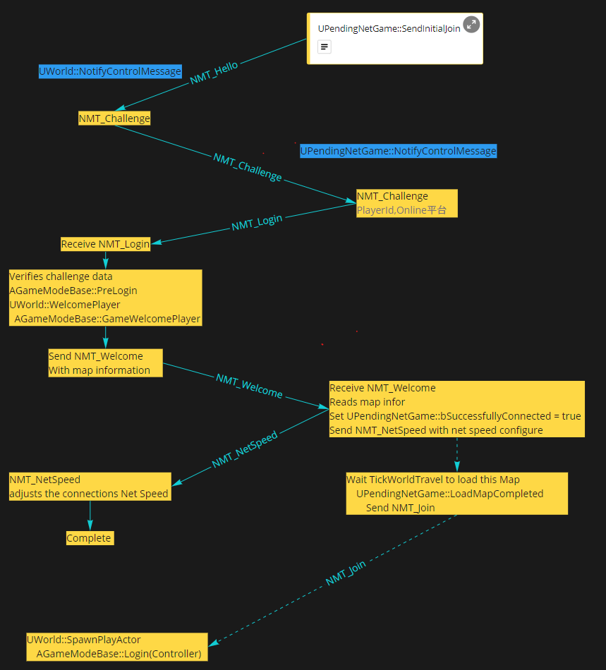
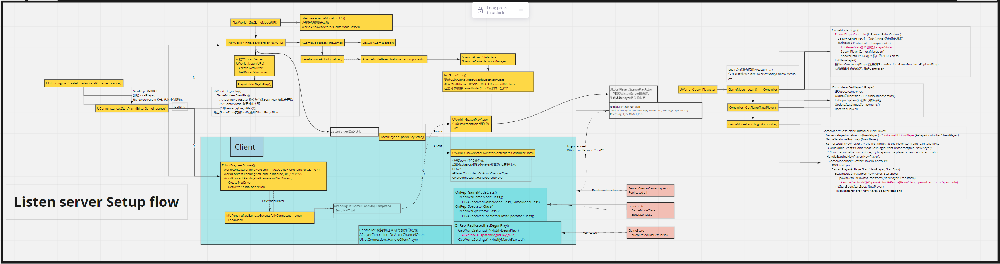
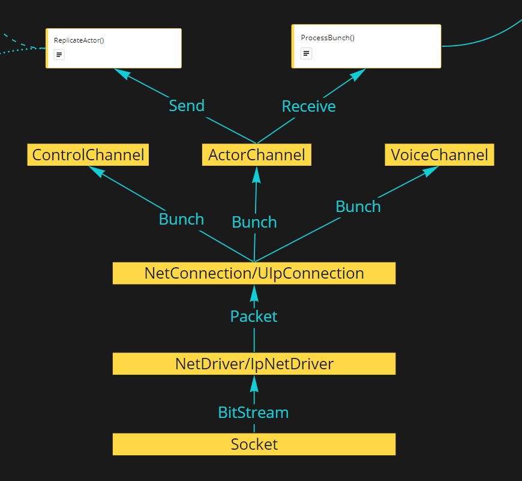
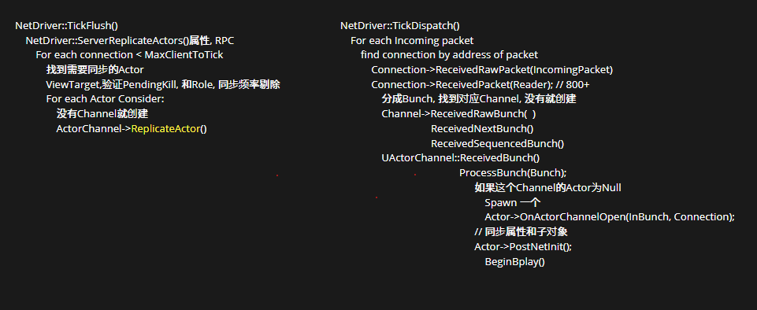
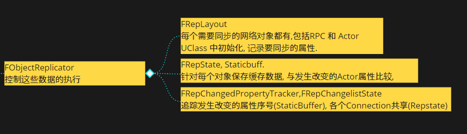

# UE4 NetWork
* [1. UNetDrivers and UNetConnections](#1-UNetDrivers-and-UNetConnections)
* [2. Initiating Connections / Handshaking Flow.](#2-Initiating-Connections-Handshaking-Flow)
* [3. Startup and Handshaking](#3-Startup-and-Handshaking)
* [4. Resetablishing Lost Connections](#4-Resetablishing-Los-Connections)
* [5. Data Transmission](#5-Data-Transmission)
* [6. Reliability and Retransmission](#6-Reliability-and-Retransmission)
* [7. 细节](#7-细节)
    * [7.1 属性复制 UStruct结构体](#71-属性复制-UStruct结构体)
    * [7.2 UObject指针作为属性复制或RPC参数](#72-UObject指针作为属性复制或RPC参数)
    * [7.3 互相引用时复制到达的先后顺序](#73-互相引用时复制到达的先后顺序)
    * [7.4 RPC 先于Actor到达(属性也是)](#74-RPC-先于Actor到达(属性也是))
    * [7.5 Game BeginPlay的时机？](#75-Game-BeginPlay的时机)
* [Reference](#Reference)
## 1. UNetDrivers and UNetConnections
负责管理一系列的UNetConnections, 和它们之间的一些共享数据.正常情况下, 仅有一个NetDriver用于标准的Game数据传输和连接.World持有它.

Server NetDriver 会维护一个NetConnections列表, 每一个都代表了一个连接到游戏中的玩家, 用于负责Actor数据的复制.
Client NetDriver 仅有一个NetConnections, 表示到Server的连接.

在Server 和Client, NetDriver 负责从网络接收Packets并传给恰当的NetConnection(并在必要时建立新的Connections).
```c++
UNetConnection* APlayerController::GetNetConnection() const
{
	// A controller without a player has no "owner"
	return (Player != NULL) ? NetConnection : NULL;
}
```
UNetConnection表示一个连接到Game(UNetDirvers)的Clients. NetConnect不直接处理数据, 而是把数据转发给Channels, 一个NetConnection有一系列它自己的Channels.
一些 Channel 类型:
* Control Channel 用于处理Connection的状态信息(是否关闭).
* Voice Channel 在Client 和 Server之间发送语言数据
* Actor Channel 每一个从Server复制到Client的Actor 都有一个唯一的Channel.

## 2. Initiating Connections Handshaking Flow
几乎所有平台, 引擎都是默认使用UIpNetDriver 和 UIpConnection, 下面的描述也是基于这两个类的这两种实现. 因为不同的NetDriver实现具体的过程有所不同.

Server和Client都有它们自己的NetDriver, 所有Game内的复制传输都从IpNetDriver上面发送或接收, 也包括了建立连接的逻辑, 和重连的逻辑.

握手的过程分散在几个不同的地方: NetDriver, PendingNetGame, World, PacketHandlers 和一些可能的其它地方.这种分离是因为确实有这样的需求: 确定一个incoming 的连接是不是在用 "UE-Protocol" 发送数据, 确定是不是恶意攻击, 是否Client有正确版本的Game.



## 3. Startup and Handshaking
Server 在通过UEngine::LoadMap加载Map时, 都会调用UWorld::Listen, 这些代码负责创建主要的Game NetDriver, 解析设置, 调用UNetDriver::InitListen, 最终这些代码负责弄清楚如何监听Client Connections. 在UIpNetDriver::InitListen()中, 调用了配置的Socket子系统以确定要绑定到的IP / Port.(see ISocketSubsystem::GetLocalBindAddresses and ISocketSubsystem::BindNextPort).一旦Server 处于Listen状态, 就准备好了开始接收Client Connections.

当Client想加入到一个Server时, 首先在UEngine::Browse中建立一个带有Server的IP的UPendingNetGame,`UPendingNetGame::Initialize` 和 `UPendingNetGame::InitNetDriver` 负责初始化设置和NetDriver, Clients会针对这个Server立即创建一个UNetConnection 作为它初始化操作的一部分, 并在这个Connection上向Server发送数据,  发起握手的流程。

在Server和Client上, UNetDriver::TickDispatch 通常负责接收网络数据. 通常, 当收到一个Packet时, 先检查它的地址, 是不是来自于一个已知的Connection, 通过一个TMap<FInternetAddr,UNetConnection>记录.

如果是来自一个已经建立好连接的地址, 把这个Packet传给UNetConnection::ReceivedRawPacket.

如果还没有建立连接, 就当作一个还没有连接的地址, 并开始握手流程.`StatelessConnectionHandlerComponent.cpp`



## 4. Resetablishing Lost Connections
在整个游戏过程中, 随时都有可能断线。 

如果是Server发起的Disconnection,  这会通过closing UNetConnection处理, 并通知游戏.此时可以由Game决定是否支持游戏中加入或重新加入.如果支持, 将会完全重启上面的握手流程.

如果Client的连接只是简单地中断了, 而且Server又不介意的话, Engine 通常会自动恢复(会有一些丢包和延迟).

如果Client的IP或端口由于某些原因改变了, 而且Server也不介意的话, 将通过再来一次底层握手, 以恢复连接. 游戏将不会受到影响.`StatlessConnectionHandlerComponent.cpp`

## 5. Data Transmission


Game NetConnections 和 NetDrivers 通常不知道底层使用的通信方法, 这是由子类来决定的(UIpConnection / UIpNetDriver or UWebSocketConnection / UWebSocketNetDriver).

在 NetConnections 和 NetDrivers 这一层面, 是和 Packets 和 Bunches 进行数据传输.
Packets是在Host和Client的NetConnections之间传输的数据块, 由meta data(头和ACK), 和 Bunches组成.

Bunches 是在Host和Client的Channels之间传输的数据块.

当一个Connection收到一个Packet时, 它会被拆解成独立的bunches, 这些bunches会被传给独立的Channels进一步处理. 

一个Packet, 可能没有Bunch, 有一个Bunch, 或者多个bunches.由于单个bunch的size有可能超过单个packet的size上限, UE4 会把它分成partial bunches,并打上标记( PartialInitial, Partial, PartialFinal), 使得单个bunch的大小满足要求.

Example: Client RPC to Server.
* Client makes a call to Server_RPC.
* That request is forwarded (via NetDriver and NetConnection) to the Actor Channel that owns the Actor on which the RPC was called.
* The Actor Channel will serialize the RPC Identifier and parameters into a Bunch. The Bunch will also contain the ID of its Actor Channel.
* The Actor Channel will then request the NetConnection send the Bunch.
* Later, the NetConnection will assemble this (and other) data into a Packet which it will send to the server.
* On the Server, the Packet will be received by the NetDriver.
* The NetDriver will inspect the Address that sent the Packet, and hand the Packet over to the appropriate NetConnection.
* The NetConnection will disassemble the Packet into its Bunches (one by one).
* The NetConnection will use the Channel ID on the bunch to Route the bunch to the corresponding Actor Channel.
* The ActorChannel will them disassemble the bunch, see it contains RPC data, and use the RPC ID and serialized parameters
		to call the appropriate function on the Actor.

## 6. Reliability and Retransmission

UE4 Networking假定了底层网络协议并不保证可靠, 它自己实现了packets 和 bunches的重传.

当NetConnection建立的时候, 它将会为它的packets和bunches生成Sequence Number, 这可以是固定顺序的, 也可以是随机的(此时, Server将会把它发给Client).

Packet number 是针对每个NetConnection的, 每次发送Packet时都会+1, 并发送它自己的Packet number.  相同Packet number 的packet将不会重复传输.

Bunch number 是针对每个Channel的, 针对每个reliable 的bunch 而增加, 并且每个reliable 的 bunch都会包含这个Number.和Packet不同的是, reliable的bunch可能会被重传, 这即意味着将会以相同的 bunch number 重新发送这个bunch.

### 6.1 接收端检测丢包

通过packet number, 可以很容易检测丢包, 用当前接收到的Packet 的 number, 与最近的成功接收的packet number比较.

在好的网络条件下, 所有packet将以它们发送的顺序接收, 即后到的packet 总是比之前的+1.

如果是比大, 表明有些packet missing了.此时将会假定missing的packet被dropped掉.并认为当前packet被成功接收, 并使用这个packet number 进一步处理.

如果差值是负值(或0), 这意味着收到了一些没有按顺序到达的packet, 或者外部Service 在尝试重新发数据(Engine不会重复使用Packet number).这两种情况, engine通常直接忽略这些missing 或invalid的packets.

的确也有办法修复在同一帧无序到达的packet, 在开启这个功能后, 当检测到missing packets (差值大于1)时, 并不立即处理这个packet, 而是把它加到一个队列中.下一次成功收到顺序正确的packet后(差值为1), 查看队头的顺序是否恰当, 是就处理, 不是就继续接收.

当收到当前帧的所有packets, 将flush 这个队列, 处理所有剩下的packets, 任何missing的packet都会被假定dropped.

每一个成功接收的packet都会把它对应的packet number 发回发送者作为acknowledgment. missing的 则 不作处理.

### 6.2 检测发出去的包被丢弃了

和上面提到的一样, 当一个packet被成功接收后, 会发一个ACK, 其中包含了这个成功被接收的Packet number, (按顺序的).

sender会追踪最大的Acked的packet number.当ACKs被处理后, 任何收到的小于最近收到的Ack的将会被忽略, 并被认为是Not Acknowledge.

sender负责处理Acks 和 NAKs并重传任何丢失的数据. 新的数据将会被添加到新的将要发送的packets中, (不会发送已经发送过的packet, 也不会重复使用sequence number).

### 6.3 重传

packets 并不包含有用的 game 信息.bunches才包含了对 game 有意义的数据. bunches 可以被标记为 Reliable 或 Unreliable.

Engine 不会尝试在unreliable 的bunches被drop后重发。因此, 如果被标记为unreliable, Game 应该能够在没有这些数据时也能正常work, 或者你自己实现外部重传机制,

对于reliable bunches, engine会在丢失这些数据时尝试重传. 当一个reliable bunch 被发送后, 它将会被添加到一个un-ACKed reliable bunches 列表中.如果收到一个包含了这个bunch 的packet的NAK, Engine将会重传一个这个bunch的Copy.如果这个bunch是一组partial bunch的一部分, 这组bunch都会被重传, 只有当所有partial bunch 都被ACK后, 才会把它从这个列表移除.

和Packets一样, 在每个Channal中, 将会比较reliable 的bunch的bunch number. 如果检测到差值为负, 将直接忽略这个bunch.  如果大于1, 则假定missing 了bunch, 与packet的处理不同(认为之前的都丢了, 接收当前的), 这里将会把这个bunch放到一个queue中, 并暂停这个channel中所有的bunch处理(reliabl or unreliable),直到检测到我们收到了所有missing的bunches, 开启处理过程.

在等待missing bunches 或 queue 不为空 的时候收到的所有bunch都会被添加到queue中, 而不会立即处理.

## 7 细节

### 7.1 属性复制 UStruct结构体



属性的复制总是伴随着某个Object的, 而Object的复制总是和某个Actor绑定的. 因为只有ActorChannel, 没有什么ObjectChannel, 即只有Actor才能创建数据交流的Channel. 而ActorChannel中实际处理Object的属性复制却是Object通用的, 即使是Actor本身, 也是被当作一个Object来复制它的属性的. 所以, ActorComponent也就能复制它的属性了.
```c++
bool AActor::ReplicateSubobjects(UActorChannel *Channel, FOutBunch *Bunch, FReplicationFlags *RepFlags)
{
	bool WroteSomething = false;
	for (UActorComponent* ActorComp : ReplicatedComponents)
	{
		if (ActorComp && ActorComp->GetIsReplicated())
		{
			WroteSomething |= ActorComp->ReplicateSubobjects(Channel, Bunch, RepFlags);		// Lets the component add subobjects before replicating its own properties.
			WroteSomething |= Channel->ReplicateSubobject(ActorComp, *Bunch, *RepFlags);	// (this makes those subobjects 'supported', and from here on those objects may have reference replicated)		
		}
	}
	return WroteSomething;
}
```
Component还可以继续嵌套下去, 比如GameplayAbilitySystemComponent中复制UAttributeSet和Ability:
```c++
bool UAbilitySystemComponent::ReplicateSubobjects(class UActorChannel *Channel, class FOutBunch *Bunch, FReplicationFlags *RepFlags)
{
	bool WroteSomething = Super::ReplicateSubobjects(Channel, Bunch, RepFlags);

	for (const UAttributeSet* Set : GetSpawnedAttributes())
	{
		if (Set && !Set->IsPendingKill())
		{
			WroteSomething |= Channel->ReplicateSubobject(const_cast<UAttributeSet*>(Set), *Bunch, *RepFlags);
		}
	}

	for (UGameplayAbility* Ability : AllReplicatedInstancedAbilities)
	{
		if (Ability && !Ability->IsPendingKill())
		{
			WroteSomething |= Channel->ReplicateSubobject(Ability, *Bunch, *RepFlags);
		}
	}

	return WroteSomething;
}
```
这些子对象的属性可以像Actor的属性一样, 标记为Replicated, 并拥有RepNotify.

被标记为Replicated的结构体成员属性, 其中所有的UPROPERTY()默认都会同步, 如果不需要同步则需要标记为NotReplicated。这一过程会递归进行.

结构体内的属性不能也不必被标记为Replicated.

对于单个属性的复制, 在其所属的对象的Replicator中进行(每一个子对象都有一个对应的Replicator), 在初始化复制时, 它会Copy一份原来的对象的内存叫做StaticBuffer,在server上, 每次进行复制时, 把这个Object当前值和StaticBuffer中的值比较, 如果不同就进行复制, 并覆盖StaticBuffer.

在Client上, StaticBuffer也是存的原来的值, 当有新的值被复制过来, 直接写到对应的Object的属性中, 再和StaticBuffer上的值比较, 如果不同, 则调用RepNotify函数, 然后覆盖StaticBuffer上的值.

所以属性该不该复制的判断, 和回调是否执行的判断是没有必然关系的.

属性一般只在第一次复制时标记为可靠, 后续将会是不可靠的. 这样在发生丢包后, 后到的属性会直接被丢弃掉, 这样保证了这个属性最终的状态一致. 但如果最终的包丢掉了也会导致不一致.

### 7.2 UObject指针作为属性复制或RPC参数

Server在同步一个对象时会给它分配一个FNetworkGUID, 并通过网络发送, Client识别这个GUID找到对应的Object.

分配操作是在创建每个Object的Replicator时进行, 先从ObjectLookup中找, 找不到才分配, 所以一个Game中被复制的Object的GUID对每个Connection都是相同的.
```c++
// NetDriver
TSharedPtr< class FNetGUIDCache > GuidCache;
    TMap< FNetworkGUID, FNetGuidCacheObject >  ObjectLookup;
    TMap< TWeakObjectPtr< UObject >, FNetworkGUID > NetGUIDLookup;

// --------------------------
void FObjectReplicator::StartReplicating(class UActorChannel * InActorChannel)
{
    // ... ...
	UNetDriver* const ConnectionNetDriver = Connection->GetDriver();

	// Cache off netGUID so if this object gets deleted we can close it
	ObjectNetGUID = ConnectionNetDriver->GuidCache->GetOrAssignNetGUID( Object );
    // ... ...
}
```

Clinet接收时, 对于Actor:
```c++
void UActorChannel::ProcessBunch( FInBunch & Bunch )
{
	bool bSpawnedNewActor = false;	// If this turns to true, we know an actor was spawned (rather than found)
	if( Actor == NULL )
	{
		AActor* NewChannelActor = NULL;
		bSpawnedNewActor = Connection->PackageMap->SerializeNewActor(Bunch, this, NewChannelActor);

        // ... ...
        NotifyActorChannelOpen(Actor, Bunch);
            Actor->OnActorChannelOpen(InBunch, Connection);
    }

    // 接收属性复制, 可能包含了RPC
    // ..........

    if (Actor && bSpawnedNewActor)
	{
		SCOPE_CYCLE_COUNTER(Stat_PostNetInit);
		Actor->PostNetInit(); // BeginPlay
	}
}
```
其中SerializeNewActor会把GUID 和创建出来的Actor注册到NetDriver的GUIDCache中. 此后从Server复制过来的对这个Actor的引用就可以从NetDriver中通过GUID找到在当前Client中的实例.

而对于其它Object(子对象, RPC), 一般是会在收到的每个Bunch时, 首先就在`UChannel::ReceivedRawBunch`中处理这个Bunch中的所有GUID部分, 通过调用`UPackageMapClient::ReceiveNetGUIDBunch(Bunch)`.
```c++
FNetworkGUID UPackageMapClient::InternalLoadObject( FArchive & Ar, UObject *& Object, const int InternalLoadObjectRecursionCount )
{
	// ----------------	
	// Read the NetGUID
	// ----------------	
	FNetworkGUID NetGUID;
	Ar << NetGUID;

	// ... ...
	FExportFlags ExportFlags;

	if ( NetGUID.IsDefault() || GuidCache->IsExportingNetGUIDBunch )
	{
		Ar << ExportFlags.Value;
	}

	if ( ExportFlags.bHasPath )
	{
		FString PathName;

		Ar << PathName;

		// Register this path and outer guid combo with the net guid
		GuidCache->RegisterNetGUIDFromPath_Client( NetGUID, PathName, OuterGUID, NetworkChecksum, ExportFlags.bNoLoad, bIgnoreWhenMissing );
	}
	return NetGUID;
}
```
这里基本操作就是读出GUID, 先找, 找不到就读PathName, 加载Outer class, 自身的Class, 然后注册到NetDriver的Map.所以, 基本上只要Server和Client上都可以通过同一个PathName引用的类, 都可以同步.

比如Map中的对象, Server只要发送GUID和PathName, 然后就可以在Clinet上接收这个GUID, 通过这个PathName, 把这个GUID和具体的在Client上的对象关联起来. 这些对象, 在RPC和属性引用上都是可以通过网络传递的.

还有Content Browser中看到的蓝图资源, 包括CDO, 也是可以直接引用的. 对于热更和Mod的资源, 同样也需要所有端都有这些资源,且引用路径一致即可.

### 7.3 互相引用时复制到达的先后顺序

Engine 尽量保证了收包和发包的先后顺序一致, 但由于网络的不可预测, 常常会导致重传, 或其它情况导致顺序不一致, 如果有互相引用, 则先到的必定引用为空.甚至进一步说, 如果是在同一帧开始复制的Actor, 如果存在互相引用, 他们的BeginPlay执行时, 必然找不到引用.

```c++
// NetDriver::TickDispatch
void UActorChannel::ProcessBunch( FInBunch & Bunch )
{
    // ... ...

	// ----------------------------------------------
	//	Read chunks of actor content
	// ----------------------------------------------
	while ( !Bunch.AtEnd() && Connection != NULL && Connection->State != USOCK_Closed )
	{
		// Read the content block header and payload
		UObject* RepObj = ReadContentBlockPayload( Bunch, Reader, bHasRepLayout );

		TSharedRef< FObjectReplicator > & Replicator = FindOrCreateReplicator( RepObj );

		bool bHasUnmapped = false;

		if ( !Replicator->ReceivedBunch( Reader, RepFlags, bHasRepLayout, bHasUnmapped ) );

        // ... ...
		if ( bHasUnmapped )
		{
			Connection->Driver->UnmappedReplicators.Add( &Replicator.Get() );
		}
	}
    // ... ...
}
```
在处理一个Actor接收到的数据时, 如果有没有找到的对象, 会把对应的`Replicator`放到NetDriver的一个Set中, 保存下来.Replicator::ReceivedBunch()中会处理每一个属性, 如果有同步的对象还没到达的, 就认为这个Replicator 是 unmapped.其中有一系列的操作来记录这个unmaped Object. 这些接收数据都是在TickDispatch中完成.

此后, 在NetDriver::TickFlush, 会处理数据发送, 然后经过一系列复杂的操作, 对UnmappedReplicators中的属性更新, 此时, 之前没找到的属性就找到了.
```c++
void UNetDriver::TickFlush(float DeltaSeconds)
{
    // ... ...
	// Update properties that are unmapped, try to hook up the object pointers if they exist now
	for ( auto It = UnmappedReplicators.CreateIterator(); It; ++It )
	{
		FObjectReplicator* Replicator = *It;
		bool bHasMoreUnmapped = false;
		Replicator->UpdateUnmappedObjects( bHasMoreUnmapped );
		if ( !bHasMoreUnmapped )
		{
			// If there are no more unmapped objects, we can also stop checking
			It.RemoveCurrent();
		}
	}
    // ... ...
}
```
这里, 除了常见的自身复制过来, BeginPlay 时发现自己引用的一些东西还没到, 为空. 就算它引用的对象在这一帧到了, 但它的BeignPlay是在自己第一次被复制过来时调用的, 它的这个引用属性还没有更新,也是空的, 因为它要等到这一帧的所有数据接收完之后, 先执行World::Tick(), 再执行NetDriver::TickFlush才会更新这个unmapped的属性.

### 7.4 RPC 先于Actor到达(属性也是)
如果在Spawn一个被复制的Actor后, 立即在它上面调用一个RPC, 如果RPC先于Actor到达,则会把这个bunch缓存在对应ActorChannel中.然后放到Connection的ChannelsToTick数组中. 然后在每帧发包的时候TickFlush, 处理这些。
```c++
// class UNetConnection
TArray<UChannel*> ChannelsToTick;

// class UActorChannel
// Async networking loading support state
TArray<class FInBunch*>QueuedBunches;// Queued bunches waiting on pending guids to resolve
```
UNetDriver::ShouldQueueBunchesForActorGUID()可以自定义判断Bunch缓存的方式, 避免卡顿.

此外, 如果RPC的参数引用的对象还没到, 默认情况下执行的时候就是空指针. 如果是Reliable RPC, 可以在Client上设置控制台变量
```C++
net.DelayUnmappedRPCs 1
```
可以等到引用的参数复制过来才执行.
具体调用过程可以参考下面两个函数.以及反射生成的代码.
```c++
AActor::GetFunctionCallspace()
AActor::CallRemoteFunction()
```

### 7.5 Game BeginPlay的时机？
无论是Server还是Client, 在LoadMap时都会初始化GameMode, 调用World->BeginPlay(), 只是Client上这两个操作什么也不执行.

所以如果没有Server主动开启这场游戏, Client永远也不会BeginPlay. 

执行World->BeginPlay()时:
```c++
void UWorld::BeginPlay()
{
	AGameModeBase* const GameMode = GetAuthGameMode();
	if (GameMode)
	{
		GameMode->StartPlay();
		if (GetAISystem())
		{
			GetAISystem()->StartPlay();
		}
	}
	OnWorldBeginPlay.Broadcast();
}
```
会直接调用GameMode的StartPlay(), 把游戏开始完全交给GameMode处理.

Engine实现了两种:
```
1. AGameModeBase, AGameStateBase
2. AGameMode, AGameState
```
Base那一组实现了更为基础的操作, 游戏开始, 暂停, 结束等, 但这些操作几乎什么也没做.其中开始就是直接调用所有Actor的BeginPlay。
```c++
void AGameModeBase::StartPlay()
{
	GameState->HandleBeginPlay();
}
void AGameStateBase::HandleBeginPlay()
{
	bReplicatedHasBegunPlay = true;

	GetWorldSettings()->NotifyBeginPlay();
	GetWorldSettings()->NotifyMatchStarted();
}
void AWorldSettings::NotifyBeginPlay()
{
	UWorld* World = GetWorld();
	if (!World->bBegunPlay)
	{
		for (FActorIterator It(World); It; ++It)
		{
			SCOPE_CYCLE_COUNTER(STAT_ActorBeginPlay);
			const bool bFromLevelLoad = true;
			It->DispatchBeginPlay(bFromLevelLoad);
		}

		World->bBegunPlay = true;
	}
}
```
然后通过变量复制的Notify, 在所有Client上触发同样的WorldSettings的操作,调用所有Actor的BeignPlay.

这种情况下, Server上在Map加载好的时候就会调用BeginPlay(). 

而Client上要等GameState复制过来就开始. 这里如果有其它Actor先于GameState到达, 在初始化这些Actor的Channel时, 虽然都会调用其PostNetInit:
```c++
void AActor::PostNetInit()
{
	if(RemoteRole != ROLE_Authority)
	{
		UE_LOG(LogActor, Warning, TEXT("AActor::PostNetInit %s Remoterole: %d"), *GetName(), (int)RemoteRole);
	}

	if (!HasActorBegunPlay())
	{
		const UWorld* MyWorld = GetWorld();
		if (MyWorld && MyWorld->HasBegunPlay())
		{
			SCOPE_CYCLE_COUNTER(STAT_ActorBeginPlay);
			DispatchBeginPlay();
		}
	}
}
```
但如果没有调用AWorldSettings::NotifyBeginPlay, 就不会执行, 这个Actor就会在后面的调用中同一执行BeginPlay.在GameState之后的Actor, 会在第一次复制过来时就执行BeginPlay().

也就是说, 通过GameState, 控制Client端的AWorldSettings::NotifyBeginPlay()的调用时机, 就可以完全控制Client端所有Actor的BeginPlay的调用.

* AGameMode, AGameState

这一组GameMode和GameState,提供了更精细的游戏流程控制, 定义了几种游戏状态:
```
EnteringMap;		
WaitingToStart;	
InProgress;		
WaitingPostMatch;	
LeavingMap;		
Aborted;			
```
还有这些状态之间的转换关系 和 方式.
这里仅讨论BeginPlay的流程.BeginPlay是在从WaitingToStart状态到InProgress状态转换时发生的.

其中, InitGame()会将状态设为EnteringMap.随后调用AGameMode::StartPlay():
```c++
void AGameMode::StartPlay()
{
	// Don't call super, this class handles begin play/match start itself

	if (MatchState == MatchState::EnteringMap)
	{
		SetMatchState(MatchState::WaitingToStart);
	}

	// Check to see if we should immediately transfer to match start
	if (MatchState == MatchState::WaitingToStart && ReadyToStartMatch())
	{
		StartMatch();
	}
}
```
ReadyToStartMatch()只是简单地判断了玩家+机器人的数量大于0即可开始.所以对于ListenServer, 总是会在LoadMap这个流程就调用了StartMatch(),最终调用了Server上的BeginPlay().其具体操作是在`AGameMode::HandleMatchHasStarted()`中完成的:
```c++
void AGameMode::HandleMatchHasStarted()
{
	GameSession->HandleMatchHasStarted();
	// start human players first
	for( FConstPlayerControllerIterator Iterator = GetWorld()->GetPlayerControllerIterator(); Iterator; ++Iterator )
	{
		APlayerController* PlayerController = Iterator->Get();
		if (PlayerController && (PlayerController->GetPawn() == nullptr) && PlayerCanRestart(PlayerController))
		{
			RestartPlayer(PlayerController);
		}
	}
	GetWorldSettings()->NotifyBeginPlay();

	// Then fire off match started
	GetWorldSettings()->NotifyMatchStarted();
}
```
其中GameState中也保存了一个这个MatchState变量, 且可复制.
```c++
void AGameState::OnRep_MatchState()
{
	if (MatchState == MatchState::WaitingToStart || PreviousMatchState == MatchState::EnteringMap)
	{
		// Call MatchIsWaiting to start even if you join in progress at a later state
        // // 处理BeginPlay
		HandleMatchIsWaitingToStart(); 
	}
	
	if (MatchState == MatchState::InProgress)
	{
        // bReplicatedHasBegunPlay = true
		HandleMatchHasStarted();
	}
	else if (MatchState == MatchState::WaitingPostMatch)
	{
		HandleMatchHasEnded();
	}
	else if (MatchState == MatchState::LeavingMap)
	{
		HandleLeavingMap();
	}

	PreviousMatchState = MatchState;
}
```
所以BeginPlay的情况和Base的实现差不多.其它的暂停, 中途加入的处理几乎没有, 这些都需要自己实现和Game相关的流程.

如果需要控制在Client上调用BeginPlay时一些关键Actor必须完成复制, 只需要控制这些状态转换条件即可. 

对这些关键Actor, 可以重载其PostNetInit(), 在其中告诉一个统计复制情况的地方, 比如GameInstance(因为任何Actor都可能没有同步好), 当满足条件时, 通过RPC告诉Server自己准备好了. 在所有Client准备好之后, Server 即可开始BeginPlay()流程.

## Reference
* Engine\Source\Runtime\Engine\Classes\Engine\NetDriver.h, Channel.h, ActorChannel.h, NetConnection.h
* https://docs.unrealengine.com/4.26/zh-CN/InteractiveExperiences/Networking/Overview/
* https://zhuanlan.zhihu.com/p/34723199
* https://www.jianshu.com/p/b4f1a5412cc9

TODO: 
* ECS, 网络同步, https://www.youtube.com/watch?v=W3aieHjyNvw&t=1308s
    https://blog.codingnow.com/2017/06/overwatch_ecs.html#more

* TArray的复制.https://forums.unrealengine.com/t/replicating-tarrays-crashes-game/21237/6