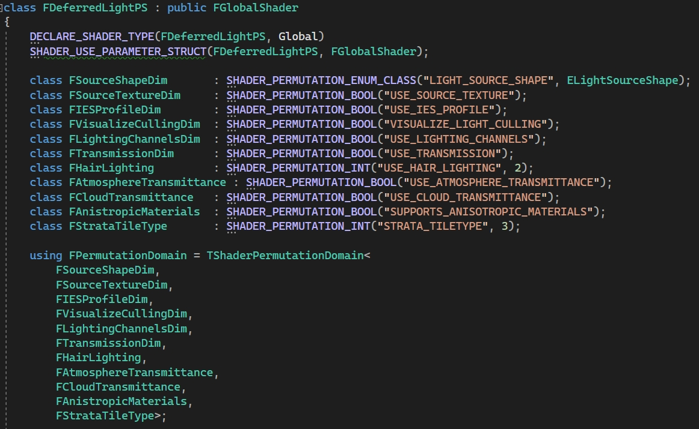
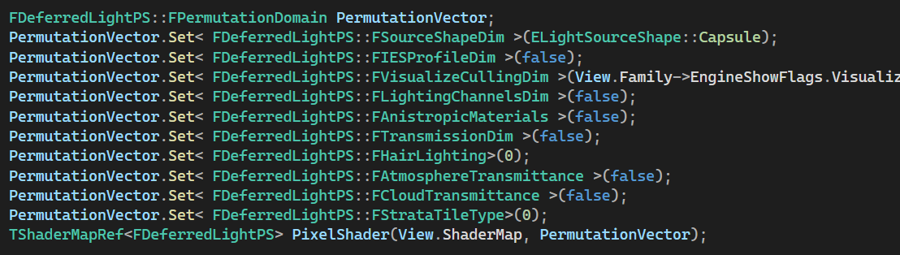

# Shader Permutation

由于UE4的Shader设计采用了Uber shader的思想，在实现一个Shader时，尽可能地把所有不同的情况实现在一起，用宏来实现不同的编译路径。当这样的宏越来越多时，在C++侧就不方便管理。所以它采用了ShaderPermutation的概念来管理这样的Shader。每一个HLSL中的宏都对应C++层的一个排列维度，每个维度可以取不同的值，这样就可以自动编译出这些宏所有可能的排列，每一种排列有一个唯一哈希值，在Runtime就可以根据当前需要的宏设置排列，找到对应的编译好的Shader.

```c++
// bool 排列维度，仅取0，1两个值
FShaderPermutationBool；

// 连续整数排列维度
template <typename TType, int32 TDimensionSize, int32 TFirstValue=0>
TShaderPermutationInt；

// 稀疏整数排列维度，只取不定数量的非连续int值
// 利用可变模板参数的递归展开定义维度数和相关操作
template <int32... Ts>
struct TShaderPermutationSparseInt；
template <int32 TUniqueValue, int32... Ts>
struct TShaderPermutationSparseInt<TUniqueValue, Ts...>；

// 定义一个排列，和上面一样的手法
// Ts 是上面三种维度之一
template <typename... Ts>
struct TShaderPermutationDomain；
template <typename TDimension, typename... Ts>
struct TShaderPermutationDomain<TDimension, Ts...>；
```
其中， 它的排列Id的生成:
```c++
// 从一个PermutationId恢复各个维度的取值
explicit TShaderPermutationDomain<TDimension, Ts...>(int32 PermutationId)
	: DimensionValue(TDimension::FromDimensionValueId(PermutationId % TDimension::PermutationCount))
	, Tail(PermutationId / TDimension::PermutationCount)
{
	checkf(PermutationId >= 0 && PermutationId < PermutationCount, TEXT("Invalid shader permutation id %i."), PermutationId);
}

// 将当前各个维度的取值生成PermutationId
int32 ToDimensionValueId() const
{
	return TDimension::ToDimensionValueId(DimensionValue) + TDimension::PermutationCount * Tail.ToDimensionValueId();
}
```
PermutationId 的取值范围为[0，PermutationCount-1], 且是连续的。

在Shader中使用排列时，首先要先定义排列维度。用提供的宏定义:
```c++
#define SHADER_PERMUTATION_BOOL(InDefineName)
#define SHADER_PERMUTATION_INT(InDefineName, Count)
#define SHADER_PERMUTATION_RANGE_INT(InDefineName, Start, Count)
#define SHADER_PERMUTATION_SPARSE_INT(InDefineName,...)
#define SHADER_PERMUTATION_ENUM_CLASS(InDefineName, EnumName)
```

例如在DeferredLightPS中的使用:



其本质是继承前面定义的那些排列维度，并加上这个排列维度对应的宏的名称`DefineName`。在编译Shader时就定义对应的宏的值。

```c++
// 编译所有排列
for (int32 PermutationId = 0; PermutationId < GlobalShaderType->GetPermutationCount(); PermutationId++)
{
	if (GlobalShaderType->ShouldCompilePermutation(Platform, PermutationId, PermutationFlags)
		&& (!GlobalShaderMap->HasShader(GlobalShaderType, PermutationId) || (OutdatedShaderTypes && OutdatedShaderTypes->Contains(GlobalShaderType))))
	{
		if (
```

渲染时，先定义好我们需要的排列值，直接从ShaderMap中根据排列值找到对应的Shader.


