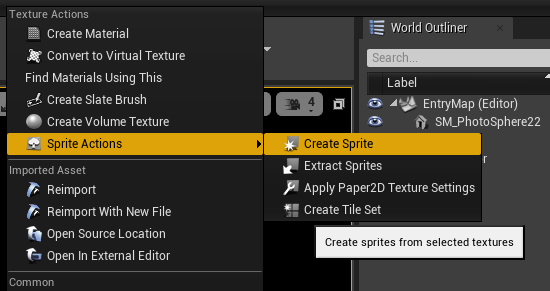

# 启动exe无响应
不能在c++ 中定义全局的静态变量。

# 导入贴图不允许非2的幂大小的图片?
如果当前路径下有连续编号的图片会自动识别为UDIM贴图,此贴图要求大小必须为2的幂.即使仅导入一张也会作这种判断。

### ActorComponent
如果需要直接在`Add Component`的列表中出现,需要在类的声明前额外加上:
```c++
meta=(BlueprintSpawnableComponent)
```

# Engine framework - Introduce and theory
1. some.uproject
some.uproject中包含
"EngineAssociation": "4.25",
字段,表示Eingine的Build ID。标准引擎版本一般是"4.25"之类的。当通过源码编译时，他会自动生成一个或手动指定，并将其写入注册表。这样就可以找到本机有的不同版本的引擎。

- 避免更换版本，避免改动引擎。

- Naming Conventions and Standards
https://github.com/Allar/ue4-style-guide

2. 委托参数绑定
- ContentBrowserExtensions.cpp, Line 222
通过原始c++函数指针创建全局函数委托
```c++
TBaseDelegate::CreateStatic(&FPaperContentBrowserExtensions_Impl::ExecuteSelectedContentFunctor, StaticCastSharedPtr<FContentBrowserSelectedAssetExtensionBase>(SpriteCreatorFunctor))
```

- Developers floder 
烘培时会忽略

- UE_LOG
https://www.cnblogs.com/blueroses/p/6037981.html

- 字符编码问题
在出现中文literal时,由于文本的编码错误，会导致编译器(或者是UHT)识别不了或者识别成其它字符，然后报一些莫名其妙、令人摸不着头脑的错，此时可以将文档保存为utf-8编码即可解决。
https://blog.csdn.net/weixin_42109012/article/details/957475763. 

- TArray
按指定字符串分割,返回分割后的字符串组成的数组
dir.ParseIntoArray(arr, TEXT("/")); 

- FPaths
FPaths::Combine(LabelXmlDirectory, TEXT("placemarklayout.xml"));
FPaths::NormalizeDirectoryName(dir);
FPaths::FileExists(realPath)
FPaths::DirectoryExists(dirs)

- FString
https://docs.unrealengine.com/zh-CN/Programming/UnrealArchitecture/StringHandling/index.html

# FlipBook 编辑器扩展
// D:\Program Files\Epic Games\UE_4.25\Engine\Plugins\2D\Paper2D\Source\Paper2DEditor\Private\ContentBrowserExtensions\ContentBrowserExtensions.cpp
// line: 227
全文搜索`Create Sprite`找到创建`Sprite`的地方.

```c++
MenuBuilder.AddMenuEntry(
	LOCTEXT("CB_Extension_Texture_CreateSprite", "Create Sprite"),
	LOCTEXT("CB_Extension_Texture_CreateSprite_Tooltip", "Create sprites from selected textures"),
	FSlateIcon(PaperStyleSetName, "AssetActions.CreateSprite"),
	Action_CreateSpritesFromTextures,
	NAME_None,
	EUserInterfaceActionType::Button);
```
第四个参数应该就是创建`Sprite`的动作执行的地方。
```c++
FUIAction Action_CreateSpritesFromTextures(
			FExecuteAction::CreateStatic(&FPaperContentBrowserExtensions_Impl::ExecuteSelectedContentFunctor, StaticCastSharedPtr<FContentBrowserSelectedAssetExtensionBase>(SpriteCreatorFunctor)));
```
创建一个可执行的委托，并绑定参数，返回的委托没有参数。这里函数`FPaperContentBrowserExtensions_Impl::ExecuteSelectedContentFunctor`的参数绑定为`StaticCastSharedPtr<FContentBrowserSelectedAssetExtensionBase>(SpriteCreatorFunctor)`，再返回一个无参数的可执行对象，相当于做了一次参数绑定。
而`ExecuteSelectedContentFunctor`只是简单地调用参数`FContentBrowserSelectedAssetExtensionBase`的`Execute()`函数。
```c++
TSharedPtr<FCreateSpriteFromTextureExtension> SpriteCreatorFunctor = MakeShareable(new FCreateSpriteFromTextureExtension());
SpriteCreatorFunctor->SelectedAssets = SelectedAssets;
```
所以当点击创建`Sprite`时,会将选中的资源`TArray<FAssetData> SelectedAssets`赋给`SpriteCreatorFunctor->SelectedAssets`，并直接调用到`SpriteCreatorFunctor->Execute()`,

// 获取烘培纹理
// D:\Program Files\Epic Games\UE_4.25\Engine\Plugins\2D\Paper2D\Source\Paper2D\Classes\PaperSprite.h
// line: 296
//	UTexture2D* GetBakedTexture() const;