# GameFeature

这篇文章主要介绍UE(Unreal Engine)中的GameFeature框架。其主要目的是将整个项目模块化，插件化。避免相关的Feature之间不必要的依赖，提供插件化动态更新游戏逻辑的办法。这样，项目主体部分只有整个游戏的大致框架，无实质性内容，主要玩法逻辑由各个GameFeature提供。

# 1. GameFeatureSubsystem -> UEngineSubsystem
其本质是一个插件管理的系统。能够在运行时动态加载/卸载插件。 同时有一固定的DataAsset表明这个插件的功能, 通过配置的Action扩展整个游戏系统。

插件在运行时会处于多个不同的状态, 并且需要在这些状态之间切换, 有时可能还需要从网络上下载插件。 所以很自然地把插件状态的管理抽象成状态机。这里把状态分成了三类, 一类可以作为`目标状态`,例如，Installed，Loaded，Active。另外一类是在从一个目标状态转换到另一目标状态的过程中会经过的`过渡状态`，例如，Downloading，Loading，Activating。还有一类是错误状态, 比如安装插件的时候，下载失败了，进入ErrorInstalling状态。

## 1.1 GameFeatureSubsystem
UGameFeaturesSubsystem是一个EngineSubsystem，负责管理所有GameFeature插件,包括加载，设置GaemFeature状态.
```c++
class GAMEFEATURES_API UGameFeaturesSubsystem : public UEngineSubsystem
{
	static TSharedPtr<FStreamableHandle> LoadGameFeatureData(const FString& GameFeatureToLoad);
	static void UnloadGameFeatureData(const UGameFeatureData* GameFeatureToUnload);
public:
	/** Loads a single game feature plugin. */
	void LoadGameFeaturePlugin(const FString& PluginURL, const FGameFeaturePluginLoadComplete& CompleteDelegate);

	/** Loads a single game feature plugin and activates it. */
	void LoadAndActivateGameFeaturePlugin(const FString& PluginURL, const FGameFeaturePluginLoadComplete& CompleteDelegate);

	/** Changes the target state of a game feature plugin */
	void ChangeGameFeatureTargetState(const FString& PluginURL, EGameFeatureTargetState TargetState, const FGameFeaturePluginChangeStateComplete& CompleteDelegate);

	/** Gets the Install_Percent for single game feature plugin if it is active. */
	bool GetGameFeaturePluginInstallPercent(const FString& PluginURL, float& Install_Percent) const;

	/** Determines if a plugin is in the Active state.*/
	bool IsGameFeaturePluginActive(const FString& PluginURL, bool bCheckForActivating = false) const;

	/** Deactivates the specified plugin */
	void DeactivateGameFeaturePlugin(const FString& PluginURL);
	void DeactivateGameFeaturePlugin(const FString& PluginURL, const FGameFeaturePluginDeactivateComplete& CompleteDelegate);

	/** Unloads the specified game feature plugin. */
	void UnloadGameFeaturePlugin(const FString& PluginURL, bool bKeepRegistered = false);
	void UnloadGameFeaturePlugin(const FString& PluginURL, const FGameFeaturePluginUnloadComplete& CompleteDelegate, bool bKeepRegistered = false);

	/** Uninstall the specified game feature plugin. Will remove the game feature plugin from the device if it was downloaded */
	void UninstallGameFeaturePlugin(const FString& PluginURL);
	void UninstallGameFeaturePlugin(const FString& PluginURL, const FGameFeaturePluginUninstallComplete& CompleteDelegate);

	/** Same as UninstallGameFeaturePlugin, but completely removes all tracking data associated with the plugin. */
	void TerminateGameFeaturePlugin(const FString& PluginURL);
	void TerminateGameFeaturePlugin(const FString& PluginURL, const FGameFeaturePluginUninstallComplete& CompleteDelegate);

	/** Loads a built-in game feature plugin if it passes the specified filter */
	void LoadBuiltInGameFeaturePlugin(const TSharedRef<IPlugin>& Plugin, FBuiltInPluginAdditionalFilters AdditionalFilter);

	/** Loads all built-in game feature plugins that pass the specified filters */
	void LoadBuiltInGameFeaturePlugins(FBuiltInPluginAdditionalFilters AdditionalFilter);
};
```
在其Initialize中会绑定委托到UAssetManager, UAssetManager被创建的时候回调到`UGameFeaturesSubsystem::OnAssetManagerCreated`，这时就可以开始初始化GameFeature。这里通过一个项目定义的policies对象, 它应该被具体项目扩展，实现项目特定初的始化GaemFeature策略。在Lyra中实现如下:
```c++
void ULyraGameFeaturePolicy::InitGameFeatureManager()
{
	Observers.Add(NewObject<ULyraGameFeature_HotfixManager>());
	Observers.Add(NewObject<ULyraGameFeature_AddGameplayCuePaths>());

	UGameFeaturesSubsystem& Subsystem = UGameFeaturesSubsystem::Get();
	for (UObject* Observer : Observers)
	{
		Subsystem.AddObserver(Observer);
	}

	Super::InitGameFeatureManager();
}
```
其中`Super::InitGameFeatureManager()`会调用到`UGameFeaturesSubsystem::Get().LoadBuiltInGameFeaturePlugins(AdditionalFilter);`执行真正的初始化GameFeature. 这里还可以传入一个可调用对象, 从Project层面决定一个GameFeature是否要初始化。初始化的逻辑很直接，通过IPluginManager遍历所有Enable的插件，对每个插件执行一系列判断，看是否要作为GameFearue初始化：

1. UGameFeaturesSubsystemSettings::IsValidGameFeaturePlugin(PluginDescriptorFilename)

    这里判断插件是否在指定目录（Plugins/GameFeatures/）下.

2. UGameFeaturesProjectPolicies::IsPluginAllowed(PluginURL)

    项目层面的逻辑判断是否要加载这个GameFeature.

3. AdditionalFilter(PluginDescriptorFilename, PluginDetails, BehaviorOptions)

    这里会有更加详细的信息判断是否要加载这个GameFeature.其中PluginDetails包含了插件的Json配置文件中的信息。其中还可以加入自定义的KeyValue, Key通过UGameFeaturesSubsystemSettings配置。

在判断需要加载后，将为这个插件创建一个状态机(`UGameFeaturePluginStateMachine`)，后续这个插件的所有信息或状态都由这个状态机维护。创建状态机时会把状态初始化成`UnknownStatus`，随后根据插件的配置`(BuiltInInitialFeatureState)`，将状态向配置的目标状态转换。

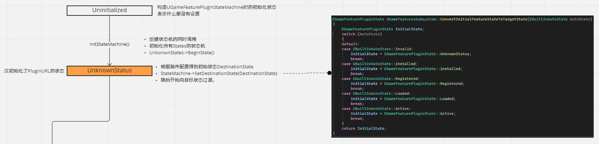

其中`UGameFeaturePluginStateMachine::SetDestinationState(InDestinationState)`只能传入目标状态，而不可以是过渡状态。随后StateMachine将会异步转换到目标状态，主要是要处理插件内容的检查，下载到本地磁盘，挂载，扫描资产，根据GameFeatureData注册GameFeature，加载特定资产，等等。在后面的Gamplay中，我们可以通过`UGameFeaturesSubsystem`的API动态转换这些GameFeature的状态。可以参考Lyra中, 游戏开始时，通过统一的配置`ULyraExperienceDefinition`确定要加载的GameFeature插件的名字，然后激活这些插件：
```
LyraExperienceManagerComponent.cpp Line: 259
```

## 1.2 GameFeaturePluginStateMachine
PluginStateMachine负责实际管理一个GameFeature插件的状态。每一种状态都对应一个`FGameFeaturePluginState`的实现：

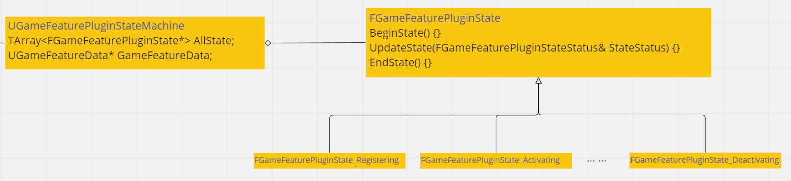

而一个状态主要有三个行为:
```c++
struct FGameFeaturePluginState
{
	/** Called when this state becomes the active state */
	virtual void BeginState() {}

	/** Process the state's logic to decide if there should be a state transition. */
	virtual void UpdateState(FGameFeaturePluginStateStatus& StateStatus) {}

	/** Called when this state is no longer the active state */
	virtual void EndState() {}

    /** Returns the type of state this is */
	virtual EGameFeaturePluginStateType GetStateType() const { return EGameFeaturePluginStateType::Transition; }
};
```
其中`BeginState`和`EndState`分别在进入这个状态和离开这个状态时调用, 通常没有什么很重要的操作。而`UpdateState()`在从当前状态转换到其它状态时调用, 这里处理这个状态的所有逻辑， 比如需要下载文件，挂载pak，注册或加载DataAsset等等。这些操作如果是异步的，则不设置下一个状态，而是在操作完成后再请求更新状态。如果不是异步，则调用`StateStatus.SetTransition(NextState)`设定下一个状态，并且会立即转换到下一个状态。这样一直到目标状态为止。或者出现某些错误，会进入错误的状态，比如下载文件失败，后面可以再次尝试。

这里我们通常关注的有四个目标状态：Installed, Registered, Loaded, Active。我们在配置一个GameFeature插件的初始状态时指定的就是这四个状态之一。
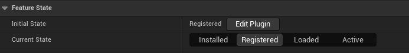

* Installed

这个状态表明这个插件所需的文件已经在磁盘上了。进入这个状态之前会根据插件内容是否需要下载而进入下载状态，并在下载成功后进入Installed.

* Registered

这个状态表明插件的Asset都已经被UAssetManager知晓了，且可以通过UAssetManager加载这些Asset，但是并没有被加载到内存中。

在这之前还要经历很多阶段，首先就是直接挂载插件的Pak，确保插件的`AssetRegistry.bin`被注册，这样就可以通过AssetManager访问AssetData。然后检查这个插件依赖的GameFeature插件，并加载它们。最后根据这个GameFeature插件的配置`GameFeatureData`，执行一些配置的注册操作：
```
1. 添加GameplayTag配置路径
2. 加载GameFeatureData -> UGameFeaturesSubsystem::LoadGameFeatureData(GameFeatureToLoad)
3. 初始化插件的Ini文件：UGameFeatureData::InitializeBasePluginIniFile()
4. 告诉GameFeatureSubsystem初始化GameFeature -> UGameFeaturesSubsystem::OnGameFeatureRegistering(GameFeatureData, PluginName)
```
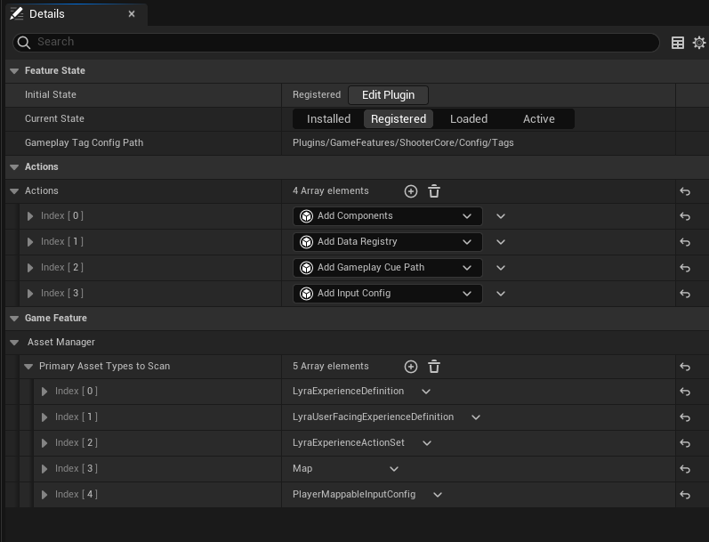
其中`UGameFeaturesSubsystem::OnGameFeatureRegistering()`会执行一些很重要的操作,首先会把GameFeatureData中配置的Asset注册到AssetManager中，这样在打包的时候就会把这些Asset打进去。AssetManager也能够访问到这些Asset。

然后会对注册到`UGameFeaturesSubsystem`的Observer调用`OnGameFeatureRegistering`事件。

最后对GameFeatureData中的每一个Action调用`UGameFeatureAction::OnGameFeatureRegistering()`。
```c++
void UGameFeaturesSubsystem::OnGameFeatureRegistering(const UGameFeatureData* GameFeatureData, const FString& PluginName)
{
	check(GameFeatureData);
	AddGameFeatureToAssetManager(GameFeatureData, PluginName);

	for (UObject* Observer : Observers)
	{
		CastChecked<IGameFeatureStateChangeObserver>(Observer)->OnGameFeatureRegistering(GameFeatureData, PluginName);
	}

	for (UGameFeatureAction* Action : GameFeatureData->GetActions())
	{
		if (Action != nullptr)
		{
			Action->OnGameFeatureRegistering();
		}
	}
}
```

* Loaded

Loaded状态表明需要预加载的DataAsset的已经加载了。这里并不会把所有的资源都加载到内存中，需要预加载的资源由ULyraGameFeaturePolicy结合GameFeatureData决定，
`ULyraGameFeaturePolicy::GetPreloadAssetListForGameFeature(GameFeatureToLoad)`会给出一个需要预加载的`FPrimaryAssetId`列表，然后会同步加载这些Asset，这里也会再次加载UGameFeatureData本身，因为这次加载会设定要加载的Bundle。之后还会通知`UGameFeaturesSubsystem`GaemFeature正在加载:
```c++
void UGameFeaturesSubsystem::OnGameFeatureLoading(const UGameFeatureData* GameFeatureData)
{
	check(GameFeatureData);
	for (UObject* Observer : Observers)
	{
		CastChecked<IGameFeatureStateChangeObserver>(Observer)->OnGameFeatureLoading(GameFeatureData);
	}

	for (UGameFeatureAction* Action : GameFeatureData->GetActions())
	{
		if (Action != nullptr)
		{
			Action->OnGameFeatureLoading();
		}
	}
}
```

* Active

这个状态表明GameFeature已经被充分激活，并在Game中发挥作用了。在这之前会也会告诉`UGameFeaturesSubsystem`这个GameFeature激活了：
```c++
void UGameFeaturesSubsystem::OnGameFeatureActivating(const UGameFeatureData* GameFeatureData, const FString& PluginName, FGameFeatureActivatingContext& Context)
{
	check(GameFeatureData);

	for (UObject* Observer : Observers)
	{
		CastChecked<IGameFeatureStateChangeObserver>(Observer)->OnGameFeatureActivating(GameFeatureData);
	}
	
	for (UGameFeatureAction* Action : GameFeatureData->GetActions())
	{
		if (Action != nullptr)
		{
			Action->OnGameFeatureActivating(Context);
		}
	}
}
```

在后面Deactivate GameFeature时，会把状态退回到Loaded，并执行相反的操作。对于GameFeature的管理，除了Asset的配置和预加载，还有GameFeatureAction，它控制了当前GameFeature的主要逻辑，并且会随着GameFeature的状态转换执行对应的行为。

# 2. UGameFeatureAction
`UGameFeatureAction`定义了一些随着GameFeaturePlugin状态转换而调用的接口，被配置在GameFeatureData中，这里主要承载了这个GameFeaturePlugin扩展的Game逻辑。在GameFeature的状态转换时会调用所有Action对应的方法。

```c++
class UGameFeatureAction : public UObject
{
public:
	/** Called when the object owning the action is registered for possible activation, this is called even if a feature never activates */
	virtual void OnGameFeatureRegistering() {}

	/** Called to unregister an action, it will not be activated again without being registered again */
	virtual void OnGameFeatureUnregistering() {}
	
	/** Called to indicate that a feature is being loaded for activation in the near future */
	virtual void OnGameFeatureLoading() {}

	/** Called when the feature is actually applied */
	virtual void OnGameFeatureActivating(FGameFeatureActivatingContext& Context);

	/** Older-style activation function with no context, called by base class if context version is not overridden */
	virtual void OnGameFeatureActivating() {}

	/** Called when game feature is deactivated, it may be activated again in the near future */
	virtual void OnGameFeatureDeactivating(FGameFeatureDeactivatingContext& Context) {}
};
```

由于这是GameFeaturePlugin层面的调用，没有额外的GamePlay信息，所以，通常要有对应的Gameplay系统来支撑对应的Action。通常一种Action的扩展是向特定Gameplay系统中注册什么东西，以扩展特定的Gameplay系统。

# 2.1 UGameFeatureAction_AddComponents

`GameFeatures`中实现了一个`UGameFeatureAction_AddComponents`，通过`ModularGameplay`模块向场景中一些Actor添加组件。

```c++
class UGameFeatureAction_AddComponents final : public UGameFeatureAction
{
public:
	//~UGameFeatureAction interface
	virtual void OnGameFeatureActivating(FGameFeatureActivatingContext& Context) override;
	virtual void OnGameFeatureDeactivating(FGameFeatureDeactivatingContext& Context) override;

	/** List of components to add to gameplay actors when this game feature is enabled */
	UPROPERTY(EditAnywhere, Category="Components", meta=(TitleProperty="{ActorClass} -> {ComponentClass}"))
	TArray<FGameFeatureComponentEntry> ComponentList;
private:
	struct FContextHandles
	{
		FDelegateHandle GameInstanceStartHandle;
		TArray<TSharedPtr<FComponentRequestHandle>> ComponentRequestHandles;
	};

	void AddToWorld(const FWorldContext& WorldContext, FContextHandles& Handles);

	void HandleGameInstanceStart(UGameInstance* GameInstance, FGameFeatureStateChangeContext ChangeContext);

	TMap<FGameFeatureStateChangeContext, FContextHandles> ContextHandles;
};
```
外部调用`OnGameFeatureActivating(Context)`传入的Context表明了要为哪一个World添加，如果这个Action是通过GameFeature的激活而激活的，则会是一个空的Context，表明为每一个World都激活一次这个Action。由于Action还可以被配置在其它地方，例如配置在GameMode中，为特定GameMode激活一些Action，则需要传入当前的Context，以避免在多个端的情况下激活多次。

在Lyra中，每种游戏模式的描述由`ULyraExperienceDefinition`配置，其中也可以配置Action, 在游戏开始的时候激活，结束的时候Deactivate.

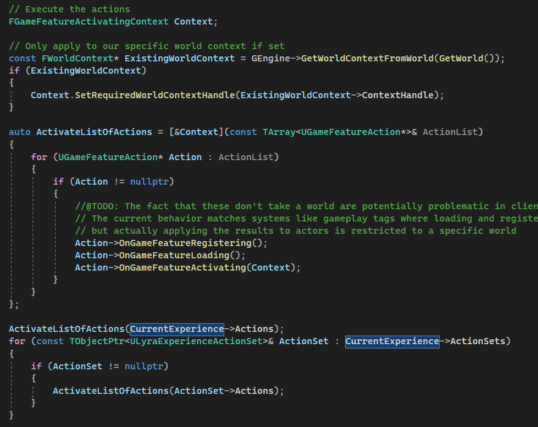

这里的Context直接从当前的WorldContext初始化，里面用一个FName表示不同的World，类似于Context_2。

而配置在GameFeatureData的Action会跟随GameFeaturePlugin的状态变化而调用`OnGameFeatureRegistering()`，`OnGameFeatureLoading()`，`OnGameFeatureActivating(Context)`。而这里的Context是空的，则会对每一个World都激活一次Action。

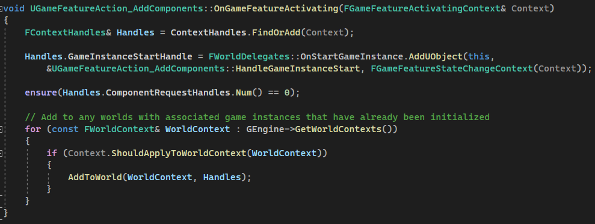

每次激活都遍历一遍所有的WorldContext, 由传入的ActivateContext判断是否要对一个World 激活当前Action。而最终执行添加Component是在`AddToWorld()`。拿到`UGameFrameworkComponentManager`添加扩展：
```
TSharedPtr<FComponentRequestHandle>  UGameFrameworkComponentManager::AddComponentRequest(const TSoftClassPtr<AActor>& ReceiverClass, TSubclassOf<UActorComponent> ComponentClass)
```
而返回的Handle，在析构的时候会自动Remove这次扩展。所以Action必须持有这个Handle，直到Deactivate的时候释放它。

# 3. GameFrameworkComponentManager -> UGameInstanceSubsystem
`ModularGameplay`插件中的`UGameFrameworkComponentManager`实现了灵活扩展Gameplay功能的方法。大致可分为两类扩展。

* 对指定类型的Actor添加Component
* 对指定Actor的事件监听

通常可以对一些有特定功能的Actor添加Component，可以在不更改原Actor所在的模块的情况下扩展它的功能。也可以监听`Receiver Actor`的事件回调，执行特定的逻辑。
```c++
class UGameFrameworkComponentManager : public UGameInstanceSubsystem
{
	//...
	/** Adds an actor as a receiver for components. If it passes the actorclass filter on requests it will get the components. */
	void AddReceiver(AActor* Receiver, bool bAddOnlyInGameWorlds = true);
	/** Removes an actor as a receiver for components. */
	void RemoveReceiver(AActor* Receiver);

	/** Adds a request to instantiate components on actors of the given classes. Returns a handle that will keep the request "alive" until it is destructed, at which point the request is removed. */
	TSharedPtr<FComponentRequestHandle> AddComponentRequest(const TSoftClassPtr<AActor>& ReceiverClass, TSubclassOf<UActorComponent> ComponentClass);

	/** Sends an arbitrary extension event that can be listened for by other systems */
	void SendExtensionEvent(AActor* Receiver, FName EventName, bool bOnlyInGameWorlds = true);

	/** Adds an extension handler to run on actors of the given class. Returns a handle that will keep the handler "alive" until it is destructed, at which point the delegate is removed */
	TSharedPtr<FComponentRequestHandle> AddExtensionHandler(const TSoftClassPtr<AActor>& ReceiverClass, FExtensionHandlerDelegate ExtensionHandler);
};
```
首先，通常在支持被扩展的`AActor`的`PreInitializeComponents`中注册自己为`Component Receiver`，并在恰当的时候发送`GameActorReady`事件:
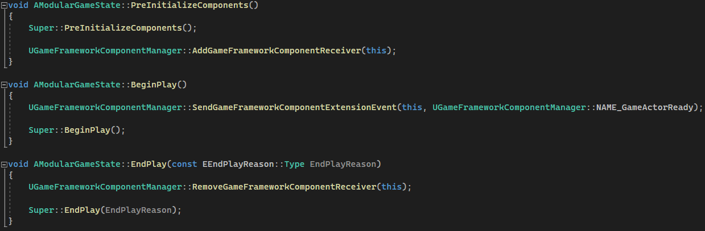

上面AddReceiver和AddComponentRequest的实现保证了无论是先AddReceiver还是先AddComponentRequest都能正确的添加对应的Component到Actor上。

`AddReceiver`从ReceiverClassToComponentClassMap中取出所有注册Components扩展，实例化并添加到Actor上，随后还要调用Actor的NAME_ReceiverAdded事件。
```c++
void UGameFrameworkComponentManager::AddReceiverInternal(AActor* Receiver)
{
	checkSlow(Receiver);
	
#if WITH_EDITOR
	AllReceivers.Add(Receiver);
#endif
	
	for (UClass* Class = Receiver->GetClass(); Class && Class != AActor::StaticClass(); Class = Class->GetSuperClass())
	{
		FComponentRequestReceiverClassPath ReceiverClassPath(Class);
		if (TSet<UClass*>* ComponentClasses = ReceiverClassToComponentClassMap.Find(ReceiverClassPath))
		{
			for (UClass* ComponentClass : *ComponentClasses)
			{
				if (ComponentClass)
				{
					CreateComponentOnInstance(Receiver, ComponentClass);
				}
			}
		}

		if (FExtensionHandlerEvent* HandlerEvent = ReceiverClassToEventMap.Find(ReceiverClassPath))
		{
			for (const TPair<FDelegateHandle, FExtensionHandlerDelegate>& Pair : *HandlerEvent)
			{
				Pair.Value.Execute(Receiver, NAME_ReceiverAdded);
			}
		}
	}
}
```

`AddComponentRequest`会把ReceiverClass-ComponentClass保存到一个Map中`(ReceiverClassToComponentClassMap)`，以便后续Actor实例注册Receiver时添加对应的Component。同时，也会遍历World中的所有ReceiverClass类型的Actor，并添加Component。这样，即使先于`AddComponentRequest`就注册成Receiver的Actor也能正确加上这个Component。这里还会把ReceiverClass-ComponentClass组成key计数，避免重复添加同样的扩展。

而Actor事件的使用则更加灵活。除了ReceiverAdded,ReceiverRemoved这两个事件，在Actor Receiver添加和移除时调用。还有ExtensionAdded，ExtensionRemoved这两个在AddExtensionHandler和FComponentRequestHandle析构的时候调用。这里虽然叫ComponentRequestHandle，但是Extension事件也是用的它。

`AddExtensionHandler`会把传进来的Delegate保存到ReceiverClassToEventMap中，随后任何这个Actor的事件都会调用所有这些注册的委托。同时，会把当前注册的Delegate对所有这个类型的Actor实例都调用一遍NAME_ExtensionAdded事件。
```c++
TSharedPtr<FComponentRequestHandle> UGameFrameworkComponentManager::AddExtensionHandler(const TSoftClassPtr<AActor>& ReceiverClass, FExtensionHandlerDelegate ExtensionHandler)
{
	// You must have a target and bound handler. The target cannot be AActor, that is too broad and would be bad for performance.
	if (!ensure(!ReceiverClass.IsNull()) || !ensure(ExtensionHandler.IsBound()) || !ensure(ReceiverClass.ToString() != TEXT("/Script/Engine.Actor")))
	{
		return nullptr;
	}

	FComponentRequestReceiverClassPath ReceiverClassPath(ReceiverClass);
	FExtensionHandlerEvent& HandlerEvent = ReceiverClassToEventMap.FindOrAdd(ReceiverClassPath);

	// This is a fake multicast delegate using a map
	FDelegateHandle DelegateHandle(FDelegateHandle::EGenerateNewHandleType::GenerateNewHandle);
	HandlerEvent.Add(DelegateHandle, ExtensionHandler);

	if (UClass* ReceiverClassPtr = ReceiverClass.Get())
	{
		UGameInstance* LocalGameInstance = GetGameInstance();
		if (ensure(LocalGameInstance))
		{
			UWorld* LocalWorld = LocalGameInstance->GetWorld();
			if (ensure(LocalWorld))
			{
				for (TActorIterator<AActor> ActorIt(LocalWorld, ReceiverClassPtr); ActorIt; ++ActorIt)
				{
					if (ActorIt->IsActorInitialized())
					{
						ExtensionHandler.Execute(*ActorIt, NAME_ExtensionAdded);
					}
				}
			}
		}
	}
	else
	{
		// Actor class is not in memory, there will be no actor instances
	}

	return MakeShared<FComponentRequestHandle>(this, ReceiverClass, DelegateHandle);
}
```

在`UGameFeatureAction_AddWidgets`中，实现了添加Widget的Action。在UE的框架中，UI总是由`AHUD Actor`表示，所以这里注册了一个对`ALyraHUD`的事件处理：
```c++
void UGameFeatureAction_AddWidgets::AddToWorld(const FWorldContext& WorldContext, const FGameFeatureStateChangeContext& ChangeContext)
{
	UWorld* World = WorldContext.World();
	UGameInstance* GameInstance = WorldContext.OwningGameInstance;
	FPerContextData& ActiveData = ContextData.FindOrAdd(ChangeContext);

	if ((GameInstance != nullptr) && (World != nullptr) && World->IsGameWorld())
	{
		if (UGameFrameworkComponentManager* ComponentManager = UGameInstance::GetSubsystem<UGameFrameworkComponentManager>(GameInstance))
		{			
			TSoftClassPtr<AActor> HUDActorClass = ALyraHUD::StaticClass();

			TSharedPtr<FComponentRequestHandle> ExtensionRequestHandle = ComponentManager->AddExtensionHandler(
				HUDActorClass,
				UGameFrameworkComponentManager::FExtensionHandlerDelegate::CreateUObject(this, &ThisClass::HandleActorExtension, ChangeContext));
			ActiveData.ComponentRequests.Add(ExtensionRequestHandle);
		}
	}
}
```
在事件处理中，同时响应`ExtensionAdded`事件和`GameActorReady`事件，添加配置好的Widget到Lyout中。这里，如果激活这个Action之前`ALyraHUD`就已经创建好了，则会通过`ExtensionAdded`事件立即添加Widget，或者稍后创建`ALyraHUD`时，通过`GameActorReady`添加。
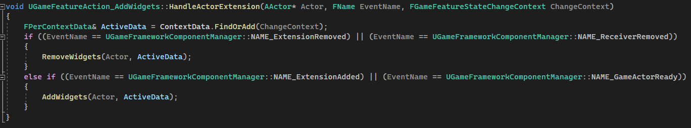


# 4. UIExtensionSubsystem -> UWorldSubsystem
Lyra的UI主要通过两个系统扩展，`UGameUIManagerSubsystem`和`UIExtensionSystem`。

## 4.1 ULyraUIManagerSubsystem
`ULyraUIManagerSubsystem`为跨Level的全局UI管理。但它把所有实际对UI的管理都转发给了UIPolicy对象，这会在子系统初始化时根据配置创建。GameInstance在LocalPlayer创建和移除时会通知到`ULyraUIManagerSubsystem`，然后调用UIPolicy的对应方法，创建实际的主UI(UPrimaryGameLayout)。

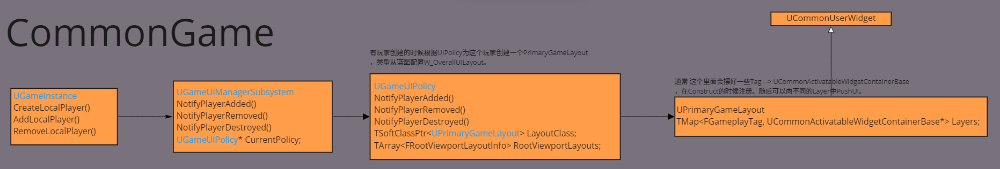

在Lyra中的UPrimaryGameLayout是`W_OverallUILayout`，在其Construct中注册了四种Layout：

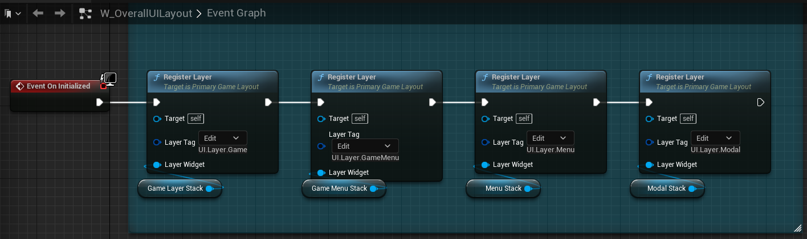

每种Layout用一个GameplayTag标识，随后可以向指定Tag的Layer Push UI。在蓝图中向指定Layer Push UI：

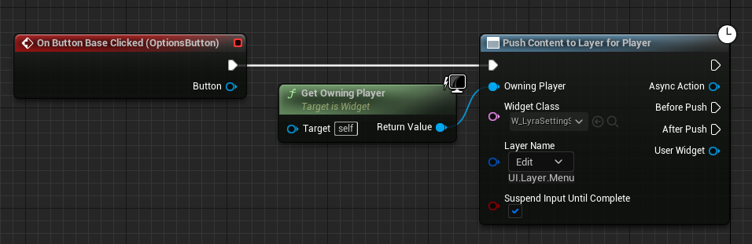

这里的Class对象是一个软引用，里面会异步加载对应的UI。

在C++中PushUI:

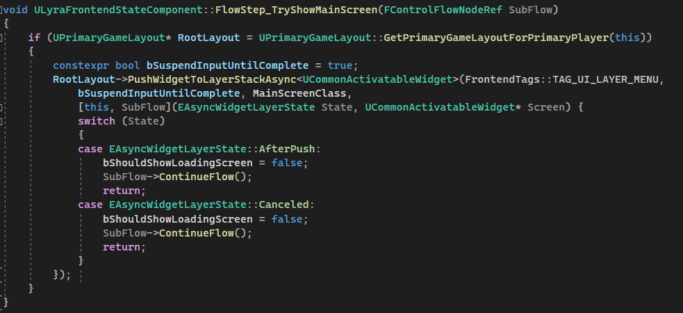

这是Lyra中创建主界面的Widget。这里实现了一个GameStateComponent，并通过AddComponentAction创建这个Component，最后创建这个UI。也可以通过AddWidget Action创建，游戏内的主HUD就是如此`(W_ShooterHUDLayout)`。

PrimaryLayout中不同的Layer之间会同时显示。Layer内的Widget有不同的显示逻辑。CommonUI中实现了两种Layer，`UCommonActivatableWidgetStack`和`UCommonActivatableWidgetQueue`，都可以通过Tag 把不同的Widget Push到这些layer中。

WidgetStack 会立即Activate当前Psuh 的 Widget，并把上一个Widget Deactivate。直到栈顶Widget被Deactivate，下一个Widget会被自动显示。

WidgetQueue 的显示逻辑和队列的意义一致，先push的先显示，正在显示的被Deactivate后，再显示下一个。

## 4.2 UIExtensionSystem