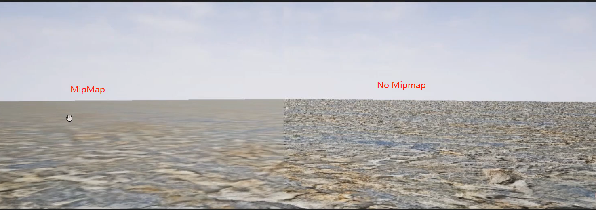
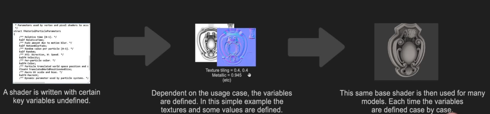
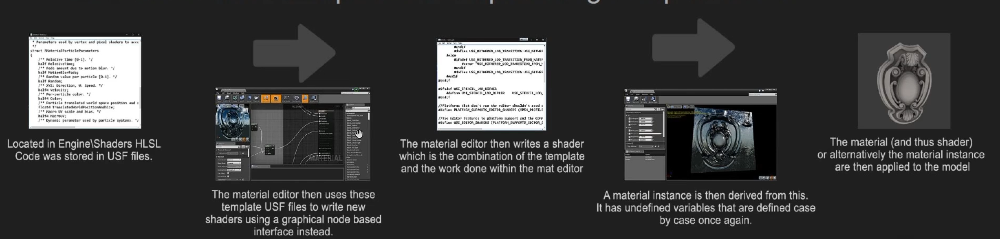
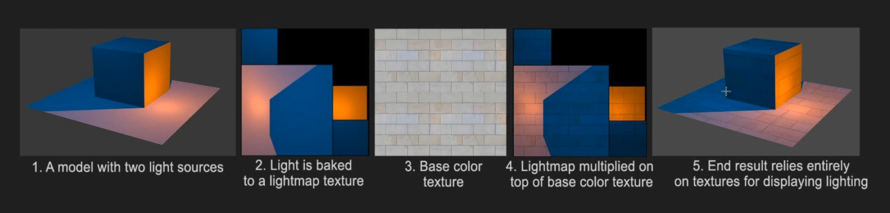

# Deferred redering
1. 着色(Shading)延迟发生
2. 用GBuffer组合work
3. 对渲染动态光照友好
4. 性能稳定可预测
5. 关闭一些特性时很灵活, 但对表面属性不灵活
6. 不能用MSAA(Mutisample anti-aliasing), 用TAA(Temporal anti-aliasing)

# Forward redering
1. 几何/材质 的的渲染和着色同时发生
2. 光照和材质的计算更加灵活, 但在混合多个特性时不灵活。
3. 擅长半透明表面的渲染.
4. 简单的应用更快
5. 动态光照对性能的影响很大
6. 可以用MSAA, 抗锯齿效果更好

## 2. 渲染之前
CPU上有一个普通thread和一个DRAW thread.GPU Thread 和CPUthread同步.

### 2.1 Frame 0 - Time 0 - CPU
计算所有的逻辑和变换(GameThread)
* Animations
* Positions of models and objects.
* Physics
* AI
* Spawn and destroy, Hide and Unhide 

### 2.2 遮挡 Frame 1 - Time 33ms - Draw Thread (mostly CPU)

什么是可见的?

构建一个可视性列表, 逐对象进行.
1. Distance Culling (距离剔除)
物体离相机的距离超过某个值就不渲染.
默认关闭.
在所有可见物体的Details 面板下的render分类下, 可设置剔除距离.
也可以用剔除体积, CullDistanceVolume, 其中的物体都会收到影响.
2. Frustum Culling (视锥剔除)
不在相机的可视范围内的物体就不渲染, 几乎无法关闭.
3. Precomputed Visibility (预计算可见性)
首先在worldsetting中开启, 

创建一个PrecomputedVisibilityVolume, 包住想要预计算的体积.
构建光照。

然后就可以看见预计算的cell.

4. Occlusion Culling (遮挡剔除)

性能消耗大.
freezerendering, stat Initviews
遮挡的性能影响:
1. 总是开启距离剔除, 没有先剔除的在计算遮挡时的消耗很大.
2. 超过10-15K的对象影响很大, 基准测试, 概要分析.
3. 大型开放式场景无法很好地应用遮挡
4. 粒子(Bounding Box)的遮挡, 任何可见对象都能被遮挡
5. 大型物体很少被遮挡, 减少了CPU的遮挡计算,但增加GPU渲染消耗
6. 组合小模型到一个大的模型, 增加CPU的消耗(遮挡计算) 


# 几何结构渲染
## Prepass / Early Zpass

逐对象渲染.

互相部分遮挡的物体导致一些像素重复被多次渲染.预渲染Z Pass, 确定每个对象的那一部分最终被显示在屏幕上.

## Draw calls
共享同一属性的一组多边形就是一个drawcall, 逐对象(材质)调用.相同材质的对象逐个接连调用.

stat RHI 

Draw Primitive calls 就是drawcall 调用次数

2000 —— 3000 是比较合理的(reasonable)
超过5000 就有点高了
超过10000就可能会成为一个问题
在移动设备上更低(最多几百)

DrawCalls 对性能影响巨大, 每次渲染完都要接收渲染线程的命令, 导致损耗增加. 通常影响比多边形面数大得多.
三角形面数对几何渲染这一步的影响很小.

组件也是组个DrawCall.所以将多个mesh挂到一个actor下与一个个分开没什么区别.

降低DrawCall :
* 使用大型模型而不是小而散的模型, 但大模型太多会导致其它问题(遮挡, 碰撞碰撞计算, 光照贴图 变复杂, 存储空间)
* 模块化网格体, 可以节省工作量和内存, 提升光照, 遮挡, 碰撞, LOD. 但也增加了Draw call.
* 在后期合并网格体.
合并规则:
* 经常被使用且面数也比较低的.
* 仅合并在同一区域内的东西.
* 仅合并有同样材质的东西
* 没有或仅有简单碰撞的Mesh才适合合并.
* 小的Mesh或仅接受动态光照的Mesh也是很好的选择.
* 远距离的几何体

仅当出现问题时再合并, 在非常低端的设备上(移动设备)才需要合并.

模型在内存中实例化, 不会再渲染中实例化, 一个模型放置多个时, 只会在内存中存在一份, 渲染时会渲染多次.

实例化渲染 

Lodding - Level Of Detail

常规LOD 只是减少了面数, 并没有减少Draw call.
HLOD - Hierarchical LOD 在足够远距离时用一个模型替换一组模型.

# Vertex Shaders
有许多不同类型的shader: 顶点着色, 像素着色, whole 着色, 域着色. 

Vertex Shaders 

根据模型的世界坐标, 将顶点本地坐标转换为世界坐标.  处理平滑过渡, 硬边缘, 柔化边缘, 顶点的颜色。
还会处理材质上的偏移, World Position Offset 材质输入. 

World Position Offset 可以干:
1. 布料
2. 水偏移, 波浪
3. 植被波纹
因为不可能都用动画来实现这么多的动画, CPU支撑不了, 但因为着色被超级优化过, 则可以支撑.

顶点着色不会修改模型位置(CPU不会知道这个, 物理, 碰撞也不会影响), 仅仅是渲染的视觉效果上的改变.

性能影响: 
1. 动画越复杂, 越会降低性能》
2. 越多顶点被影响, 越慢
3. 多顶点的对象应该用更简单的顶点着色.
4. 在距离较远时禁用顶点着色便宜, 或者动画之类的不必要的消耗.

# 6 . 光栅化, 遮蔽和G-Buffer

## Rasterizing and Overshading 
Overshading 过度着色
一个像素点只会显示一个多边形.

由于硬件设计的原因, 每次着色用2x2的四个像素点处理, 如果多边形非常小, 这四个像素也许只有一个像素应该被填充颜色. 但实际会给这四个像素点都执行计算.
当三角面很密集时, 每次都要用差不多甚至是相同的2x2的像素计算着色.
这就Overshading了.

1. 多边形数量在密集时渲染花费更多性能.
2. 从远处看时密度增加
3. 因此在远距离时要减少多边形(LOD / culling).
4. 初始像素着色通道越复杂, 过度着色就越慢. 所以过度着色对前向渲染的影响更大.

尽量让三角形分布均匀.

## GBuffer
光栅化之后的操作都是基于GBuffer.
光栅化出来多个不同的图片, 他们然后被用于合成任何东西 比如 ： 从材质到光照, 雾, 等等

GBuffer 会占用很多内存, 因为每一帧要渲染X张中间信息的图片, 如果有60帧每秒就要有60*10张.这些都还要送给GPU, 需要大量的带宽.

# 7. 渲染和纹理
## 压缩
纹理在导入时总会被压缩.方式因平台而异, PC上通常是BC(块压缩DXTC DirectX Texture Compression). BC有许多压缩设置UE4没有暴露出来.

```
Why 要压缩?
因为内存和带宽有限.
着色器有最大纹理采样数量.
不会影响渲染性能. 只会造成画面滞后或冻结或卡顿, 不会导致帧率持续下降.
```
法线贴图用特殊的BC5格式, 仅保留Red/Green, 可以通过这两个通道直接计算出Blue通道.

BC3(DXTC5) = Textures with alpha.
BC1(DXTC1) = Textures without alpha 

Photoshop 中有一个插件 Intel Texture Works可以预览不同的压缩方式.

UE4的TextureEditor中, Compression Setting 可以选择压缩方式:

* BC7可以得到最高的质量.

* VectorDisplacementmap RGBA8 这样的是没有压缩的, 相当于解压缩.

* Grayscale 压缩的很大, 几乎没有压缩.

* 法线贴图必须是BC5 
## Mipmaps 多级渐进纹理
WHY?
最大化内存效率, 平滑图片.
没有Mipmaps, 会出现许多噪点.

根据距离切换使用不同模糊程度的Texture,(实际上还是同一张, 只是根据渲染距离切换)
离相机越远用的分辨率越低.
 
Texture Streaming : 确定Engine何时需要那一张纹理, 并仅在需要时加载.根据相机位置和角度.

每一级的大小是上一级的1/4.
因此, Texture 的长和宽都必须是2的幂的大小, 可以不同.
如果不是, 仍可以使用, 但不会有MipMap.

# 8 Sharder and Material 

## Pixel Shaders
和 Vertex shader 相似. 在GPU上运行的一组计算以修改像素的颜色.
渲染管线的核心, 用于计算和应用渲染的每一步, 从几何渲染 直到渲染完成. 

用来实现材质系统, 光照, 雾, 后处理, 反射, 颜色校正.

### Shader Language
着色语言是平台特异的.在DirectX上用HLSL--High Level Shader Language.

1. Shader编写时带有一些未定义的变量
2. 依赖于不同的使用情况, 定义这些变量.
3. 同样的Shader用于许多模型, 每次都有着不同定义的输入变量.



Blend Mode 就是不同的Shader模板, 所以有不同的输出参数.

Material pipeline 是基于PBR.使用Specular/Metallic/Roughness, 高光/金属/粗糙度, 计算环境种几乎所有的着色.

### 性能影响
1. 材质/Shader 可以查看的纹理采样器数量(通常16个, 13可以使用)有限.DX11可以用128个(shared samplers).
2. Texture 太大可能造成滞后或卡顿, 但不会有持续的帧率损失.
3. 像素着色器有很大影响.
4. 分辨率越高, 材质受到影响就越大越复杂.
一个材质在屏幕上着色的像素越多, 性能损耗就越大.

# 9 反射
很难实时实现. 用三种不同的技术混合.完了和渲染的剩下部分去混合.
## 1. Reflection Captures 反射捕获
在指定位置捕获静态立方体贴图.预计算, 很快, inaccurate 不准确. 在捕获地点附近的局部效果.

Sphere Reflection Capture Actor: 当相机到捕获点时,就可以看到.

## 2. Planar Reflections 平面反射
很少用, 仅限于在某个平面上的反射.
* 在一些设置下的消耗可能很大.
* 适用于需要精确反射效果的平面.
* 不适合其它东西.
* 仅在受限的区域内有效.
做一面在房间里的镜子很容易.但不适合海面这么大的区域.

## 3. Screen Space Reflecctions (SSR) 屏幕空间反射
默认开启, 能反射所有对象, 而且是实时的, 精确的, 结果会有噪声, 中等性能消耗, 仅能显示屏幕可见的几何体的反射.
在PostProcessVolume中设置, Rendering Features > Screen Space Reflections > Intensity

性能影响:
1. 在一个工程没有打包时, 每次加载关卡都会捕获反射, 所以过多的反射捕获会很慢.
2. 多个反射捕获重叠极度影响性能.Pixel shading 会一遍遍操作同一个像素.
3. 反射捕获分辨率可在Project setting 中设置.

* Skylight 可以为整个world提供低成本反射捕获.
* 仅在需要时开启平面反射.
* SSR性能消耗最多, 移动设备上可以直接 关掉.
* 如果性能允许, 可以提升SSR质量以避免噪声. r.SSR.Quality

# 10 Static light 
指所有预先计算的光照. 光照和阴影是分开的.
```c++
静态光照
静态阴影 
动态光照
动态阴影
```
## Process Pros/Cons
1. 在编辑器中预计算, 并存储在lightmaps中.
2. 超级快, 但会增加内存开销
3. 预计算光照会花费大量时间
4. 每次有什么东西改变都的重新渲染.
5. 模型需要lightmap UV, 这个额外的步骤会花费时间.
## Quality Pros/Cons
1. 处理辐射和全局光照
2. 渲染真实的阴影, 包括软阴影.
3. 质量依赖于lightmap 分辨率和UV布局.
4. 出现一些缝, 由于UV布局
5. Lightmap 分辨率有上限.
6. 太大的模型没有足够的lightmap UV空间.
7. 一旦计算好, 光照和阴影不能在运行时修改.

## Lightmaps
就是一种纹理, 带有光照和阴影信息.会被乘到baseclor上.模型的UV lightmap就是这个用处.


## Lightmass
是一个独立的Application, 处理光照渲染并烘培到lightmaps.

支持通过网络进行分布式渲染.

烘培质量取决于Light Build质量和每个关卡的Lightmass section 的设置.

LightmassImportanceVolume 体积内的任何东西都会有更高质量的光照.

## Indirect Lighting Cache
为了处理在动态模型上的预计算光照, 需要ILC间接光照缓存.
LightmassImportanceVolume 中会生成各种带有当前点位范围光照信息的点.

每个可移动的模型都有个属性: indirect Light Cache Quality.

Lightmass Character Indirect Detail Volume 强迫这些间接光照点的出现.

World setting 中 Volume Light Sample Placement 可以设置缓存点密度.

## Static Lighting 性能影响
1. 静态光照总以相同的速度渲染.
2. 光源的数量也没啥影响. 
3. Lightmap 分辨率影响内存和文件大小, 而不是帧率.
4. 烘培时间会增加:
    * Lightmap 分辨率
    * 模型和光的数量
    * 高质量的设置
    * 光源的半径或衰减半径太大.

5. 使用一致的lightmap大小可以得到最好的效果

# 11. Dynamic light and Shadows

## Process Pros / Cons
1. 用GBuffer 实时渲染
2. 光源可以被改变, 移动, 或者添加/删除
3. 不需要任何特殊的模型准备
4. 尤其是阴影耗费性能.
5. 多个不同的方式渲染动态阴影, 需要花时间和实践去找到正确的类型和正确的混合. 

## Quality Pros / Cons
1. 阴影十分耗费性能, 通常要降低渲染质量.
2. 动态光照不会对大部分内容产生辐射或全局光照.
3. 动态光照看上去更清晰, 更具"现场感", 看上去更像是在场景中.
4. 动态光照不需要考虑模型大小.
5. 动态软阴影很难做, 所以不会产生.

## Shadows 
阴影非常消耗性能, 在一些光源上关闭阴影投射将很有帮助.

有四个主要类型的动态阴影, 还有许多不怎么普遍的类型.

1. Regular Dynamic Shadows - 常规动态阴影, 被用于各种地方.
设置成Movable并在投射阴影的光源.

2. Per Object Shadows - 逐对象阴影， 固定光源阴影

3. Cascaded Shadow Maps (CSM) - 级联阴影Map, 直接光照阴影
不能用于大型室外.仅用于定向光源.

4. Distance Field Shadows - 距离场阴影, 使用距离场信息而不是几何体信息.
为了投射阴影, 需要知道两点之间的距离.

为了知道几何体之间的距离, 必须查询这些信息并比较结果.

这个过程非常缓慢.

DF是众多加速计算两点间距离的过程的办法.

它被保存在Volume Texture, 纹理分辨率决定了阴影细节.

通常细节不是很好， 所以仅用于远距离的阴影.

动态光照性能影响:
1. 在延迟渲染中动态光照相对cheap, 但是在前向渲染中很expensive.
2. cost 由pixel shader 操作产生，所以像素越多越慢.
3. 相机离光源越近, 越多的像素就会受到影响, 就会越慢.
4. 光源半径应该尽可能小.
5. 不要过多的重叠.
动态阴影性能影响:
1. 不需要的时候关闭阴影投射.
2. 几何体的面数影响阴影. 在复杂环境中显示动态阴影需要降低多边形数量.
3. 用距离场减少这些影响（高面数模型）.
4. 对长直硬边缘的模型距离场效果很好.
5. 远距离时关闭阴影.


## 混合动态和静态的光照

* 弱的和远距离的光用static
* 在相机附近用static渲染间接光照
* 在静态光头上加个动态光强调着色和阴影,并在static 结果上提供一层可交互的结果.
* 如果最求性能, 就只用静态光照.
* 如果需要在任何时候都自由地修改光源, 用动态光照.

# 12. Fog and Transparency

## Distance Fog 
有两种类型的雾:
* Atmospheric and Exponentional 
* Local volumetric fog
距离雾意味着雾随着距离的变换而消散.
Height fog 在接近天空时消散.
这些都是基于Pixel Shader.
Depth 图+Fog 颜色, 根据离相机的远近, 着不同程度的雾的颜色.然后和其它结果混合在一起.

## Transparency 
在延迟渲染中难得多.因为GBuffer没有提供足够的信息来渲染透明度.除非能正确的设置它或者转移到前向渲染中实现.

因此把半透明表面的渲染推迟到很靠后的阶段.

为了获得高质量透明效果, 用前向渲染完成一部分操作(透明度), 再和延迟渲染管线合并.

在材质中, Translucency 有许多设置, 要么设置成效果普通运行也快, 或者效果很好但运行缓慢.

## Transparency Performance Implications
1. 以最高质量渲染透明度时, Pixel shader 损耗很大.
2. 多层半透明表面重叠到一个像素上, 或者覆盖了大量的像素都会expensive.
3. 除了pixel shader, 渲染排序也会加重损耗,很慢且容错率低.

半透明材质shading model 尽量使用无光照模式.
Lighting Mode, Volumetrix PerVextex Direction
使用其它办法伪造半透明效果.

## Things not covered 
* Sub Surface rendering 
* Refraction
* Displacement 
* Screen Space Ambient Occlusion 
* Interface and UI rendering 
* Decals 

# 13. Post Processing 
后处理是一种视觉效果,应用在render的非常后面.严重依赖Pixel shaders.复用GBuffer来组合计算.

常见效果:
* Light Bloom 
* Depth of Field / Blurring
* Some types of lensflares 
* Light Shafts
* Vignette
* Tonemapping / Color correction
* Exposure
* Motion Blur

