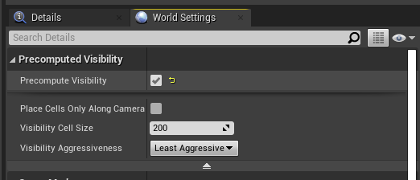
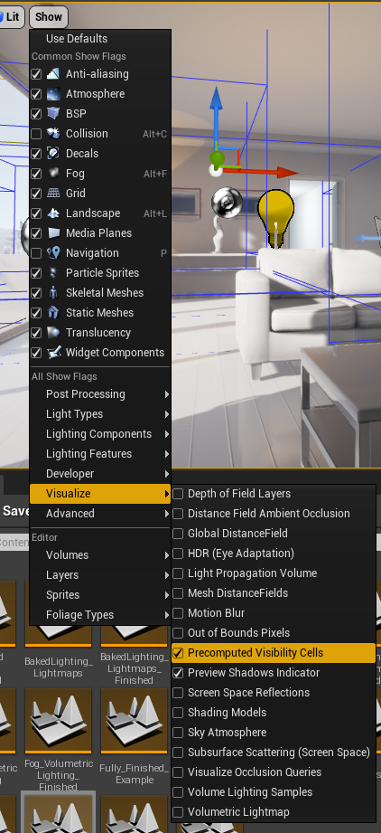

# Deferred redering
1. 着色(Shading)延迟发生
2. 用GBuffer组合work
3. 对渲染动态光照友好
4. 性能稳定可预测
5. 关闭一些特性时很灵活, 但对表面属性不灵活
6. 不能用MSAA(Mutisample anti-aliasing), 用TAA(Temporal anti-aliasing)

# Forward redering
1. 几何/材质 的的渲染和着色同时发生
2. 光照和材质的计算更加灵活, 但在混合多个特性时不灵活。
3. 擅长半透明表面的渲染.
4. 简单的应用更快
5. 动态光照对性能的影响很大
6. 可以用MSAA, 抗锯齿效果更好

## 2. 渲染之前
CPU上有一个普通thread和一个DRAW thread.GPU Thread 和CPUthread同步.

### 2.1 Frame 0 - Time 0 - CPU
计算所有的逻辑和变换(GameThread)
* Animations
* Positions of models and objects.
* Physics
* AI
* Spawn and destroy, Hide and Unhide 

### 2.2 遮挡 Frame 1 - Time 33ms - Draw Thread (mostly CPU)

什么是可见的?

构建一个可视性列表, 逐对象进行.
1. Distance Culling (距离剔除)
物体离相机的距离超过某个值就不渲染.
默认关闭.
在所有可见物体的Details 面板下的render分类下, 可设置剔除距离.
也可以用剔除体积, CullDistanceVolume, 其中的物体都会收到影响.
2. Frustum Culling (视锥剔除)
不在相机的可视范围内的物体就不渲染, 几乎无法关闭.
3. Precomputed Visibility (预计算可见性)
首先在worldsetting中开启, 

创建一个PrecomputedVisibilityVolume, 包住想要预计算的体积.
构建光照。

然后就可以看见预计算的cell.

4. Occlusion Culling (遮挡剔除)

性能消耗大.
freezerendering, stat Initviews
17:42