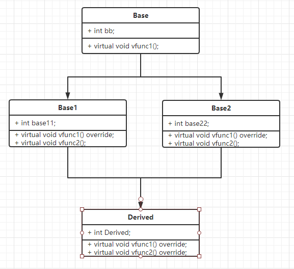

# 内存模型

Key: c++中的类的内存布局是怎么样的?

### 虚表和虚函数指针

```c++
class Base1
{
public:
    virtual void vfunc1() 
    {
        std::cout << "Base1::vfunc1" << std::endl;
    }
    virtual void vfunc2()
    {
        std::cout << "Base1::vfunc2" << std::endl;
    }
};

class Derived: public Base1
{
public:
    virtual void vfunc1() override
    {
        std::cout << "Derived::vfunc1" << std::endl;
    }
    virtual void vfunc2() override
    {
        std::cout << "Derived::vfunc2" << std::endl;
    }
};

int main()
{
    typedef void (*func)(void);
    Derived der; // &der ---> 虚表函数指针数组的数组指针(第一个数组元素的地址)
    Base1* b1 = &der;

    int* p_vftable = (int*)(&der); // 指向虚表数组的指针

    int* p_first_vf_addr = (int*)*p_vftable; // 虚表数组第一个元素的地址
    int* p_second_vf_addr = p_first_vf_addr + 1; // 虚表数组第二个元素的地址

    int* p_first_func = (int*)*p_first_vf_addr; // 函数指针,虚表数组中的元素
    int* p_second_func = (int*)*p_second_vf_addr;

    std::cout << "Virtual table address: " << p_vftable << std::endl; 
    std::cout << "The pointer to first function's address" << p_first_vf_addr << std::endl; 
    std::cout << "The pointer to second function's address" << p_second_vf_addr << std::endl; 
    std::cout << "The first function pointer: " << p_first_func << std::endl;
    std::cout << "The second function pointer: " << p_second_func << std::endl;
    func f = nullptr;
    f = (func)p_first_func;
    f();
    f = (func)p_second_func;
    f();
}
```
对象`der`的内存空间中最前面的位置保存了指向虚表数组的指针。`&der`即表示了这一指针。
```
virtual table address: 0087FC08
The pointer to first function's address: 0091AC74
The pointer to second function's address: 0091AC78
The first function pointer: 009112D0
The second function pointer: 009112FD
Derived::vfunc1
Derived::vfunc2
```

### 普通继承
1. 虚函数按其声明顺序放于表中.
2. 父类的虚函数在子类的虚函数之前
3. 变量放在虚表后。
4. 子类重写的虚函数放到了虚表中原来父类实现的虚函数的位置。
5. 没有被覆盖的照旧。

在有多层级继承结构下,每一层级都按照这一规则,后面的覆盖前面的。

### 多重继承
即继承多个父类.
1. 每一个父类都有自己的虚表(按声明顺序)
2. 每一个虚表后面是这个父类的成员变量
3. 子类的虚函数成员被放到第一个父类的虚表中(按上述规则)
4. 子类的数据成员在最后.
在继承的多个父类中若有相同的虚函数,则子类在重写这一函数时会同时覆盖所有父类。
5. 子类重写的虚函数会覆盖所有父类虚函数表中的同一虚函数。
6. 如果多个父类都有的虚函数没有被重写,则调用该函数会出现二义性.

### 菱形继承
对于菱形继承, 即是多个父类继承了同一个类(父类的父类).考虑这样一个继承结构:

实例化Derived,后如果直接访问`Base`的`bb`成员
```c++
Derived d;
d.bb; // Error C2385 ambiguous access of 'bb'
```
由于直接父类Base1, 和Base2中都继承了`Base`, 导致`Derived`对象中有两份`Base`类的成员存在。编译器不知道访问的哪一个。

或者可以用`using`在`Derived`类中指定用那一个父类的版本:
```c++
    using Base1::bb;
    // using Base2::bb;
```
在转换到Base时, 可以先转到Base1 或Base2。
但这毕竟不是长久之计,所以有了虚继承, 他能够防止多重继承时同一个类出现的多个拷贝:
```c++
class Base1 : virtual public Base{};
class Base2 : virtual public Base{};
```
```
1>class Derived	size(36):
1>	+---
1> 0	| +--- (base class Base1)
1> 0	| | {vfptr}
1> 4	| | {vbptr}
1> 8	| | base11
1>	| +---
1>12	| +--- (base class Base2)
1>12	| | {vfptr}
1>16	| | {vbptr}
1>20	| | base22
1>	| +---
1>24	| Derived
1>	+---
1>	+--- (virtual base Base)
1>28	| {vfptr}
1>32	| bb
1>	+---
1>Derived::$vftable@Base1@:
1>	| &Derived_meta
1>	|  0
1> 0	| &Derived::vfunc2
1>Derived::$vftable@Base2@:
1>	| -12
1> 0	| &thunk: this-=12; goto Derived::vfunc2
1>Derived::$vbtable@Base1@:
1> 0	| -4
1> 1	| 24 (Derivedd(Base1+4)Base)
1>Derived::$vbtable@Base2@:
1> 0	| -4
1> 1	| 12 (Derivedd(Base2+4)Base)
1>Derived::$vftable@Base@:
1>	| -28
1> 0	| &Derived::vfunc1
1>Derived::vfunc1 this adjustor: 28
1>Derived::vfunc2 this adjustor: 0
1>vbi:	   class  offset o.vbptr  o.vbte fVtorDisp
1>            Base      28       4       4 0
```
在采用`virtual`继承`base`的类中(Base1 或Base2),会出现一个`vbptr`指针,它指向一个`vbtable`,其中记载了数据相对于虚基类指针的偏移,根据偏移找到数据。虚基类往往出现在内存布局的最后。
#### Warning
* 可以通过父类型的指针访问子类的虚函数(通过虚表)
* 访问non-public虚函数
    * 非public的虚函数同样存在于虚表中。

reference:
* https://coolshell.cn/articles/12165.html
* https://coolshell.cn/articles/12176.html
* https://isocpp.org/wiki/faq/multiple-inheritance
* 虚继承:https://blog.csdn.net/longlovefilm/article/details/80558879
* vbptr和vbtable:https://blog.csdn.net/qq_41431406/article/details/84933450
* https://blog.twofei.com/496/